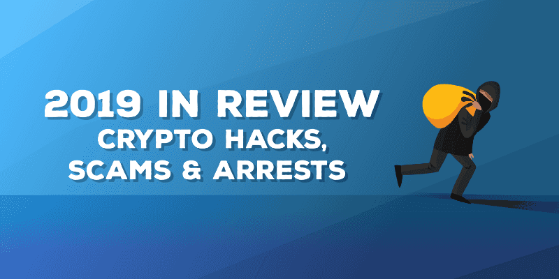

A look back at some of the crypto hacks, scams, and arrests that happened this past year.

There were a lot of security incidents across the blockchain space this year. As we near the end of 2019 and get ready to head into a new decade, let’s take a look back and see what happened and how we, as an industry, can learn from them moving forward.

We [published](https://medium.com/mycrypto/unique-phishing-method-to-look-out-for-the-fullscreen-api-e6cd08a6293a) [multiple](https://medium.com/mycrypto/the-dangers-of-malicious-browser-extensions-ef9c10f0128f) [security](https://medium.com/mycrypto/hunting-huobi-scams-662256d76720)-[related](https://medium.com/mycrypto/be-careful-with-your-kyc-documents-978ab532f2be) [stories](https://medium.com/mycrypto/private-keys-websites-aa85b42113a0) [this](https://medium.com/mycrypto/discovering-fake-trezor-metamask-and-mycrypto-android-apks-596168761f54) [year](https://medium.com/mycrypto/disclosure-key-generation-vulnerability-found-on-walletgenerator-net-potentially-malicious-3d8936485961). [Like](https://medium.com/mycrypto/what-to-do-when-sim-swapping-happens-to-you-1367f296ef4d), [seriously](https://medium.com/mycrypto/introducing-cryptoscamdb-org-77125e140650), [lots](https://medium.com/mycrypto/research-into-trust-trading-scams-on-twitter-ba6309d87a18) [of](https://medium.com/mycrypto/operation-cryptokitty-rescue-93fd8e00e4f8) [stories](https://medium.com/mycrypto/country-click-through-rates-for-bitly-scams-dbafdfd48b04). Each story we publish addresses varying threat vectors that someone should be aware of when using cryptocurrency, with examples of real-life situations. The information shared in these stories are not only for the typical MyCrypto / Ethereum user either — the details can be applied across the industry, no matter what chain, exchange, or wallet you prefer.

We will also note some security-specific events for each quarter to illustrate and remind readers as to what went on through the year. Sadly there were too many events to list in a single article like this.

Quarter 1 of 2019 was very interesting, involving high-profile cases such as [QuadrigaCX](https://www.vanityfair.com/news/2019/11/the-strange-tale-of-quadriga-gerald-cotten). At MyCrypto, we published five security-related articles to help educate users entering and staying safe within the cryptocurrency world.

### Story: [Unique phishing method to look out for: the fullscreen API](https://medium.com/mycrypto/unique-phishing-method-to-look-out-for-the-fullscreen-api-e6cd08a6293a)

**TL;DR:** A website can trick the user into thinking that they are on a different website by crafting specific images and forcing the browser to go into full-screen mode. This can then be used to extract secrets (private keys, mnemonics, etc.) and sign non-intended transactions.

### Story: [The dangers of malicious browser extensions](https://medium.com/mycrypto/the-dangers-of-malicious-browser-extensions-ef9c10f0128f?source=---------11------------------)

**TL;DR:** Browser extensions can be good, but also very, very bad. The CCB Cash extension, in particular, is designed to steal your login credentials to various exchanges. The CCB Cash campaign stole over 12 BTC.

### Story: [MyCrypto’s (Opinionated) Security Incident Response 101](https://medium.com/mycrypto/mycryptos-security-incident-response-101-36a57b17038b)

**TL;DR:** In this story, we aimed to standardize how entities in the industry react and communicate during a security incident. We were motivated by our observation that a lot of these events were occurring with very little coordination between parties after-the-fact.

### Story: [Hunting Huobi, MyEtherWallet, and Blockchain.info Scams](https://medium.com/mycrypto/hunting-huobi-scams-662256d76720)

**TL;DR:** Unsolicited airdrops can be useful(?), but be vigilant to inform yourself as to what they are advertising. This story investigates a big airdrop campaign that ties into a fake MyEtherWallet UI to steal your wallet secrets!

### Story: [The Difference Between a Hardware Wallet and a USB Drive](https://medium.com/mycrypto/the-difference-between-a-hardware-wallet-and-a-usb-drive-c50523d24e02)

TL;DR: Are you confused about what a “hardware wallet” means? We go into detail on the specifics of different solutions for a hardware wallet so you can make an educated decision based on your threat models.

## QuadrigaCX

QuadrigaCX was one of the top Canadian cryptocurrency exchanges and its shutdown in Q1 of 2019 was the event of note. The unexpectedly strange story began after QCX filed for creditor protection after the CEO allegedly died in India (while, apparently, having sole access of the cold wallets). The first reports estimated $130,000,000 was owed to its customers. The true amount owed is yet to be known as, apparently, the administrators of QCX were prone to trading on their own exchange as well as other exchanges. Apparently the database which logged user balances was… a bit of a mess and not entirely tied to reality. The investigation into QuadrigaCX is ongoing.

MyCrypto CEO ([Taylor Monahan](https://twitter.com/tayvano_)) did an in-depth investigation of the Ethereum on-chain activity for Quadriga and published a spreadsheet of her findings.

Since that tweetstorm, the case has only become more muddled as new information comes to light. We strongly recommend checking out the recent [Vanity Fair article](https://www.vanityfair.com/news/2019/11/the-strange-tale-of-quadriga-gerald-cotten) on the case, which gives some additional insight into the players and moving pieces of the case. Here’s to hoping 2020 brings answers to those who lost funds due to QuadrigaCX’s ineptitudes.

## Bithumb

Another high profile exchange hack happened in the first quarter of 2019. Bithumb is a South Korean cryptocurrency exchange, and was reported to have been hacked for a loss of $13,000,000 worth of EOS holdings. However, in an official statement from the exchange, it was declared the theft did not affect users, as those funds are “under the protection of a cold wallet.”

## Cryptopia

In January 2019, Cryptopia, a New Zealand-based exchange, went dark after reporting a security incident. Information, including the amount stolen, has been scarce. Cryptopia only disclosed, “We are continuing to work on assessing the impact incurred as a result of the hack in January. Currently, we have calculated that worst case 9.4% of our total holdings was stolen.”

Some have estimated approximately $16M in ether and ERC-20 tokens were stolen. Cryptopia is working with various law enforcement agencies to determine the scope of the damage.

Quarter 2 of 2019 was extremely interesting, as we saw two separate zero-days performed on an exchange to gain unauthorized access, the Binance SAFU fund being utilized, and a couple of high profile arrests.

In Q2, the MyCrypto released 5 more security-related articles to help remind users, both old and new, to stay vigilant.

### Story: [Be careful with your KYC documents](https://medium.com/mycrypto/be-careful-with-your-kyc-documents-978ab532f2be)

**TL;DR:** Be careful of what documents you upload and to where you upload them. This story illustrates how easy it is for someone to gain 10GB of KYC data from unsuspecting potential “investors.”

### Story: [Private Keys + Websites = 💀](https://medium.com/mycrypto/private-keys-websites-aa85b42113a0)

**TL;DR:** We discussed the dangers of using raw private keys, what they are, and how they are used to sign a transaction to send assets. We went into detail on how dangerous to a user they can be, especially when being trained to enter them on a live website.

### Story: [Disclosure: Key generation vulnerability found on WalletGenerator.net — potentially malicious](https://medium.com/mycrypto/disclosure-key-generation-vulnerability-found-on-walletgenerator-net-potentially-malicious-3d8936485961)

**TL;DR:** Secure secret generators are hard to do properly, and even harder to trust! In this story, we investigate malicious activity on a top Google result to generate wallets detailing how the strange behavior compromises the entropy giving the site operators your generated secrets to later steal your funds!

### Story: [Discovering Fake Trezor, MetaMask, and MyCrypto Android APKs](https://medium.com/mycrypto/discovering-fake-trezor-metamask-and-mycrypto-android-apks-596168761f54)

**TL;DR:** The mobile wallet apps “came to life” during 2019, which is fantastic (we even launched Ambo this year!), though it didn’t come without the bad actors. This story details how malicious APKs are designed to steal your wallet secrets (private keys, mnemonics, etc.), including an investigation on their backend servers.

### Story: [The SIM Swapping Bible: What To Do When SIM-Swapping Happens To You](https://medium.com/mycrypto/what-to-do-when-sim-swapping-happens-to-you-1367f296ef4d)

**TL;DR:** We teamed up with the good people at [CipherBlade](https://cipherblade.com/) to create a huge resource and informational article to help you prevent sim hijacking and know how to manage the incident if you should, unfortunately, fall victim.

## Binance

In May 2019, [Binance got the spotlight when a hack claimed $40,000,000 of bitcoin](https://www.binance.com/en/blog/336904059293999104/Security-Incident-Recap) from their platform. Fortunately, Binance “swallowed” the loss and the users were not affected, thankfully to the “Safu Fund” — a fund that Binance has as an insurance policy against these types of events.

## Bitfinex

It was reported in June 2019 that two Israeli brothers were arrested for a hack performed on the Bitfinex exchange in 2016. Exact figures of how much they gained are unclear in the reports, but it is estimated to be “tens of millions of dollars.” The hack, which originally took place in August of 2016, seemed to be due to an internal breach of sorts. While Bitfinex utilized BitGo multi-signature accounts, Bitfinex has repeatedly stated that BitGo’s security was not compromised. Some speculate that Bitfinex’s implementation of the BitGo accounts was not properly implemented or secured.

## Coinbase

The cryptocurrency industry has seen its fair share of interesting techniques used by bad actors to gain unauthorized access to funds, but in June 2019, Coinbase published a recount of an attempt made on its system by using two separate FireFox 0 days. The attack was unsuccessful, and [Coinbase posted a full postmortem](https://blog.coinbase.com/responding-to-firefox-0-days-in-the-wild-d9c85a57f15b). They were awarded 2 CVEs; CVE-2019–11707 and CVE-2019–11708. This reveals how far attackers are willing to go to get their hands on some crypto, as well as how dedicated Coinbase’s security is for spotting and dissecting this attack before it could claim any funds.

## PlusToken

In June 2019, six Chinese individuals connected to the PlusToken ponzi/scam/??? were arrested. It’s reported that the scam attracted nearly $3,000,000,000 (THREE BILLION!) dollars worth of cryptocurrency. Chainalysis was able to track nearly $2B, making it one of the largest Ponzi schemes ever: “…180,000 BTC + 6,400,000 ETH + 111,000 USDT + 53 OMG (OmiseGo) that went from scam victims to PlusToken wallets.”

While the arrests happened in June, it wasn’t until December 2019 when news broke about the full scope and impact of the scam, thanks to [Chainalysis’s in-depth report](https://blog.chainalysis.com/reports/plustoken-scam-bitcoin-price) on the movement of funds.

In Q3, the MyCrypto publication brought you 2 more pieces to help users stay security-minded.

### Story: [Introducing CryptoScamDB.org](https://medium.com/mycrypto/introducing-cryptoscamdb-org-77125e140650)

**TL;DR:** As we started tracking scams and phishing campaigns across multiple chains, we decided to retire “EtherScamDB” and rebrand with CryptoScamDB. Since announcing the launch in July, we’ve grown our dataset by 9% in a few months — very thankful for those that [report to us](https://cryptoscamdb.org/report).

### Story: [Research into Trust-Trading Scams on Twitter](https://medium.com/mycrypto/research-into-trust-trading-scams-on-twitter-ba6309d87a18)

**TL;DR:** If you are on Twitter, you’ve probably seen the reply bots to “influencer” tweets promoting a trust trading scam. In this story, we researched the campaigns and the Twitter users behind them.

## Bitpoint

Bitpoint is a cryptocurrency exchange in Japan. In July 2019, it was reported to have been hacked for $32,000,000 from its hot wallets.

## Elliott Gunton

Quarter 3 of 2019 lead to some sort of closure for a lot of people affected by the EtherDelta hack of 2017 when a 19-year-old was arrested for his alleged involvement in sim swapping rings.

In August 2019, it was reported that Elliot Gunton was arrested. After hacking TalkTalk and stealing personal data in 2016, he helped supply the data for sim swapping attacks that lead to cryptocurrency exchange account hacks and stolen assets. This person was also part of the EtherDelta DNS hack in 2017 that led to a direct loss for a lot of users utilizing the (now small) DEX.

Quarter 4 of 2019 included hacks on Asian-based cryptocurrency exchanges, showing that exchanges repeatedly are the largest targets and increasingly hard to properly secure.

In Q2, we kept articles coming with 2 additional pieces to round out the year and remind users to keep their guard up.

### Story: [Nigeria, Indonesia, the US, and Vietnam are among the highest victim rates for crypto scams](https://medium.com/mycrypto/country-click-through-rates-for-bitly-scams-dbafdfd48b04)

**TL;DR:** In this story, we investigated the demographics of victims for a long-running, dubious venture in the cryptocurrency industry — trust trading. A low effort scheme that can bring in some serious money.

### Story: [#MyCryptoWinter is back!](https://medium.com/mycrypto/mycryptowinter-is-back-98a309c96fc)

**TL;DR:** We brought back our Winter event and partnered with brands to promote security tips for cryptocurrency users! During the month of December, you get an actionable security tip each day to help buff your online security.

## UPbit

In November 2019, $48,500,000 was stolen to South Korean exchange UPbit. The hack affected its Ethereum (ETH) hot wallet. A statement from the exchange promised that no user will bear a direct impact from this hack because UPbit has the assets to cover it entirely.

## GateHub

In November 2019, it was reported that GateHub, an XRP wallet product, was hacked and 1,400,000 wallet details were dumped online. This was the second hack on GateHub in 2019, and it affected many more users than the first.

## OneCoin

A giant Ponzi scheme collapse was reported through major mainstream media outlets and industry-specific podcasts. OneCoin boasted a $4,000,000,000 (yes, billion) market cap, with most victims based in China. Suddenly, the “CryptoQueen” vanished, and her brother (whilst cooperating with law enforcement) has hired a private investigator to find her. This enthralling story is now the subject of a [BBC longread](https://www.bbc.com/news/stories-50435014) as well as it’s [accompanying podcast](https://www.bbc.co.uk/programmes/p07nkd84/episodes/downloads).

---

## Observations

### If you store your assets in a legit exchange, you’re still at risk

The year of 2019 was ripe with hacks on cryptocurrency exchanges that hold user funds, per usual. However, we are seeing more exchanges cover the losses of customers than before, whether that is due to “insurance” or simply by digging into their own profits. While this is ultimately a win for those who use the exchange, it’s not something worth relying on.

### If you store your assets in a illegitimate exchange, you’re really at risk

In the largest “this only happens in the movies” event since perhaps MtGox, QuadrigaCX continues to baffle those who investigate. Evidence reveals that the exchange was, at best, disorganized from the start and, at worst, founded solely for malicious purposes. They were likely insolvent and/or operating as a fractional reserve since ~2016. The fact that they stayed afloat so long, regardless of whether or not Gerald Cotten is actually deceased, is a testament that we are still in a time of trusting without verifying. This needs to change.

### If you give you assets to a scammer, you’re really screwed

While we saw many short-term ICO-scams fall apart in 2017/2018, it wasn’t until this year that the largest ponzi schemes finally imploded. Both PlusToken and OneCoin collected billions of dollars, likely from willing participants.

### Decentralized does not mean safe

While the attack surfaces are different for decentralized products (wallets, DEX’s) and the losses get far less attention than the large exchange hacks, there are a multitude of ways for attackers trick you into parting with your digital assets. Phishing campaigns continue to thrive and continue to especially target products that encourage using private keys and raw seeds via websites.

Let’s do better in 2020.