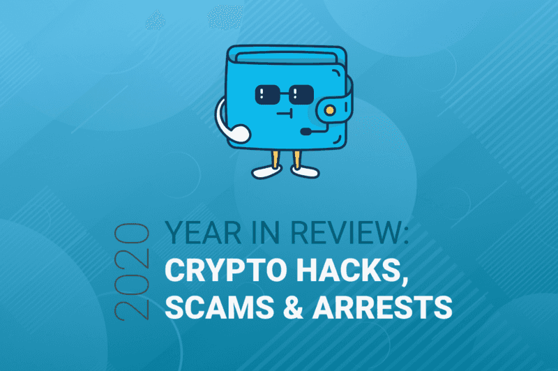

*To catch up, check out [my previous 2019 in Review](/2019-in-review-major-blockchain-crypto-security-incidents).*

**If 2019 could be classified as a wild ride, 2020 could be classified as going off the rails.**

Throughout the year we published articles covering such topics as [whitehatting funds back from phishers](/working-with-binance-to-return-10-000-of-stolen-crypto-to-a-victim), [discovering big campaigns pushing malicious browser extensions](/discovering-fake-browser-extensions-that-target-users-of-ledger-trezor-mew-metamask-and-more), [the top ten action items to prevent loss of your crypto assets](https://medium.com/mycrypto/the-10-best-things-you-can-do-to-not-lose-your-crypto-dba4f5c05c7), and [Risky Business: DeFi](https://medium.com/mycrypto/risky-business-defi-and-ethereums-coming-of-age-story-4d99465ad102). Each story we published addressed varying threat vectors that someone should be aware of when using cryptocurrency, with examples of real-life situations. The information shared in these stories are not just for the typical [MyCrypto](https://mycrypto.com/) / Ethereum user either — the lessons can be applied across the industry, no matter what chain, exchange, or wallet you prefer.

Let’s take a deeper look back at these events to see what happened and how we, as an industry, can learn from them moving forward.

*What follows is a list of the major security incidents of 2020. However, we will NOT be recapping all the rug-pulls that occurred, as there are too many to count…*

The first quarter of 2020 started off with some good news and some bad news (minus the global pandemic and the following lockdowns). We had arrest confirmations and hardware hacking research, but we also had a rise in hacks and money loss.

**Story:** [Cryptocurrency exchange Poloniex issues password reset warning](https://nakedsecurity.sophos.com/2020/01/03/cryptocurrency-exchange-poloniex-issues-password-reset-warning/)
**TL;DR:** Poloniex issued a PSA about their late-December 2019 email that announced some users were forced to reset their passwords after a tweet was made about a list going around containing email addresses and passwords.

**Story:** [YouTubers are being hijacked for crypto scams](https://decrypt.co/15931/youtubers-are-being-hijacked-for-crypto-scams)
**TL;DR:** Whilst not a new method of scamming, it became more popular for YouTube accounts to be hijacked and broadcast fake cryptocurrency giveaways using pre-recorded footage of cryptocurrency events with notable people in them.

**Story:** [Upbit Upgrades ETH Wallet Security Following $50M Hack](https://www.financemagnates.com/cryptocurrency/news/upbit-upgrades-eth-wallet-security-following-50m-hack/)
**TL;DR:** A South Korean exchange publicly stated that in November 2019 their hot wallets were compromised, and a theft of 342,000 ETH (valued ~$50,000,000) took place

**Story:** [Teen Charged Over $50M SIM-Swapping Scam on Blockchain Experts(https://www.infosecurity-magazine.com/news/teen-charged-over-50m-simswapping/)
**TL;DR:** SIM-Swapping is a real threat in this industry, despite the assumption many people have that using SMS 2FA on their accounts makes them safe. A teenager exploited this fact, netting over $50M from various entities. The 18-year-old was arrested and is facing multiple criminal charges.

**Story:** [Kraken Identifies Critical Flaw in Trezor Hardware Wallets](https://blog.kraken.com/post/3662/kraken-identifies-critical-flaw-in-trezor-hardware-wallets/)
**TL;DR:** Kraken Exchange (Security Labs dept.) discovered and disclosed a physical attack vector that extracts seed phrases from most of the Trezor products.

**Story:** [IOTA cryptocurrency shuts down entire network after wallet hack](https://www.zdnet.com/article/iota-cryptocurrency-shuts-down-entire-network-after-wallet-hack/)
**TL;DR:** IOTA shut down their network for a considerable amount of time as hackers exploited a vulnerability in the official IOTA wallet (Trinity) app to steal users’ funds.

**Story:** [Risky Business: #DeFi and Ethereum’s Coming of Age Story](https://medium.com/mycrypto/risky-business-defi-and-ethereums-coming-of-age-story-4d99465ad102)
**TL;DR:** MyCrypto founder Taylor Monahan transcribed the talk she gave at ETHDenver 2020 about DeFi and the risks involved with it. Taylor discusses potential pitfalls, previous attacks, what we learned and did not learn from past mistakes, and what we can do to improve the space.

**Story:** [Are the BZx Flash Loan Attacks Signaling the End of DeFi?](https://cointelegraph.com/news/are-the-bzx-flash-loan-attacks-signaling-the-end-of-defi)
**TL;DR:** A popular DeFi protocol suffered two attacks within a short amount of time via two flash loan exploits. The first resulted in a loss of 1,193 ETH and another 2,378 ETH was gone by the end of the second.

**Story:** [Bitcoin Scams Continue to Exploit Covid-19 Chaos in UK](https://cointelegraph.com/news/bitcoin-scams-continue-to-exploit-covid-19-chaos-in-uk)
**TL;DR:** With the recent news of a global pandemic caused by Coronavirus (COVID-19), bad actors were creating campaigns to profit from the scare and uncertainty of the times by creating fake research groups from the CDC asking for Bitcoin donations.

### BZx Again

Although not a new method of attack, a second attack occurred on the BZx protocol within a handful of days via exploiting flash loans.

https://twitter.com/dsearch3r/status/1228657292792549383

In Quarter 2, we saw more smart contract exploits and brought attention to a large campaign publishing malicious browser extensions that mimicked known brands in the industry to gain access to user secrets.

**Story:** [Hacker Exploits Flaw in Decentralized Bitcoin Exchange Bisq to Steal $250K](https://www.coindesk.com/hacker-exploits-flaw-in-decentralized-exchange-bisq-to-steal-250k)
**TL;DR:** Bisq took an “unprecedented” step and halted trading after noticing an attacker was exploiting the software to steal funds from users. It was reported that the attackers stole 3BTC and 4000XMR.

**Story:** [Discovering Fake Browser Extensions That Target Users of Ledger, Trezor, MEW, Metamask, and More](/discovering-fake-browser-extensions-that-target-users-of-ledger-trezor-mew-metamask-and-more)
**TL;DR:** MyCrypto and PhishFort published a research piece on grim campaigns ramping up to target cryptocurrency users by using Google Ads to push malicious published browser extensions that mimicked known brands.

**Story:** [Etherscan Launches “ETH Protect” to Identify and Flag Tainted ETH Addresses](https://btcmanager.com/etherscan-eth-protect-identify-flag-tainted-eth-addresses/)
**TL;DR:** One of the most used blockchain explorers — Etherscan — launched a product to give users more information about an address (taint analysis) and quickly show if they have received cryptocurrency from a known bad address.

**Story:** [dForce Drained of $25 Million in DeFi Smart Contract Exploit](https://cryptobriefing.com/dforce-drained-25-million-defi-smart-contract-exploit/)
**TL;DR:** Lending protocol dForce, which is alleged to be a fork of Compound with modified code, was attacked with an offensive that was similar to one that happened to a Uniswap pool. The attack took advantage of a standard on the imBTC contract.

**Story:** [‘Evil genius’ teens accused of stealing millions in cryptocurrency](https://news.sky.com/story/evil-genius-teens-accused-of-stealing-millions-in-cryptocurrency-11985185)
**TL;DR:** Information about a high profile SIM swap complaint filed by Michael Terpin was released. At the time of the attack, one of the main accused bad actors was only 15 years old when he allegedly SIM swapped multiple people and stole over $23M.

**Story:** [Supercomputers hacked across Europe to mine cryptocurrency](https://www.zdnet.com/article/supercomputers-hacked-across-europe-to-mine-cryptocurrency/)
**TL;DR:** Multiple supercomputers in the UK, Germany, and Switzerland were infected with cryptocurrency mining malware via compromised SSH logins to mine Monero — a privacy-focused cryptocurrency.

### dForce / Lendf
The Lendf hack is interesting because the ERC777 standard that was exploited to commit a re-entry attack was also abused to take advantage of a Uniswap pool (imBTC) a couple of days prior. But dForce did not audit their system, even though they supported the same token. There’s a [good tweet thread from defiprime](https://twitter.com/defiprime/status/1251707688213340160) on this — with evidence to suggest the code was forked from Compound Finance, which even in an open-source world is another can of worms.

**Story:** [Intercepting and Saving $5,000 Worth of Phished Crypto](/intercepting-and-saving-5-000-worth-of-phished-crypto)
**TL;DR:** When I'm looking at phishing kits, I found an open door in an active campaign, and monitored it for secrets being phished. In a rare turn of events, we managed to intercept cryptocurrency assets that were taken from victims. We swept the assets before the bad actors were able to and returned the funds to the verified owners.

**Story:** [The #TwitterHack Postmortem](/the-twitterhack-postmortem)
**TL;DR:** On July 15, 2020, a massive account takeover campaign occurred on the Twitter platform, which included using verified political accounts to promote a “trust-trading”/advanced-fee Bitcoin scam. Overall, “only” about $150k was stolen, which is small relative to the wide exposure that the bad actors had from the accounts they gained access to.

**Story:** [Working With Binance to Return $10,000 of Stolen Crypto to a Victim](/working-with-binance-to-return-10-000-of-stolen-crypto-to-a-victim)
**TL;DR:** When I was looking at more phishing campaigns and found another open door to a server that the bad actors were using. We, again, sat in the middle of their phishing frontend and the bad actors’ communication channels to whitehat sweep the phished assets away from the bad actors’ control.

**Story:** [The 10 Best Things You Can Do to Not Lose Your Crypto](https://medium.com/mycrypto/the-10-best-things-you-can-do-to-not-lose-your-crypto-dba4f5c05c7)
**TL;DR:** MyCrypto published a brief ten-step article on best practices with clear action items on how to secure your cryptocurrency assets and associated accounts. We used our extensive knowledge of how cryptocurrency is stolen and composed an actionable list.

**Story:** [Hackers Nab $16 Million In BTC Through Bitcoin Wallet Exploit](https://markets.businessinsider.com/currencies/news/hackers-nab-$16-million-in-btc-through-bitcoin-wallet-exploit-9247287)
**TL;DR:** A user did not install critical security updates on their Electrum wallet and fell victim to an [[old method of](https://blog.malwarebytes.com/cybercrime/2019/04/electrum-bitcoin-wallets-under-siege/)] attack, resulting in a loss of 1,400 BTC. The user was tricked into connecting to a malicious Electrum server, which allowed rich text in an error popup. The returned error prompted the user to update their Electrum software, but it [linked them to download malware](https://twitter.com/_benkaufman/status/1299971327231692800).

**Story:** [Escape the Dark Forest](https://samczsun.com/escaping-the-dark-forest/)
**TL;DR:** Samczsun (and crew) successfully exploited a vulnerable contract for $9,600,000 in a whitehat campaign. This story is especially interesting because Samczsun explains how they beat frontrunner bots by privately giving the signed transaction to a miner directly instead of broadcasting to the txpool.

**Story:** [Over $280M Drained in KuCoin Crypto Exchange Hack](https://www.coindesk.com/hackers-drain-kucoin-crypto-exchanges-funds)
**TL;DR:** A popular Asian based exchange, KuCoin, had their hot wallets compromised and were alerted to large withdrawals of Bitcoin and Ethereum. KuCoin is investigating with international law enforcement, and the exchange committed to covering the entire loss of customer funds with their insurance fund.

### Ledger’s Data Breach
Ledger is one of the industry-leading hardware wallets with many customers in the space. In July 2020 they issued a statement about a data breach from their e-commerce platform and their marketing platform. They were alerted of a potential data breach from their bounty program on July 14, 2020. After an internal investigation, Ledger discovered the data breach occurred on June 25, 2020, affecting some of their customers. Twitter user [UnderTheBreach tweeted](https://twitter.com/UnderTheBreach/status/1264460979322138628) about a potential breach in May 2020.

### KuCoin
KuCoin had a security breach and their keys were compromised. Assets worth a total of ~$281,000,000 were stolen. What is noteworthy with this attack is that various projects came to the aid to assist fund recovery, including Ocean Protocol, who [forked their contracts](https://www.coindesk.com/ocean-protocol-hard-fork-freezes-funds-kucoin-hack) to remove the tokens issued to the attackers.

**Story:** [Cryptocurrency exchange Liquid confirms hack](https://techcrunch.com/2020/11/18/cryptocurrency-exchange-liquid-confirms-hack/)
**TL;DR:** Liquid confirmed that their domain and email accounts had been compromised. The exchange believes the hackers may have had access to personal information including email addresses, names, shipping addresses, and encrypted passwords.

**Story:** [Hackers used GoDaddy Employees to Hack Crypto Sites: Liquid and NiceHash](https://www.thecoinrepublic.com/2020/11/23/hackers-used-godaddy-employees-to-hack-crypto-sites-liquid-and-nicehash/)
**TL;DR:** A report was published that said there is solid proof that NiceHash and Liquid were compromised through their service provider — GoDaddy.

**Story:** [$10.8M Stolen, Developers Implicated in Alleged Smart Contract ‘Rug Pull’](https://www.coindesk.com/compounder-developers-implicated-alleged-smart-contract-rug-pull)
**TL;DR:** A smart contract of a yield farming protocol (clone of Harvest and YearnFinance) had a hidden backdoor in it that allowed the contract to be drained of wBTC, ETH, DAI.

**Story:** [Ledger Adds Bitcoin Bounty and New Data Security After Hack](https://www.coindesk.com/ledger-bitcoin-bounty-new-data-security-after-hack)
**TL;DR:** Ledger alleged/ that the recent data dumps on their customers came from a rogue Shopify agent. Ledger’s new CISO, Matt Johnson, set up new procedures and policies to prevent a data breach in the future and announced a 10 BTC bounty for any information that leads to the hacker’s arrest.

**Story:** [Crypto Exchange EXMO Says Hackers Have Stolen 5% of Total Assets](https://www.coindesk.com/crypto-exchange-exmo-says-hackers-have-stolen-5-of-total-assets)
**TL;DR:** EXMO detected suspicious behavior in their hot wallets and suspended withdrawals to investigate. It was concluded that their cold storage was unaffected but five percent of their hot wallets were stolen.

---

### Observations
If we compare our observations from my [2019 edition](/2019-in-review-major-blockchain-crypto-security-incidents), it seems the industry still needs to improve. Granted, there’s no such thing as 100% security, but sometimes history repeats itself.

#### If you store your assets in a “legitimate” exchange, you’re still at risk
The year was, again, filled with hacks on cryptocurrency exchanges that hold user funds, per usual. We are seeing more exchanges cover the losses with insurance funds, and while this is ultimately a win for those who use the exchange, it’s not something worth relying on.

#### Decentralized does not mean safe
While the attack surfaces are different for decentralized products (wallets, DEX’s), and the losses receive far less attention than the large exchange hacks, there is a multitude of ways for attackers to trick you into parting with your digital assets. Phishing campaigns continue to thrive and especially continue to target products that encourage using private keys and raw seeds via websites. With the rise of decentralized exchanges (DEX), it has become more common for users to lose money being rug pulled after “apeing in.”

#### Trusting third-parties with PII is not safe
Even trusting some of the most well-known brands in the space with your personal information, including shipping address, is not at all reliable. The data can be accessed via rogue employees or software vulnerabilities and sold on the underground markets. Although most threats using this personal information are likely to see little-to-no-action, it does cause concern, especially for those known to have large holdings. Your best bet is to set up a PO Box with an assumed name to send your physical cryptocurrency items to — ideally, you don’t want your home address attached to cryptocurrency.

The goal for 2021 is the same goal we had for 2020: Let’s do better.