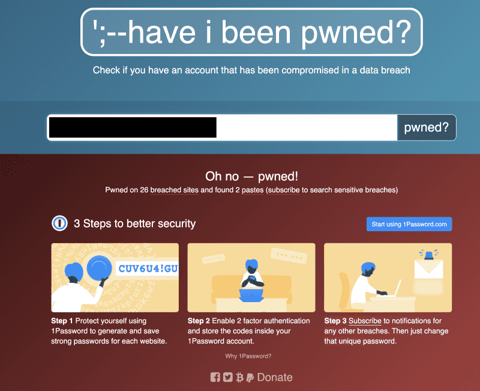

**This year is shaping up to be an interesting year in terms of security exploits and domain compromises.**

We’re halfway through the year, and already a bunch of personal information dumps and compromises have been made public. I was first made aware by the [Under the Breach](https://medium.com/u/dc18a0721bd0) Twitter feed of an uptick of vendors selling this sensitive information (specific to cryptocurrency users) on the dark markets in late May 2020.

Although the [majority of the dumps claimed in the tweet above were told to be false from the companies statements](https://cointelegraph.com/news/stolen-trezor-ledger-and-keepkey-databases-are-a-scam-says-satoshilabs), it highlighted the threat from other dumps in the cryptocurrency space and how companies have reacted to reassure and notify their users.

### Breaches in the media
* Hacker Attempts to Sell Data Allegedly Tied to Ledger, Trezor, BnkToTheFuture Customers — [Bitcoin.com](https://news.bitcoin.com/hacker-attempts-to-sell-data-allegedly-tied-to-ledger-trezor-bnktothefuture-customers/)
* Hackers have obtained over 5,000 email addresses from Coinsquare’s database and intend to use them for SIM swapping attacks — [Cointelegraph](https://cointelegraph.com/news/recent-data-hack-could-put-millions-of-dollars-in-bitcoin-at-risk)
* BlockFi’s Data Breach May Allow Criminals to Extort Rich Clients — [CoinTelegraph](https://cointelegraph.com/news/blockfis-data-breach-may-allow-criminals-to-extort-rich-clients)
* Recent Data Hack Could Put Millions of Dollars in Bitcoin at Risk — [CoinTelegraph](https://cointelegraph.com/news/recent-data-hack-could-put-millions-of-dollars-in-bitcoin-at-risk)
* Crypto exchange Coincheck says it suffered a data breach, which may have exposed some users’ personal information — [The Block Crypto](https://www.theblockcrypto.com/linked/67278/crypto-exchange-coincheck-says-it-suffered-a-data-breach-which-may-have-exposed-some-users-personal-information)

MyCrypto has been provided with some samples ([BnkToTheFuture 2020](https://twitter.com/underthebreach/status/1268243292178784256), [Coinigy 2016, Augur 2015](https://twitter.com/underthebreach/status/1264818516970127362)) from previous data breaches so we can have a better insight into writing this article knowing what kind of data are in these leaks — thank you to [UnderTheBreach](https://twitter.com/underthebreach/)

### How can this data be used?
These data dumps can be used to target individuals directly with sophisticated (and sometimes not sophisticated) attacks to gain access to specific accounts that will either allow the bad actor to pivot between accounts or to steal assets directly.

These dumps (at least the ones MyCrypto has samples of) have a lot of information that a bad actor could use to start initiating an attack — some of which include full names and physical address, [which can have its own problems in the wrong hands](https://xkcd.com/538/).

The emails in these leaks can be cross-referenced in other data breaches to see if there is a [password reuse](https://owasp.org/www-community/attacks/Credential_stuffing), which could make account takeover easy — this is why it’s important for you to have unique random strong passwords for every login, generated by a trustworthy password manager and not your brain (e.g., MyPassword2020!Facebook and MyPassword2020!Twitter won’t really cut it. Once a hash is decrypted and a bad actor sees the pattern of {$CommonPhrase}{$Year}{$Symbol}{$ServiceName} then your “security” is essentially nulled).

Some of these dumps include peripheral service account information that could be used to conduct a spear-phishing attack on you. For example, if a dump includes your onchain cryptocurrency addresses and your email address, an attacker could use some sort of onchain analysis to see what exchanges you use, and attempt to phish your exchange credentials — this is an important note because as soon as you know you were included in a data breach, you will need to review your security settings (authorisation and recovery) on all of your accounts, not just that of the directly affected.

Having good security hygiene on your accounts is paramount, and especially so when you’re dealing with cryptocurrency — a form of money that generally has no “refund” or insurance, like you will find in a stolen credit card case.

### Best practices to increase your online security
* When signing up for a service with your email address, [include a +servicename in your email address](https://www.cs.rutgers.edu/~watrous/plus-signs-in-email-addresses.html) (e.g., `foo+serviceName@gmail.com`). This will likely help you audit what service is selling your data and which service has been breached (i.e., you receive an email unrelated to serviceName)
* Use a [password manager](https://twitter.com/MyCrypto/status/1206641616624111616) to generate and store your unique passwords — you will only need to remember one strong password (or [have possession of a U2F device](https://www.yubico.com/solutions/hardware-protection-for-password-manager/)) to access your password manager.
* Be mindful of what information you are giving out and [who you are giving it out to](https://twitter.com/MyCrypto/status/1113930286390071296). Some services offer “security questions” (e.g, the name of your first pet) which can be socially engineered out of you (or you publicly post this information on social media) — be sure to input random strings in here, managed by your password manager.
* Try to “[hack yourself](https://twitter.com/sniko_/status/1064533135457546240)” to see what data an attacker needs to recover your accounts — start with your primary email account (if an attacker has access to this, they can pivot and recover your other accounts).
* [Familiarise yourself with SIM hijacking](https://medium.com/mycrypto/what-to-do-when-sim-swapping-happens-to-you-1367f296ef4d) and action any items to increase your security. You should not rely on 2FA via text-message, especially if the service offers another form of 2FA (Our friends at [CipherBlade were recently featured on a VICE documentary](https://cipherblade.com/blog/cipherblade-featured-on-vice-showtime-sim-swapping-documentary/) about this). SIM hijacking is a common technique used by bad actors to gain access to accounts and steal assets from you.
* [Hold companies accountable](https://medium.com/mycrypto/mycryptos-security-incident-response-101-36a57b17038b) for mishandling your sensitive data. Did they notify you? Did they tell you what you can do to protect your identity with the leaked information now in non-authorised hands? Have they published a post-mortem of the incident and changed policies to ensure a data breach does not happen again?