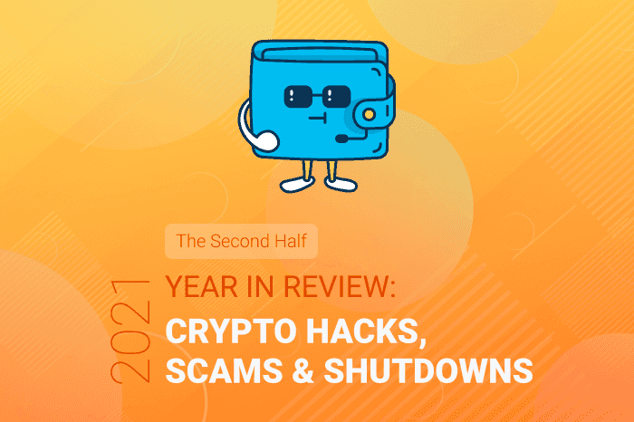

To catch up, check out [the first half of 2021 in review](/2021-first-half-in-review-major-blockchain-crypto-hacks-scams-shutdowns).

Today we’ll be taking a look at the second half of 2021 and reviewing the security events that happened in the industry with the goal of educating users and developers of common pitfalls. Whilst we don’t touch too much on individual cases relating to NFTs, NFT theft was a very common occurrence in the last two quarters of 2021, and I expect NFT theft cases to grow in the new year.

*What follows is a list of the major/noteworthy security incidents of 2021 Q3/Q4. However, we will NOT be recapping all the rug-pulls, NFT thefts, and events that occurred, as there are too many to count…*

### Story: [Yearn Awards $200k Security Boundy to xyzaudits](https://github.com/yearn/yearn-security/blob/master/disclosures/2021-06-29.md)
**TL;DR:** Thankfully no funds were lost and xyzaudits responsibly disclosed a vulnerability to the Yearn team, which allowed a bad actor to liquidate an affected strategy’s (`GenLevComp` used in yvDAI 0.3.0 vault) entire debt position on Compound and profit from the liquidation fees. Yearn awarded xyzaudits with the maximum bounty reward of $200,000.

### Story: [My Research on Twitter Reply Scam Rings](/investigating-twitter-reply-scam-rings)
**TL;DR:** I published a written report with data on the scam rings that operate on Twitter to trick users out of their cryptocurrency. These scam rings are still pretty much everywhere on “Crypto Twitter,” even months after this article was published, so it must still be profitable and Twitter has not prioritised their detection.

### Story: [Ransomware Hackers Demand $70M in Bitcoin](https://www.forbes.com/sites/roberthart/2021/07/05/ransomware-hackers-demand-70-million-in-bitcoin-claim-massive-us-attack-as-biden-investigates-possible-russian-involvement/?sh=2b48318ff3b0)
**TL;DR:** A group of Russian-speaking hackers claimed responsibility for a massive ransomware attack that hit 200 firms in the US and hundreds more around the world, demanding $70M in Bitcoin to restore the companies’ data.

### Story: [CasaHODL User Attacked by a “$5 Wrench Attack”](https://twitter.com/nneuman/status/1413171857625214978?s=21)
**TL;DR:** Whilst no major harm happened to the user, they were drugged by a date they met online. The attacker was then able to access the intoxicated user's phone and password manager to steal funds from centralised exchanges. However, most of the user's funds were held in their CasaHODL account, which the attacker was unable to compromise thanks to the 3-of-5 multisig that protected them.

### Story: [Edgar Arout Releases “Reorg as a Service” Project](https://twitter.com/EdgarArout/status/1413322294345097218)
**TL;DR:** Arout released a repository, which was more of a proof-of-concept than a fully-fledged mainnet project, in an attempt to bribe/communicate with miners to organise a block reorg. This received polarized responses from the community. However, six days later, Edgar [shelved the project](https://twitter.com/EdgarArout/status/1415792147673108485). Shortly after, the Flashbots Organisation [released a statement on the project](https://twitter.com/phildaian/status/1416065133495848962?s=21).

### Story: [Swedish Fraudster Jailed 15 Years for $16 Million Crypto Con](https://decrypt.co/75611/swedish-fraudster-jailed-15-years-16-million-crypto-con)
**TL;DR:** Con artist Roger Nils-Jonas Karlsson reportedly used Coinbase to review funds from would-be investors in his fraudulent program. He pled guilty to securities fraud, wire fraud, and money laundering charges.

### Story: [Anyswap Multichain Router V3 Exploit Statement](https://medium.com/multichainorg/anyswap-multichain-router-v3-exploit-statement-6833f1b7e6fb)
**TL;DR:** On July 10, 2021, the Anyswap V3 liquidity pool was exploited on BinanceSmartChain. The attacker deduced the private key to an MPC ([multi-party computation](https://www.fireblocks.com/what-is-mpc/)) account and drained the pools of ~$2.3M USDC and $5.5M MIM. Anyswap replicated the attack and audited their bridges for the exploit but found no issue. They commissioned TrailOfBits for auditing.

### Story: [THORChain Exploited for 2400ETH](https://thearchitect.notion.site/THORChain-Incident-07-15-7d205f91924e44a5b6499b6df5f6c210)
**TL;DR:**  An attacker made use of a custom contract with Bitfrost implementation to trick the system into thinking some value was deposited whereas, in reality, it was 0. They cycled this method and each time drained more assets.

### Story: [Lookout Unearths Android Crypto-Mining Scams](https://resources.lookout.com/blog/lookout-unearths-android-crypto-mining-scams)
**TL;DR:** Lookout, a device security vendor, identified over 170 Android apps, including 25 on the Play Store, intentionally scamming users who were interested in cryptocurrencies. The apps were designed to offer a cloud mining service, but after some analysis Lookout concluded that there was no mining happening. The apps scammed a cumulative 93,000 people.

### Story: [Ethereum Co-Founder Says Safety Concerns Has Him Quitting Crypto](https://www.bloomberg.com/news/articles/2021-07-16/ethereum-co-founder-says-safety-concern-has-him-quitting-crypto)
**TL;DR:** Anthony Di Iorio stated he’s done with the cryptocurrency world, partially because of personal safety concerns - he’s had a personal security team with him since 2017. He wants to refocus on the philanthropy world instead.

### Story: [Man arrested in Connection with Alleged Role in Twitter Hack](https://www.justice.gov/opa/pr/man-arrested-connection-alleged-role-twitter-hack)
**TL;DR:** On July 21, 2021, a United Kingdom citizen was arrested in Spain by Spanish National Police in connection to the [2020 Twitter hack](/the-twitterhack-postmortem).

### Story: [THORChain Hacked Again, This Time for Around ~$8M](https://twitter.com/THORChain/status/1418360743523618825)
**TL;DR:** Using a “sophisticated attack,” someone was able to exploit THORChains ETH Router for $8M. THORChain halted the network and offered a 10% bounty, citing a possible “whitehat” as the attack was intentionally limited.

### Story: [THORChain ERC20 Logic Exploited to Steal Tokens](https://twitter.com/sniko_/status/1418592740594667522)
**TL;DR:** The RUNE ERC20 contract had “intentional design decision” logic that allowed someone to steal RUNE tokens from individuals. Around July 23, 2021, someone airdropped a malicious token (with manipulated price feed, showing the airdrop to be worth multiple thousands of dollars) to RUNE holders, which prompted users to try selling the token via DEX (such as Uniswap). The attack made use of calling `approve()` (a seemingly innocent function call), which relayed a call to `transfer()` on the RUNE contract, which was guarded by `tx.origin` instead of `msg.sender`.

### Story: [Monero’s Former Maintainer Arrested in the US for Allegations Unrelated to Cryptocurrency](https://cointelegraph.com/news/monero-s-former-maintainer-arrested-in-u-s-for-allegations-unrelated-to-cryptocurrency)
**TL;DR:** A popular figure within the Monero ecosystem - fluffypony/Riccardo Spagni - was arrested in the United States at the request of the South African government for fraud charges that date back to 2009-2011.

### Story: [BitcoinSV Experiences a Massive 51% attack](https://twitter.com/LucasNuzzi/status/1422637361138130944)
**TL;DR:** On Aug 3, 2021, some “serious hashing power” was unleashed on BSV, causing a 51% attack with the biggest reorg being 14 blocks deep and three versions of the chain were being mined simultaneously.

### Story: [PopsicleFinance Exploited for ~$25M](https://twitter.com/defiprime/status/1422708265423556611)
**TL;DR:** Although having conducted multiple audits, attackers exploited PopsicleFinance for the sum of ~$25M. According to researcher [Mudit Gupta, the hack “was complex but the bug was simple.”](https://twitter.com/Mudit__Gupta/status/1422797923037814786)

### Story: [$600M Stolen in Compromised Key Attack with PolyNetwork](https://twitter.com/PolyNetwork2/status/1425073987164381196)
**TL;DR:** In a series of events, after following one of the largest economical on-chain hacks to date, the [hacker blogged their thoughts on chain](https://twitter.com/sniko_/status/1425110175246061569). After some days, PolyNetwork claimed they recovered the entirety of the funds.

### Story: [$7M Drained from DAOMaker](https://twitter.com/defiprime/status/1425818726658494471)
**TL;DR:** Although the smart contract for DAOMaker was not verified (we only know the bytecode), someone managed to exploit the logic to eventually call `withdrawFromUser()` function to drain the contract.

### Story: [Japanese Exchange Liquid Hacked for $80M](https://twitter.com/Cointelegraph/status/1428244591896059906)
**TL;DR:** CoinTelegraph identified 107BTC, 9000000TRX, 11000000XRP, and ~$60M ETH that were taken by hackers from Liquid’s warm wallets.

### Story: [BitConnect Promoters Pay $12M in Cash, Bitcoin to Settle $2B alleged scam](https://decrypt.co/79066/bitconnect-promoters-pay-12m-bitcoin-cash-settle-sec)
**TL;DR:** BitConnect shut down in 2018 but many promoters of the alleged Ponzi scheme reached a settlement with the SEC. Later, [director and promoter Glenn Arcaro pleaded guilty](https://www.justice.gov/usao-sdca/pr/director-and-promoter-bitconnect-pleads-guilty-global-2-billion-cryptocurrency-scheme).

### Story: [Alleged Dogecoin Mining Scam Rakes in $119M](https://decrypt.co/79511/dogecoin-mining-scam-119-million-reports-turkey)
**TL;DR:** Dogecoin branding was used to steal from ~1,500 people to the tune of $119M, according to local media in Turkey. The scam involved selling mining contracts to people with the promise of “100% returns.”

### Story: [Coinbase Sent Erroneous Notifications to 125k Customers About Their 2FA](https://twitter.com/coinbase/status/1431729517475758083)
**TL;DR:** On August 28, 2021, Coinbase sent a series of tweets explaining the erroneous notifications that were sent to 125k customers about having their 2FA settings changed.

### Story: [C.R.E.A.M v1 Suffers an Exploit](https://twitter.com/CreamdotFinance/status/1432249771750686721)
**TL;DR:** CreamFinance issued a statement about an exploit that harnessed a contract standard to perform a re-entrancy attack, draining the C.R.E.A.M pool of 418,311,571 AMP and 1,308.09 ETH.

### Story: [Launchpad Service Miso Exploited by Supply Chain Attack](https://arstechnica.com/information-technology/2021/09/cryptocurrency-launchpad-hit-by-3-million-supply-chain-attack/)
**TL;DR:** A launchpad service by SushiSwap was hacked, causing the platform to lose/misdirect 864.8ETH. SushiSwap’s investigation led to the discovery that an anonymous contractor called “AristoK3” was the culprit who committed the malicious code. The [funds were later returned](https://etherscan.io/address/0x3ddd8b6d092df917473680d6c41f80f708c45395).

### Story: [Bridging Protocol pNetwork Suffers $12M Hack](https://decrypt.co/81301/defi-bridging-protocol-pnetwork-suffers-12-million-hack)
**TL;DR:** A bug in the pNetwork code caused 277 BTC to be stolen from the protocols bridge on Binance Smart Chain. pNetwork [tweeted about it](https://twitter.com/pNetworkDeFi/status/1439690593211490324) and offered a $1.5M bounty if funds were returned.

### Story: [IndexedFinance Hacked for $16M](https://twitter.com/peckshield/status/1448811902117679104)
**TL;DR:** Through two transactions (targeting DEFI5 and CC10), Indexed Finance was exploited via a vulnerability in the way the pool value was calculated. [PeckShield wrote a great mini postmortem](https://twitter.com/peckshield/status/1448811902117679104) about it.

### Story: [Teen Steals $16M and Tests “Code is Law”](https://www.coindesk.com/tech/2021/10/22/after-stealing-16m-this-teen-hacker-seems-intent-on-testing-code-is-law-in-the-courts/)
**TL;DR:** Following the IndexedFinance exploit, a discussion in the exploit “war room” led experts to believe they have found the attacker’s real-world identity; an 18-year-old mathematics student called “Andy.” IndexedFinance stated that Andy refuses to return the funds under the assertion that he “executed a full legal arbitrage trade.”

### Story: [Polygon Double-Spend Bug Fix - $2M Bounty](https://medium.com/immunefi/polygon-double-spend-bug-fix-postmortem-2m-bounty-5a1db09db7f1)
**TL;DR:** A whitehat hacker named Gerhard Wagner submitted a bug on October 5th, 2021, describing an exploit on the bridge that allowed for multiple exits using the same funds - up to 223 times. Polygon confirmed the bug within 30 minutes of the report and began fixing it.

### Story: [Airdrop Scams Start to Become More Common](https://blog.coinbase.com/security-psa-airdrop-phishing-campaign-38b880c0298a)
**TL;DR:** Coinbase, [MyCrypto](https://twitter.com/sniko_/status/1438643879851528199), and others began to see a common occurrence of airdrop scams whereby tokens are sent to your address and when you try to transfer/sell them via Uniswap, they revert and you are directed to a website that tries to scam you out of your highest holding assets.

### Story: [Cryptocurrency Loan Platform Implodes in $130M Hack](https://www.vice.com/en/article/m7vjjy/cryptocurrency-loan-platform-implodes-in-dollar130-million-hack)
**TL;DR:** For the third time, C.R.E.A.M suffered another hack that resulted in a $130M loss to the protocol. This attack was performed via flash loan with an [incredibly complex transaction](https://twitter.com/Mudit__Gupta/status/1453401698563596293?s=20).

### Story: [Oracle Manipulation on Fuse Pool #23](https://twitter.com/RariCapital/status/1455569653820973057)
**TL;DR:** On November 2, 2021, a Rari Capital product (Fuse) experienced an oracle pricing manipulation on the VUSD assets and drained the pool (id 23).

### Story: [Revealed: The Cryptoqueen’s £13.5m London Penthouse](https://www.bbc.co.uk/news/stories-59062959)
**TL;DR:** During a trial in Germany, a penthouse property belonging to Dr. Ruja Ignatova, the founder of money laundering operation OneCoin. A BBC article highlighted details of the penthouse, as well as the apparently despondent state of a pair of men who had worked for her. Ignatova vanished in 2021 with $13B.

### Story: [SilkRoad Admin Forfeits $667K Worth of Bitcoin to British Authorities](https://decrypt.co/85176/silk-road-admin-forfeits-667000-worth-bitcoin-british-authorities)
**TL;DR:** Thomas White was ordered to forfeit his Bitcoin holdings after having pleaded guilty in 2019 to crimes committed while acting as administer to the SilkRoad.

### Story: [DeFi Protocol bZx Compromised Again: $55M Stolen in Private Key Leak](https://www.theblockcrypto.com/linked/123429/defi-protocol-bzx-compromised-again-55-million-stolen-in-private-key-leak)
**TL;DR:** The private key that controls the project’s deployment on Polygon and Binance Smart Chain was compromised, and a suspected $55M was siphoned from attackers.

### Story: [Unlock Protocol Attack Post-Mortem](https://unlockprotocol.notion.site/Sunday-November-21st-2021-Incident-Update-a8e05ba111284d5ba43872fa5f00bccb)
**TL;DR:** Unlock Protocol published a post-mortem about their attack that involved a private key compromise that caused some tokens to be dumped on Uniswap, sending the price of the token into a freefall.

### Story: [DeFi Protocol BadgerDAO Exploited for $120M in Front End attack](https://www.theblockcrypto.com/post/126072/defi-protocol-badgerdao-exploited-for-120-million-in-front-end-attack?utm_source=twitter&utm_medium=social)
**TL;DR:** Another large attack on a cryptocurrency protocol resulted in $120M being stolen from BadgerDAO users. The front end was compromised and prompted some users to give spending access to the attacker. One [user lost ~$50M in a single transaction](https://etherscan.io/tx/0x951babdddbfbbba81bbbb7991a959d9815e80cc5d9418d10e692f41541029869). [BadgerDAO released a technical post-mortem](https://badger.com/technical-post-mortem) some days later.

### Story: [Indian Prime Minister Suffers a Twitter Hack, Sends Tweet Promising Bitcoin](https://www.coindesk.com/business/2021/12/12/india-prime-minister-suffers-another-twitter-hack-fake-tweet-sent-promising-bitcoin-to-all-indians/)
**TL;DR:** The account was restored quickly, but the hacker had enough time to tweet that India had adopted Bitcoin as legal tender and the Indian government had bought 500 Bitcoin.