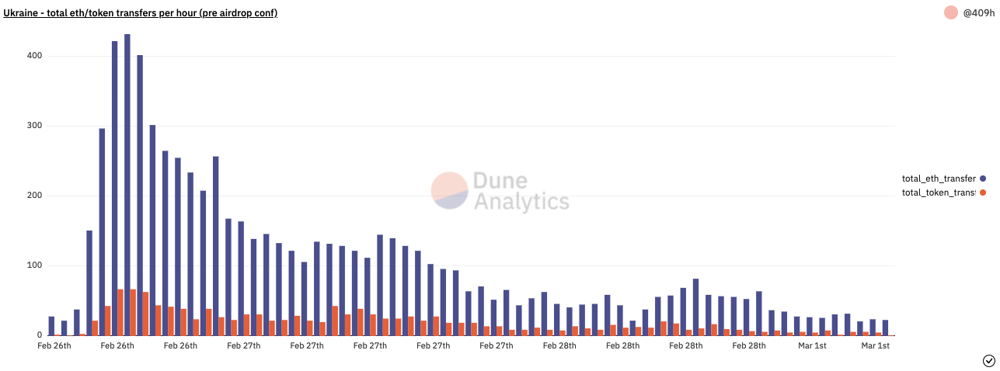
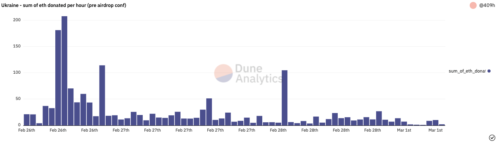
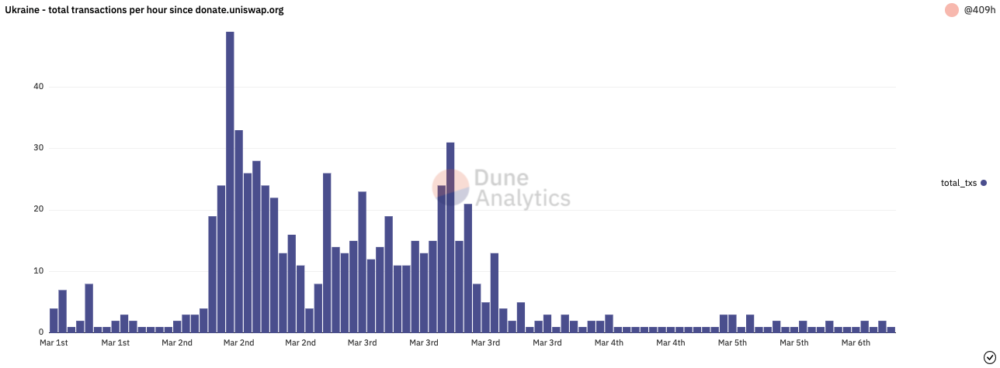
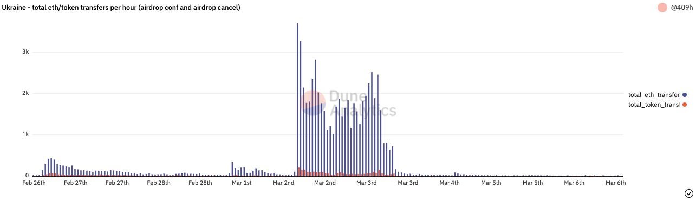
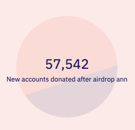
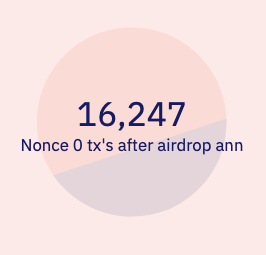
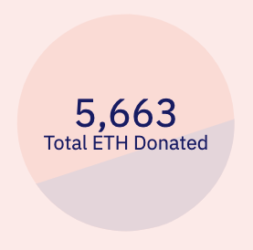

The purpose of this is to discuss only the cryptocurrency events that occured after @Ukraine tweeted they were accepting crypto donations to aid [the situation of Russia invading](https://en.wikipedia.org/wiki/2021%E2%80%932022_Russo-Ukrainian_crisis#Escalation_and_invasion_(February_2022_%E2%80%93_present)).

On 2022-02-26, @Ukraine tweeted that they were accepting crypto donations.

https://twitter.com/Ukraine/status/1497594592438497282

```txt
0x165CD37b4C644C2921454429E7F9358d18A45e14 (ETH)
357a3So9CbsNfBBgFYACGvxxS6tMaDoa1P (BTC)
```

Whilst support was given, there was some suspicion that the account was hacked, and a lot of people were hesitant to send cryptocurrency to the addresses.

After the tweet was confirmed to be legitimate and the cryptocurrency would help those in need in Ukraine by prominent figures in the space, support still continued.

https://twitter.com/TomicahTD/status/1497601610775769094

On 2022-03-01 (March 1st), @Ukraine answered to speculators that an airdrop had not been confirmed.

https://twitter.com/Ukraine/status/1498549165646921728

Below is a graph of the count of eth and token transfers into the Ukraine Ethereum account up until block 14299516 - which is the last block before the airdrop was confirmed.



Below is a graph of the sum of eth donated to Ukraine per hour up until block 14299516 - which is the last block before the airdrop was confirmed.



Also on this day, Uniswap team launched an easy to use interface to donate _any_ token to @Ukraine and have them be able to realise its value (as the donation address only supported ETH and USDT due to it being an exchange deposit address) by routing the donation through Uniswap and have the output of ETH to the @Ukraine donation address.

https://twitter.com/haydenzadams/status/1498683412869177354

This helped have this amount of transaction volumne into the Ukraine donation address per hour.




On 2022-03-02 (March 2nd), @Ukraine tweeted that an airdrop ***was*** confirmed.

https://twitter.com/Ukraine/status/1498911922791583746

We can see from the graph where exactly the airdrop was confirmed as it dwarfs all previous activity.



Now, whilst it was never said was this airdrop was, it still incentivised a lot more accounts to donate. In fact, it caused 57,542 new accounts to send ETH to the Ukraine account.



What is more interesting, to me at least, is that of these 57k new accounts, 16k accounts were "created" to solely donate - potentially to try to game the airdrop. These 16,247 accounts sent ETH to Ukraine as their first outgoing transaction onchain.



On 2022-03-03 (March 3rd), the Ukraine president tweeted that the airdrop was to be cancelled, but NFTs will be issued instead.

https://twitter.com/FedorovMykhailo/status/1499348177002151937

Whilst donations are still trickling in, as of block 14336258, @Ukraine has recieved a total of 5663ETH.

