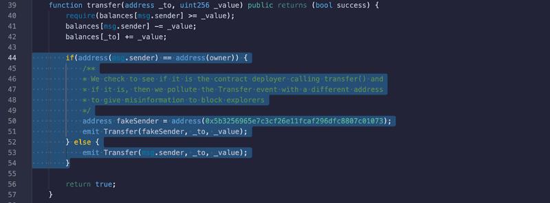
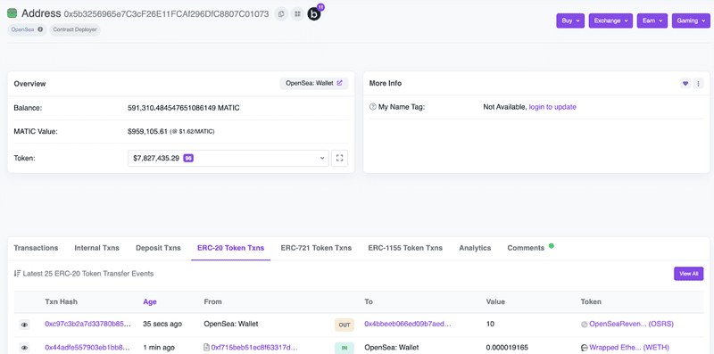
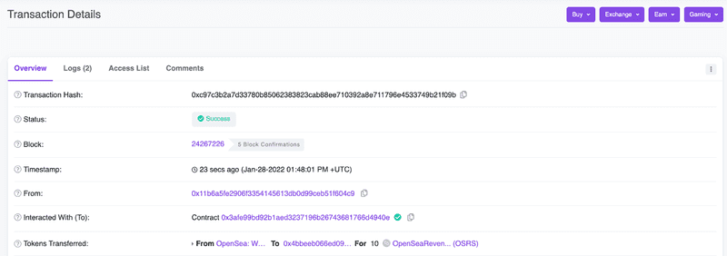
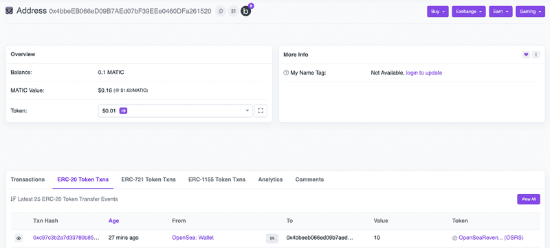
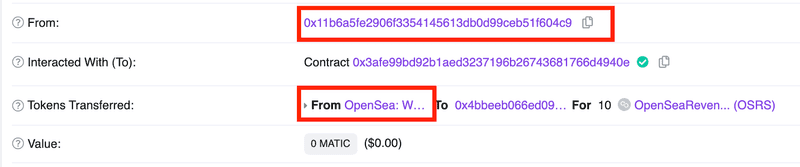
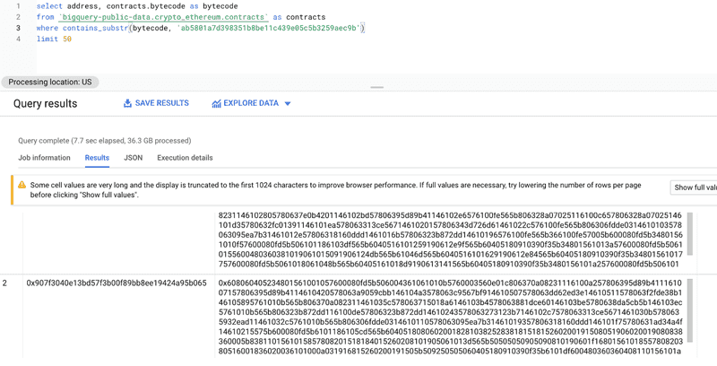
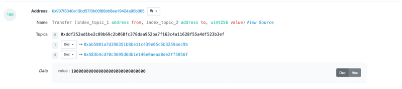
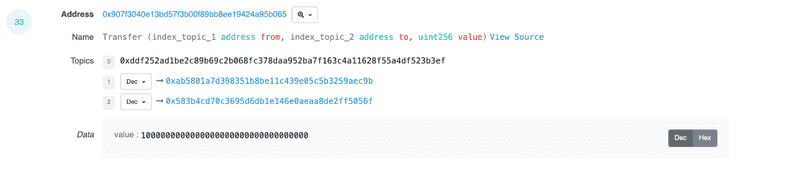
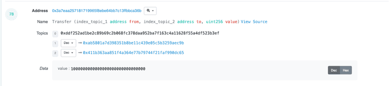

Blockchain index services rely on contract [Events](https://ethereum.org/ig/developers/tutorials/logging-events-smart-contracts/) to help archive data and give you a record of a transaction in a nice user-interface, commonly referred to as a “Block Explorer” like [Etherscan](https://etherscan.io/). A malicious-intent contract can behave like “normal,” but pollute these events to trick block explorers to give out misleading information on where a token originated from to unsuspecting users.

For example, a malicious user could deploy a simple ERC20 contract and “airdrop” it a bunch of users, create a healthy-looking liquidity pool on an automated-market-maker and wait for users to either buy or sell based on misplaced hype due to thinking the token is part of something that by a known-developer/entity.

### Breakdown
An ERC20 token (which is a common-standard of token interfaces) is a [set of properties, functions, inputs, outputs, and events](https://eips.ethereum.org/EIPS/eip-20) for a contract. As long as our contract has the correct function fingerprints, we can have custom logic within those functions - even ones to give incorrect data.

For example, we can make it so some/all block explorers will show a different address to the end user (in some views) if the contract deployer sends them a token. Assume the following;

* The contract deployer is malicious and wants to create some hype for their token
* The token has some liquidity in an AMM (such as Uniswap) for users to buy/sell, with the main liquidity provider position belonging to the group behind the token (read: eventual [rug pull](https://www.coingecko.com/en/glossary/rug-pulled))
* The faked sender is known to many users and not some random address

Also be aware that this is not exclusive to [ERC20](https://eips.ethereum.org/EIPS/eip-20)... polluted data can be inserted in any token standard events, such as NFTs ([ERC721](https://eips.ethereum.org/EIPS/eip-721), [ERC1155](https://eips.ethereum.org/EIPS/eip-1155)), to confuse users and potential investors to think a project has specific interested parties/influencers, when in reality it does not.

This problem isn’t “new” but we are writing this article to highlight what is happening and what users could do to have more diligence before “apeing” into projects that “looks legit”.

When a block explorer sees an event being emitted from a transaction, they log it in their offchain database and build relationships with other pieces of data so they can build a nice relational graph of the transaction to display to an end user in their UI.

### Proof of Concept
We will [deploy a proof-of-concept contract](https://polygonscan.com/address/0x3afe99bd92b1aed3237196b26743681766d4940e), using an old version of solidity (due to most of the [code being forked from a repo made 4 years ago](https://github.com/ConsenSys/Tokens/blame/fdf687c69d998266a95f15216b1955a4965a0a6d/contracts/eip20/EIP20.sol)), but also to demonstrate that it is not an issue with any Solidity version or anything within Ethereum, but a trust problem from contracts with off-chain applications trusting Events being emitted from potentially untrustworthy contracts. Generally speaking, the inherit trust on the Event being “correct” is *fine*, it is a way for contracts to give usable data to offchain programs to index.

In the above contract (located at [`0x3afe99bd92b1aed3237196b26743681766d4940e`](https://polygonscan.com/address/0x3afe99bd92b1aed3237196b26743681766d4940e)), we have modified the logic to change the sender address in the Transfer event to be the labelled “OpenSea: Wallet” address on popular block explorers only if we (the one who created the contract) sends tokens.

What this does is when the block explorer indexes that event, it sees from the Transfer event that address 0x5b32…1073 sent tokens instead of the actual initiator 0x11b6…04C9, which can lead to this method being harnessed by bad actors to trick users into thinking;

* A popular figure has a vested interest in the token
* A popular figure is offloading a large portion of the tokens
* The token is legitimate because on block explorers it shows known entities “interacting” with the token contract

Let’s call `transfer()` from the contract deployer address and see what the block explorer indexes. Remember, we are simply moving tokens from my address (0x11b6...04C9) to a destination (0x4bbe...1520). [“OpenSea: Wallet” ERC20 Activity](https://polygonscan.com/address/0x5b3256965e7c3cf26e11fcaf296dfc8807c01073#tokentxns) view shows it seems to have sent a token called OpenSeaRevenueShare to the destination

[The transaction](https://polygonscan.com/tx/0xc97c3b2a7d33780b85062383823cab88ee710392a8e711796e4533749b21f09b) indicates (in “Tokens Transferred”) that “OpenSea: Wallet” sent tokens to the destination address

[The destination](https://polygonscan.com/address/0x4bbeeb066ed09b7aed07bf39eee0460dfa261520#tokentxns) address shows that “OpenSea: Wallet” transferred them 10 tokens.

### What to Look For
Although most malicious contracts that do this to exploit users are not “verified”, as in we are only exposed to the [bytecode](https://blog.mycrypto.com/the-ethereum-virtual-machine---how-does-it-work-) on block explorers, it can be hard for users to verify if the events are polluted with bad data based on some condition, like in our proof-of-concept. If a contract is not verified, as in you cannot see the Solidity/Vyper/… code and are only exposed to the byte code, then you should be taking precautions anyway before interacting with the contract.

If a token is “airdropped” to you or another entity, you should be cautious especially if you try to liquidate the token on a DEX as there have been some past events that have used methods of creating artificial price to steal from you.

https://twitter.com/sniko_/status/1438643879851528199

https://twitter.com/sniko_/status/1418592740594667522

One quick way, although not foolproof due to multisender contracts for airdroppers, is to check to see if the event parameters match the transaction initiator. For example, if the transaction “From” field does not match the event, proceed with caution.

The method of polluting events with bad data is on-going on mainnet. A known problem. For example, if we run the following query on Google BigQuery then we can get a small insight on what is happening with contracts emitting events to fool indexers into thinking Vitalik Buterin (0xab5801a7d398351b8be11c439e05c5b3259aec9b) is using their token.

### Abuse Examples

#### ElonPlaid (0x907f3040e13bd57f3b00f89bb8ee19424a95b065)

Emitting a `Transfer()` event polluted with Vitalik Buterins address on the [constructor](https://etherscan.io/tx/0xb7ab98ee1f8ec0c68b2033b2615a67cb6217ba34f23f16a0f3de852ef638f27a) for the entire supply of the token

Emitting a Transfer() event polluted with Vitalik Buterin address when [trading opens](https://etherscan.io/tx/0xb4132c47674747f2e29283d394cba0e5ef3050f47b10a794d003479bf642be7c) with the token

1. Contract creator [supplied liquidity to a DEX (4ETH worth)](https://etherscan.io/tx/0xaee0f08830484be4362b42a83b9058dbf96e92ea425760ae0250963f4875006d)
2. Three days later, [removed 6ETH liquidity](https://etherscan.io/tx/0xc966569bc72ff16ceefeeaa3f8e21e0828906a5630ac92f1d66dd97717c51784), rugging the project for 2ETH profit

#### KenshaInu (0x3a7eaa257181719965f8ebe64bb7c13ffbbca36b)

Emitting a `Transfer()` event polluted with Vitalik Buterins address on the [constructor](https://etherscan.io/tx/0x35b908a227647e0bb2db1f6f9a4fbda1feb097e903112d97f666408eb2b18c96) for the entire supply of the token

1. Contract creator [supplied liquidity to a DEX (5ETH worth)](https://etherscan.io/tx/0x0ff5179e8c7a1c6064ff36290ad4e54b372df84410b1320906e9724ab0d43eff)
2. Three days later, [removed 6.9ETH liquidity](https://etherscan.io/tx/0xd8e66ef3775f37de170df94ac8630e0e51062044c4f6cc5f837b3401b546342c), rugging the project for 1.9ETH profit

#### IronDoge (0xf6072df56114e1a1c76fe04fb310d468c9ba8c38)

Emitting a `Transfer()` event polluted with Vitalik Buterins address on the [constructor](https://etherscan.io/tx/0xb897a68c38a4b33c0e30e9946a53b45aeeb89fdc3398c9d2deaab28d346086ed) for the entire supply of the token

1. Contract creator [supplied liquidity to a DEX (4ETH worth)](https://etherscan.io/tx/0xbb4e8e18f5771aad18bf2a4de29b5879a0a7af31b06a37ac07bbb08a0c1e024e)
One day layer, [removed 5.8ETH liquidity](https://etherscan.io/tx/0x6fd8584c139af694da9e74c82c7a1912e16ed5da29940934df4a3acfeff87dd3), rugging the project for 1.8ETH profit

These are just three examples of many. Bad actors are taking advantage of polluting events to fool users and they are not only targeting Vitalik Buterin's known address.

### Summary
Although block explorers are extremely helpful in visualizing blockchain data, their logic can be abused to show misleading/incorrect data. It seems suitable to remind you about the old blockchain adage “Don’t trust, verify”, especially when we all put trust in block explorers to give absolute accurate data and not think about how they interpret the data.

It’s a known and potentially hard problem to fix, and I hope this article helps people act with less FOMO and with more care before “apeing” into a project because it *looks* like someone has invested in it, when they really haven't.