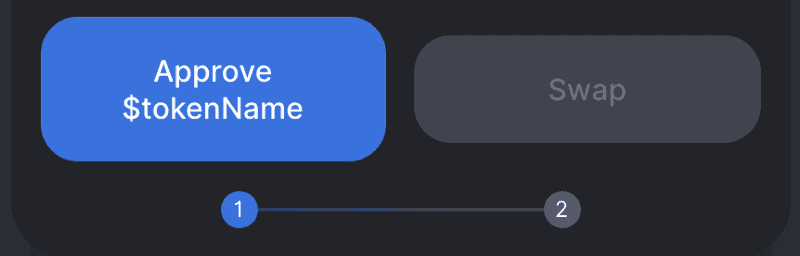
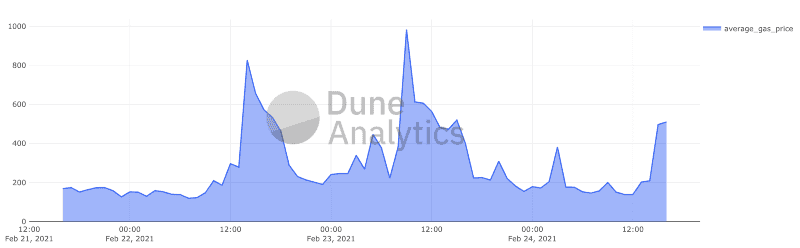
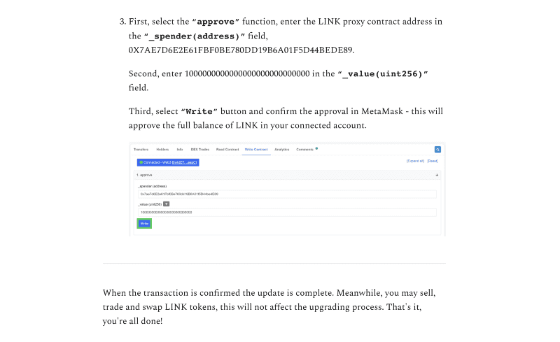

### Overview
A lot of tokens on Ethereum use the [ERC/EIP20 standard](https://eips.ethereum.org/EIPS/eip-20). This is a standard interface for the token contract that details the contract properties, functions, function arguments, and function return types.

One of these standard functions is `function approve(address _spender, uint256 _value) public returns (bool success)`. This allows a third-party to send tokens from your account on your behalf. You’ll recognize this pattern if you’ve ever done a swap through an AMM (like [Uniswap](https://app.uniswap.org/#/swap)) as you’ll have to approve the AMM to spend your tokens before you swap.



Bad actors have learned how to exploit this function, as it’s harder for unsuspecting users to avoid when they’re only expecting scams that outright ask for their private keys (like they usually do). Exploiting token approvals is a clever approach because users generally think: *“If they don’t have my key then they can’t sign a transaction, so they cannot steal my assets.”* Whilst generally accurate, this is not true when we talk about ERC20 tokens (and other token standards).

Right now, at least on my radar, is a scam campaign targeting Chainlink token holders (Chainlink has a market capitalization at $11B with ~450,000 holders). The funnel for this scam campaign is a mailing list — check your inbox for communitychainlink@substack.com and delete and unsubscribe (be vigilant, as they may [resell this mailing list](https://support.substack.com/hc/en-us/articles/360037465992-How-do-I-export-my-email-or-subscriber-list-) or use it again).

The malicious campaign details a fake upgrade to the token which promises 68% less gas, supports meta-transactions, and allows you to participate in future votes.

The promise of less gas is supposed to strike FOMO into the hearts of users so they “upgrade” as soon as possible without thinking — this is taking advantage of the current high gas prices on the Ethereum network and peoples’ desires to spend less on TX fees.



The scam email campaign outlines details on how to upgrade, and the bad actors are publishing a verified contract on-chain to make it look more legitimate. However, if a user reads the contract, they would understand how the token approval call is abused to steal their tokens.

The guide is generic, lengthy, and includes screenshots on how to execute this upgrade using popular UIs, such as MyCrypto and MyEtherWallet. The scam then takes its final form when users are prompted to set an approve() for their contract address at 1,000,000,000 tokens for each user. This means that the bad actors would then have permission to withdraw up to 1,000,000,000 Chainlink tokens (or the tokens from whichever protocol is being targeted) from the account approval was given on.



The spender they want the user to approve is a smart contract ([0x7AE7D6E2E61FBF0BE780DD19B6A01F5D44BEDE89](https://etherscan.io/address/0x7AE7D6E2E61FBF0BE780DD19B6A01F5D44BEDE89)), which is a relay that allows the contract owner ([0x71899b741e2316b756ad98cdf425d84f996017a0](https://etherscan.io/address/0x71899b741e2316b756ad98cdf425d84f996017a0)) to call `transferFrom()` on the Chainlink token smart contract, allowing them to “drain” users’ account balances.

At time of writing, [4 unique addresses](https://explore.duneanalytics.com/queries/20936/source) have followed the steps to sign the approve() transaction:

* [0x2a5c6607ef091f96ee1fca635db56eff18ad1fc8](https://etherscan.io/address/0x2a5c6607ef091f96ee1fca635db56eff18ad1fc8) ([tx](https://etherscan.io/tx/0x0545c1dbd7bc09f64706dc4424b2986b3925cbb558f2ef5ee2c873dc33e660e9))
* [0x7923338eb2c6b8b43407f8fd3fd75826c1c64c8c](https://etherscan.io/address/0x7923338eb2c6b8b43407f8fd3fd75826c1c64c8c) ([tx](https://etherscan.io/tx/0x1db13a784d71a49fd0302d44cd3d3e2a33f39f3ca813b1d00c102cc9509a2622))
* [0xc744a98c2e745c5da9338f9a82fdedbf6778a96d](https://etherscan.io/address/0xc744a98c2e745c5da9338f9a82fdedbf6778a96d) ([tx](https://etherscan.io/tx/0x4f819dd199bae0966743327a4ba6bf172ba0240bdd5038346d99b824758eca4a))
* [0xf7db1796ee8603f3a5de43793581e038027fb9fb](https://etherscan.io/address/0xf7db1796ee8603f3a5de43793581e038027fb9fb) ([tx](https://etherscan.io/tx/0xb0de2974b032887974bbd2ce6b4590fc33810ce40fdd00a4e7e04a3698f2497c))

Once the bad actor has a high enough Chainlink funds allowance from user approvals, they’ll call `transferFrom()` on their contract address and move tokens from the unsuspecting users’ accounts into an address that they control.

Below is the [verified smart contract code](https://etherscan.io/address/0x7AE7D6E2E61FBF0BE780DD19B6A01F5D44BEDE89#code) on Ethereum mainnet. It’s also worth noting that this contract LessGasProxy is token agnostic, so this campaign is probably targeting other token communities.

```sol
pragma solidity 0.6.12;

interface IERC20Token {
    function allowance(address _owner, address _spender) external view returns (uint256);
    function transferFrom(address _from, address _to, uint256 _value) external returns (bool);
}

contract LessGasProxy {
    address public owner;

constructor() public {
        owner = msg.sender;
    }

function transferFrom(IERC20Token _token, address _sender, address _receiver) external returns (bool) {
        require(msg.sender == owner, "access denied");
        uint256 amount = _token.allowance(_sender, address(this));
        return _token.transferFrom(_sender, _receiver, amount);
    }

function transferGas(IERC20Token _token, address _sender, address _receiver, uint256 _amount) external returns (bool) {
        require(msg.sender == owner, "access denied");
        return _token.transferFrom(_sender, _receiver, _amount);
    }
}
```

The bad actor’s EOA (externally owned account)([0x71899b741e2316b756ad98cdf425d84f996017a0](https://etherscan.io/address/0x71899b741e2316b756ad98cdf425d84f996017a0)) that can drain users’ tokens has been funded only once from another account ([0xe7f7d950e32b98a619439abd6f2e6463f3a2d908](https://etherscan.io/address/0xe7f7d950e32b98a619439abd6f2e6463f3a2d908)).

So far, the bad actors have moved 266 LINK tokens (valued at $7,700). However, the address they are sending the tokens to has a current balance of 1,111.48653745 LINK tokens (valued at ~$32k) so there are likely multiple campaigns from the same bad actors.

If you or someone you know may have approved unnecessary amounts of tokens on any product, fix it now with https://revoke.cash.

*If you aren’t sure if you have given unnecessary approvals or not, audit yourself anyway.*

### How can I stay safe?

* Make sure you trust who you are approving to spend your tokens, and understand the consequences of calling `approve()` on a token contract!
* Audit who has spending control of your tokens and revoke this control if you do not trust/use the spender anymore (tools such as https://revoke.cash/).
* If you are one of the key holders to any of the four mentioned addresses that have already given spending permissions to the bad actors, as your priority task you will need to revoke spending access immediately by calling `approve()` with 0 tokens.
* Ensure you are only consuming updates from official sources who maintain the token contract code — including adding your email to trusted mailing lists!