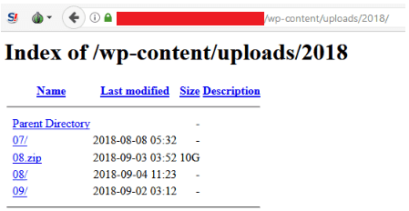

**Stop handing out your information without doing your due diligence.**

KYC is a process known as “Know Your Customer.” It is needed to ensure the customer exists and has the ability to assess potential risks of illegal intentions for a business relationship.

A lot of projects running a crowdsale require KYC and you must pass before you are allowed to invest into the project. A lot of exchanges also require your information before allowing you to take action on their site.

With all the high profile exchange hacks happening in 2019 already, I think it’s best to bring this article to light (all discovered documents, both stolen and dumped, have been sent to the respective exchange fraud teams).

The following is a key example of why you should be careful with your information.

### The terrifying discovery

I was recently forwarded a crypto project to investigate after it was discovered that the team photos on their website were faked — for example, their CMO named Rizwan Gray is represented with a picture of a Professor at Fairleigh Dickinson University named Dr. Jonathan Schiff.

My contact did some good initial investigation, and I had some time, so I confirmed their findings and tried to find anything else to warrant a blacklist across the lists I manage.

### What I found was disturbing.

The project is running on WordPress — which inherently isn’t that bad — but WordPress isn’t the pinnacle of security, and is especially bad for a project running an ICO which requires KYC documents.

I browsed the directory that stores the WordPress uploads… and over 15,000 KYC documents were listed.

15,000 documents listed publicly.

15,000 documents available for all.

Keep in mind that this project is still in the pre-sale stage, so I’d expect there to be more than 15,000 documents once the project opens the sale to the public. The first ID document was uploaded to the server on 2018–08–29.

Let’s go through what was listed (a rough list — I haven’t looked through all ~15k documents):

* Uniformed personnel holding their identity cards
* Driver’s licenses for various countries
* Documents containing fingerprint data for various countries
* People’s Republic of Bangladesh national ID cards
* ID cards titled “Government of India”
* Italian passports
* Russian Federation passports
* Ukrainian passports
* Algerian passports
* Republic of Korea passports
* Socialist Republic of Vietnam passports
* Venezuelan passports
* Indonesian passports
* Japanese passports
* Philippines Unified Multi-Purpose IDs
* Thai National ID Cards
* ...and much, much more

These were a variation of “selfie pictures” and scanned documents.

### Why did people upload so much documentation?

Now that we’ve acknowledged the elephant in the room, let’s look at their website and how they displayed their “trustworthiness” to the investors, causing them to not second-guess uploading their documentation to a random server.

> The following international team made up of experts from Data Management, business management, logistics specialists, IT-experts etc for developing complex IT- and blockchain-solutions, supports our ICO, and further realization of the project.

They mention straight off the bat that their team consists of experts within data management — which I suspect is a lie if they have open directories mismanaging such vital documents.

> Quickly register an account, complete KYC and join Airdrop to receive 2500 tokens worth 0.175 ETH now!

This technique is all-so-common and catches many people out with few offers like this being legitimate. They use language to indicate the offer is ‘selling out’ really fast, soon to end, and people will miss their chance to get free money.

> All ICO participants are required to complete a KYC check to join the whitelist and buy tokens.

They make it mandatory to complete the KYC check to participate in the crowdsale. The registration is now closed so I cannot confirm that the check is actually mandatory.

Actually, their contribution address is public on their website (without creating an account) and it seems to be a simple ERC20 contract — there are currently 0 token holders (but the presale starts in ~30 days).

### Taking another peek at the server

I wondered what else I could find with the open directories, and I noticed a reference to another ICO site with the same template/views that is also in the pre-sale phase — but their team does not seem to be fake and their directories are closed.

I found some figures — though they could be wrong as they’re in the same directory as the WordPress theme files — that indicates they have raised 1,086 ETH, and a total of $1,060,386 (including Bitcoin).

A few days later, they have now zipped the KYC data and it is still publicly visible and downloadable.

The domain is no longer resolving and the product hasn’t launched.

### A call to ‘think before action’

These types of documents are important. If passed to the wrong hands and combined with other data, people can use these to damage you in various ways: they can steal your identity, steal your money, destroy your credit rating, destroy your reputation, and cause major problems in your life.

This is a call to action to think about if you really value the project, believe in their security, and believe their vision before you upload your identity documents to a random server run by faceless admins.

It is also a call to action to get projects to ensure that their security practices do not breach the security and trust of their users regarding their mandatory KYC upload.

I personally think IEOs (Initial Exchange Offering) will mitigate the risk of identities being stolen from crowdsale sites with sub-par security measures. If you’re uploading your KYC documents to an exchange or ICO that you trust, make sure you’re timestamping it with the domain so that it’s harder be used maliciously if it gets leaked.

That’s all for now. Stay safe.