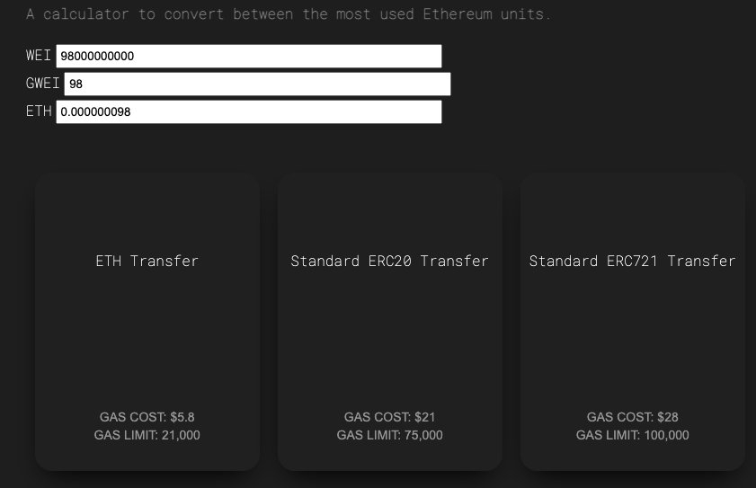
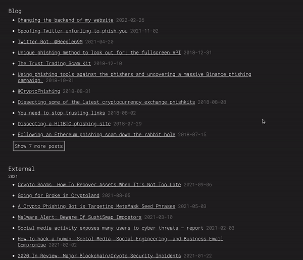
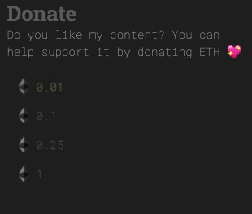

Over the weekend, I decided to change my website build process from [Jekyll](https://jekyllrb.com/) to a [Gatsby](https://www.gatsbyjs.com/) build. It didn't take too long to do, actually the biggest time sink was migrating the content format from my old `ul.li` lists into markdown and JSON files to import into GraphQL.

Now, instead of one giant repository, new website is stored in two repositories. One repo to hold the Gatsby setup with `gatsby-node.js` reading from the other repository, which holds only the content (mostly markdown files and images). It is much cleaner!

### New shiny things!

A number of new shiny things are here at the new launch and many more will come!3

#### Ethereum Wei Converter

I have also published a tool that I built that helps me quickly calculate the cost of a specific type of transfer at any GWEI cost. It will show you the cost in USD at the current ETH price (price feed fetched from [CoinGecko](https://coingecko.com))

#### Toggle Blogs

As I am moving a lot of my content posted on third-party domains to here, the Blog section can become quite big. So, I've added a quick toggle to change the view from showing the 10 most recent blog entries to all of them.

#### Donate Component

I created this component on a different project (soon to be released) and thought I may as well install it on my personal website - there's no harm in that 😅. At the footer of my website, you'll see a donation component that has 4 different tiers to donate. Clicking each will allow you to quickly donate to my efforts through WalletConnect (and thus all the supported mobile apps) and via your browser wallet (such as MetaMask). Once clicked, it will prompt your wallet to send the chosen amount of ETH to my address.

### New deployment system!

Instead of relying on [GitHub pages to build and deploy a Jekyll](https://docs.github.com/en/pages/setting-up-a-github-pages-site-with-jekyll), I am now managing the website in two repositories.

When I push a new content file (blog post, project post, external link referencing my name/projects), on the push to the `master` branch, it send a webhook request to [Netlify](https://www.netlify.com/) to trigger a build of the Gatsby site.

### New content administation

I now have a repository holding _only_ the content and these content files are stored in directories;

This is a much more cleaner way for me to manage my content as before I had everything in a flat directory called `posts/` and `posts/images/` with the [Jekyll](https://jekyllrb.com/) setup.

I also make more use of [frontmatter](https://www.gatsbyjs.com/docs/how-to/routing/adding-markdown-pages/#frontmatter-for-metadata-in-markdown-files) in the content markdown files, which is consumed within the GraphQL server on the Gatsby side of things.