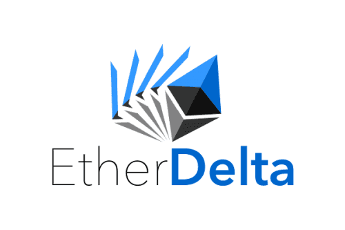
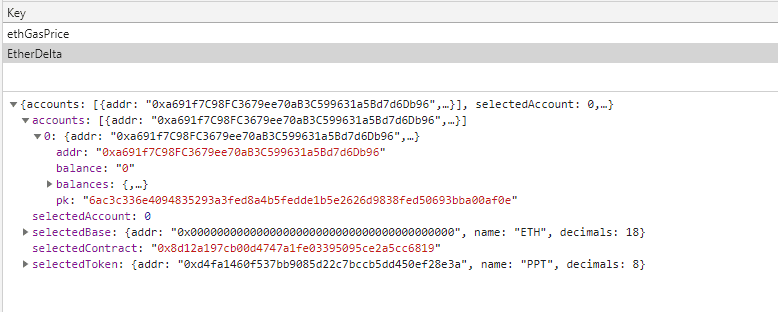
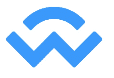

Key management is a big concern in the cryptocurrency industry as keys give access to addresses, and addresses can hold funds. If keys are handled incorrectly, users could find their funds missing, without permission…

Sure, there are ways to mitigate an entire heist on your funds, such as using a MultiSig wallet, but let’s talk about the vast majority of users who aren’t using a MultiSig.

In recent years, key management has improved for users interacting with decentralised apps, as developers are starting to separate concerns from the main app logic and signing mechanisms (i.e. key management).

Let’s take EtherDelta as our first case study — a very popular exchange in 2017.

EtherDelta is a decentralised trading platform for Ether and [ERC20 tokens](https://eips.ethereum.org/EIPS/eip-20). It launched on Ethereum MainNet in 2016. It was the absolute top place at the time for people to trade tokens in a true, decentralised manner… on-chain, so it bought a lot of good attention to the technology (and unwanted attention from scammers and phishers).

One of the main ways for users to trade on EtherDelta was to “import their account” by inputting their raw private key into a text box, which “behind the scenes” would store it in the browser LocalStorage, unencrypted in plaintext.

Let’s discuss the UX aspects of this first. The technical decision to save the imported account saves the user from importing it again on multiple visits, decreasing their inputs and allowing them to do what they wanted; trade.

Think of this like the “Remember Me” checkbox on web2 login boxes — allowing the user to use your product quickly without worrying about inputting authentication details manually.

This is, pretty much, the only advantage for this decision (and done poorly).

The privacy and security implications for this decision are enormous.

Although convienent to the end user to reduce inputs when visiting each time to trade, EtherDelta could have done one or all of the following;

* Remove key management entirely from the app and promote the use of something like MetaMask — pass the signing mechanism to a dedicated application
* Encrypt the raw private key client side with an enforced strong password

Having the plaintext secret in LocalStorage is leaving your funds open to;

* Malicious browser extensions with read permissions (though you’d probably have bigger problems)
* Someone looking at your unlocked machine and checking LocalStorage directly
* Software able to read an unencrypted secret on an Internet-connected machine
* If someone is using a shared machine, it is not communicated to them that their secrets would be saved

It also promotes bad behaviour to users as they are being trained to input their raw private key to the Internet, as well as teaching them that the main application logic and key management are intertwined and not separate concerns.

> Security is inversely proportional to convenience

Applications that promote convenience to their end users over security are arguably losing user attraction.

For example, if we ignore the different math behind EtherDelta and Uniswap, Uniswap achieves the “near-same” as EtherDelta without the use of concerning key management inside the main application — it relies on a user having a web3 enabled browser; where key management (and transaction signing) is a separate concern.

Arguably the ecosystem has evolved and it is not how it was when it first started, where the only way to interact with the blockchain was via the command line — something that would scare unfamiliar users, as it is a daunting task to learn and memorise specific commands to sign a transaction, for example.

An example of a more mature key management solution is [WalletConnect](https://walletconnect.com/). If implemented correctly within a dApp, the key management and application logic are totally separate concerns — meaning a dApp does not have wallet-like features (like in EtherDelta).

> WalletConnect is a simple protocol used by mobile wallets to sign transactions remotely from your phone.Instead of copy and pasting your private key from device to device which exposes to malicious attackers, you can simply scan a QR code to connect to your mobile wallet in an end-to-end encrypted connection.
>
> Once you scan the QR code the application on another device can request messages and transactions to be signed securely on your phone and you can control from your wallet when to end the session.
>
> Using WalletConnect makes it easy to manage your private keys from your phone while using applications on different desktops and even other devices like tablets, POS systems and TVs.
>
> It’s architecture is completely free and open-source and can be used by any wallet or application. Currently WalletConnect is supported by 10 wallets.
 — *Pedro, WalletConnect*

A setup where a dApp relies on third-party key management solutions only needs logic to tell the third-party signing mechanism different parts of the transaction to sign — this can increase both UX and security aspects for the user;

* The user will get a familar UI when confirming and signing transactions
* The user is taught that secrets, such as a private keys, are not to be known by applications — this would inturn help them not fall victim to potential specific phishing scams where they’d otherwise be ok entering their secrets on an online form because “it’s what I always do to use a dApp”
* The user is limiting their attack surface. Instead of having their secrets readily available stored across multiple browser in multiple domain LocalStorage objects, the user only has to protect one device that they know should be the only thing holding their secrets

MyCrypto, for example, made the decision to [drop raw secrets from their web application](https://medium.com/mycrypto/a-safer-mycrypto-79d65196e7d8) (private keys, mnemonic phrases, keystore files), without losing any user experience using the application at the cost of a security effort because it still allows for many third-party key management applications to interact with the app.

This means total separation of application logic and your secrets on the web app (which you can also compile and run yourself).

Tip: there is a [Desktop application](https://download.mycrypto.com/) for those users who wish to use raw secrets/keys

Having said that, key management is not just about how signing mechanisms work within dApps — it includes, amongst other things, the process of generating keys too. There have been many iterations on user experiences and interfaces to create a new “wallet”, and many public audits done to verify how secure solutions are at generating an entropy-strong secure key for the user.

This isn’t without its risks, however, as there have been multiple “backdoors” in key generation in recent years. One example is one that MyCrypto reported on in May 2019 — [Disclosure: Key generation vulnerability found on WalletGenerator.net — potentially malicious](/disclosure-key-generation-vulnerability-found-on-walletgenerator-net-potentially-malicious).

Key management may be a difficult task to handle in the web3 world, but I urge dApp developers to develop their dApp and rely on the third-party applications that are dedicated to handling keys, for all the reasons talked about above.

Let us know your thoughts, questions, and maybe even share some of your cahllenges in web3. Thanks for reading this!