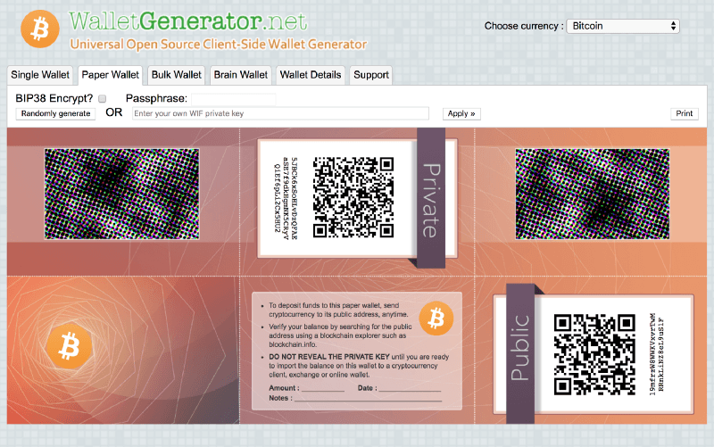
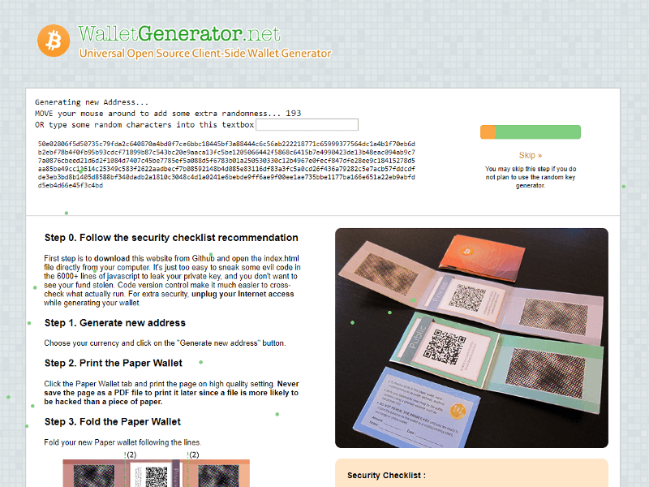
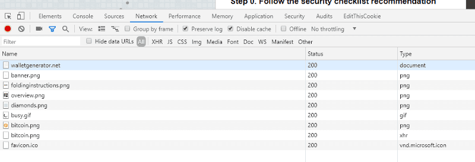
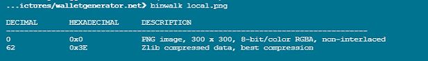
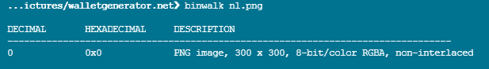

### TL;DR

* **Who is affected:** Anyone who has put funds in a public / private key generated via WalletGenerator.net after August 17, 2018.
* **When:** August 17, 2018 — ???. While the malicious behavior is not presently found as of May 24, 2019, it could be reintroduced at any point.
* **What happened:** There were changes to the code being served via WalletGenerator.net that resulted in duplicate keypairs being provided to users. These generated keypairs were also potentially stored server-side.
* **What you should do if you are affected:** Securely create a new keypair / wallet and move your funds to that new, secure address. Some folks have recommended using bitaddress (offline) via https://github.com/pointbiz/bitaddress.org.



### Preface

We were able to contact the current owner of the site prior to publishing this post and outlined some of our findings in the hopes they would secure the server and help with the investigation. They responded by stating that they were unable to verify our claims and asking if we were perhaps on a phishing website.

Sometime between the time we were last investigating and testing (the evening of May 22, 2019) and the time we received an email response from the current site owner (midday, May 23, 2019), the code being served to the site was modified to remove the previously-added, malicious, code.

In this strange turn of events, we still have no idea whether the current site owner is the malicious party, if the server is insecure, or both.

We’re still considering this highly suspect and still recommending users who generated public / private keypairs after August 17, 2018, to move their funds. We do not recommend using WalletGenerator.net moving forward, even if the code at this very moment is not vulnerable.

### The Long Version

Paper wallet interfaces are a super useful and convenient tool for users to easily generate a private / public keypair though, historically, these interfaces have been susceptible to vulnerabilities in the RNG / key derivation due to malicious or ignorant behavior conducted internally by the site owners or externally by bad actors. If the random number generator is compromised in any way, it can result (and has resulted) in guessable secrets which can, in turn, result in user funds being stolen.

**This is what has happened with WalletGenerator.net.**



### Details of the Compromise

WalletGenerator is a website that generates paper wallets for a handful of different cryptocurrencies. The code served to WalletGenerator.net is intended to be open-source and audited, and (supposedly) matches the code here: [https://github.com/walletgeneratornet/WalletGenerator.net](https://github.com/walletgeneratornet/WalletGenerator.net).

This project changed ownership approximately two years ago. It was recently brought to our attention that the code being served via the WalletGenerator.net URL did not match the code on GitHub.

**At this time, [the code on GitHub](https://github.com/walletgeneratornet/WalletGenerator.net/tree/36cefb15c625f86c1427e9a17c2bb8d5140918a4) is not malicious nor vulnerable, nor has it been malicious or vulnerable previously.**

It is unclear at this time if the new owner is responsible for these code changes or if the server has been compromised by an external party.

### The Code Changes

We investigated the differences by running a diff between the GitHub code and the server code and noticed (among other things) that an XHR request is being performed to grab the coin image. This is strange because the coin image is already downloaded by your browser when you load the HTML page—there should be no need to request it again.



We looked at the code to see *why* it’s sending an XHR request, and what we found was bizarre. It’s using the image data to seed the random number generator function.


This immediately raised eyebrows because the SecureRandom function should be taking input from the user’s browser / interactions, not from an image or server. Seeding it with data from the server compromises the integrity of the randomness, potentially making the keys generated non-random or producible.

*ELI5: When generating a key, you take a super-random number, turn it into the private key, and turn that into the public key / address. However, if the “super-random” number is always “5,” the private key that is generated will always be the same. This is why it’s so important that the super-random number is actually random…not “5.”* 😉

Additionally, a `newSecureRandomAdvanced` function was added that modifies (it removes `poolCopyOnInit` logic) the previously-used `SecureRandom` of [bitaddress.org function](https://github.com/pointbiz/bitaddress.org/blob/d389e975fe8c1b4590843c1b3854c98700525c78/src/securerandom.js). The output from this `SecureRandomAdvanced` function replaces `theSecureRandom` function. Even though the user is still prompted to move their mouse around the screen, this data is never used to seed the key generation.

### Back to the Weird Image Request

Diving deeper into the image file itself, we noticed that the file was unusually large and producing a different sha256sum for different parties. At this point, it appears the image being served by the server was 1) unique for each user (IP address?) and 2) being used to seed the key generation.

We spun up a couple of VPNs and hit the domain from various geographical locations. Below is a dump of the sha256sum hashes of the file bitcoin.png:

```bash
$ sha256sum bitcoin.png (United Kingdom)
27cfafd3fe3810a89375a2f3ccc253cd6b2f03b5ff30ec6b41a76f8f2393085d  bitcoin.png
$ du -hs bitcoin.png
156K     bitcoin.png

$ sha256sum bitcoin.png (Netherlands)
4798d4167a98b56dc112878aed578f64ff9fb20fc58774a468e9b53f9aa1fc59  bitcoin.png
$ du -hs bitcoin.png
16K      bitcoin.png

$ sha256sum bitcoin.png (California)
4798d4167a98b56dc112878aed578f64ff9fb20fc58774a468e9b53f9aa1fc59  bitcoin.png
$ du -hs bitcoin.png
16K      bitcoin.png

$ sha256sum bitcoin.png (N. Virginia us-east-1)
86b475b38b137e50e317ce4478cc9abf41d33c158e12d2174dc1dd6f786ec45f  bitcoin.png
$ du -hs bitcoin.png 
156K     bitcoin.png

$ sha256sum bitcoin.png (Spain)
4798d4167a98b56dc112878aed578f64ff9fb20fc58774a468e9b53f9aa1fc59  bitcoin.png
$ du -hs bitcoin.png 
16K      bitcoin.png
```

This led us to a conclusion that these images are served to a deterministic percentage of the visitors, likely based on the IP.

The bitcoin.png with the hash `479...c59` and a file size of 16K is the unmodified bitcoin.png icon. The other hashes and file with a file size of 156K are modified in some way and likely stored on the server in order to re-generate the keypairs at a later date and steal funds.

### Generate All the Keys

Approaching from a different angle, we then used the “Bulk Wallet” generator to generate 1,000 keys. In the non-malicious, GitHub version, we are given 1,000 unique keys, as expected.

However, using WalletGenerator.net at various times between May 18, 2019 — May 23, 2019, we would only get 120 unique keys per session. Refreshing our browser, switching VPN locations, or having a different party perform the same test would result in a different set of 120 keys being generated.

`youtube:https://www.youtube.com/embed/wi9wjoQ08tE`

In the above video, you’ll see the XHR request. We go through the seeding process and then generate 1,000 keys. Everything appears to be fine on the surface. However, when we copy the output into a text editor, remove the indexes (replacing \d+, with an empty string), and sort the lines, we see the groups of duplicate keys.

We have determined that all the keys generated are fully deterministic using the image that was grabbed via the new XHR request to seed the RNG. If you use the same image as the seed at a later date, it will generate those same 120 keys. How exactly the image is manipulated server-side and when the malicious image is served remains unknown.

The image payload is visually identical for all the visitors, but the content is generated by the server — the binary content for the image—is usually different for each user, although sometimes it can be same for the same user / session. For example, if I have an image with the hash 27fc...085d then come back later to generate more keys, I will have the same malicious image payload and therefore the same keys. This may have to do with either client-side or server-side caching, as using a VPN or switching browsers will result in a new image and new set of keys being generated.

### Steganography?

We wanted to know what was being inserted into the image, so we used binwalk to extract the data ([see the Zlib data](https://gchq.github.io/CyberChef/#recipe=Zlib_Deflate%28%27Dynamic%20Huffman%20Coding%27%29To_Hex%28%27Space%27%29&input=eNrsvUusdWt2LvUu7zYv67r3/v//LipHKC4mSiNELkYk3EAg2bjqLi%2B52KkuQaEuLughpLQuLtJANC5CLkBAI1LwpSp22U7KdtwuRmggIStISC4uSC7EVecuLv/7si7z8l3GoLEucC4uLCFsXN5va2p11tL8xnjX%2B37fO8cuXvEu3y76Lq98bLg/orQvuqhvanG3ri4uLtoubi597KO986Vuqy6pRS5SzqFxcC5rLi7TLl8vLiouNCQuWC7V%2BS0uPWu4ei4uyS58qS4n8/7BLrku/TYuPmMsLlLity7931zi18Mu/8Llt//G9etfofvz33pdrD8uLtdb8C4u69e/Lkn6Lr79OVn5Pu/LLl7n0HdOaS6lxi/i5ydCLfjbSi4uKM/USyIuLqrgti7waWVxLuPdLvIuLi64LrNIWGfm3ujyLi7uLtlRtKB%2BxC4u%2BC4sTbSq2N0u//kuLi5VLt425Nt72DY02yRcLr3W/u%2B65P9q96e/8fdfV/AusF7xXUFELtD9%2BV/8Rz4uLu4u/i0u9UdZ9U/6rtvPIaX%2BcXLLcMemLlAu5cZwLi41Li7eUS4u2NUubKZ2LqtvcfYuLi40TWioJEkufKFLLnNKyy7qLvJmS/rsRDHFLi4upSzCMHbooaFrQ2dHbEdW9y6nLklCLi5huVAu7qAuKuXi8d0udn1CLi58eyBcLkVC1dYvKfFQ8/KrsuFb6S6/9V%2B%2BVsArYb3i9y45Li7%2BLqMu%2BV8uxf9LuuFPyy7%2BaNDq6v4uYu8uTVlLJPYueyrobmAuLi5Ea0awSrMuNi7FMmHeUlkudUD7R1rdLkOgdUKnLiIuLkXyVnHvLi7izS4uPfbkqHcuMHtsLlYuLtwu2kyxLnpD2KzIdaIuLsEu5mUh3ij%2BLuHGLjl3LuMu9twuLi76Li7xLj15Lt8u2y7dLl8uzi/o1uMuWazJ/6Au/i7m%2BVUu/N3hK7%2B4/NMu/S6vLvUu3y3S%2BsYnLqgu/i4u6UvJNNWr4HzGbcAtIys9Li6gLvjqIVb8Llg2LkFmuHbkbWFILmVVfC5oXulOLnku0UwuW2xaKC79YcNaTvjLO8pdI10yplcuNy4uLXXYLnJN0C5gP9IuK0Mu7EA%2BPGHPLt5sLi5mtC4u1COlotNK6S6pLtTtRHou8C7VLlwuuKFiyy5WLy7mKbYu/C5ELvkuQWl2Li5nzKDFRszvWPWzxenws267/i7hLn65vlbNK2G94ndJSS7f/OQuevlrIdfvLuguLreuLrSnM/bFLi4udd7QLi71fC5jQnxD1y7zLi5hfaTVLi68RS4nakpEX6EuSi5g4%2BilZ1VhLsr6vEP6LqBAPdH2Lrt4pO%2BxeSYoLLbBuS5YLtsufnnD%2BuYz0slTLifGLjWlRi5Twy4uRdwtdS4uLjEupEdixHIu0y5I1yg54ndH2nQuLuj0SC4uUC4uVaFlancg1S7qJvL2LvFyRrWyLi57LvAuKs0r1FYupC5H%2Bzkt/NvpL/5ifVVery71Lv83LvXTLtB99aV58te/tLVkLtrq8S8uLt9vRS7rLrF15P0uLi5xK8ouXy7GLjzh3C7WdUi5UC7hW8H5Rtl39FPFtKcu4qQuPdAu7kYu7y5FSV0upcMuLl0u%2BC5CLtHnSC62WHliYEPdPyPXSFsqUi7r9qTwLnVLLS6%2BuSDP4FwuWMJkxtRhLvH%2BLmJCLjvqeiE5w64u7TYuPi5c7y74WSVtN9hyLi4u3EK/9eR5oSsutS7GLu0j5C5Go1t7tD%2BjLs0uXzxtLsJZMF9BLnpULkE4LsX79iulyF932M/%2Bw/v%2BW9fgLq8u9S7/Lixf/%2BHv1cEua1D9oy4uLq44/y6yPi4u1C56Li4/LuUu22ZUb2F%2BwtUuLi6pOi4uPaVvKM%2B4tS4uMS4uW/BZ0SB4Vawu6i7Rzy4rwrLbQvfI8GyovEFaRTFCeGJJLu6kVN3holHHLi0u3kda7/E5w6I03yijp0897akub27R6S62NC4jvmTKPC5Q5l2lLi7ULi6rLt3JoSa4I7TzLj9fWd4uzjVY7y46o1OjMC7cLjR9LmxuLi4uLi7dLrdMtODRZaUuQXwhVkdmx9Au2mZyuqVzJ1ourMu4J/1V9fxo92O/%2BC5eq/AusF7xLqmpL9N99S4uKC7zy1%2BzLv4uJv4utCUuySFdQS5CTS7SVer5Ls4uRrMu2S7BPS5bpMOwpLQuLj7jLi6h0tvHZDcurzNrLnRxpC4uzjbIeMU%2B2%2BDiLmnA5C66Li4j8i7BLuZbxzB79Gml7Pf4%2BC4udy7PSC6kTDguVSIiyy7VqzcoK/hCKD3uoy4u9XOj6y65ZchgvuKiRyUu5i4uLrYl%2BjPZe1IuqS6srrTuSGzvUdnj7y7yLi6re0K8IG4uzc/kOC50JO0u4LmjWCXtLrT5LqYu1C62zSznSujeUMsuSS5uYy6rLi4uLi4uV%2BhjdUv79Wr85e7HLv5v/va1esXvLtzrLfi9Ian/Lj0uqn7jSy69fvNrTb39pC72Ry7VsC4uai4yuK4n0C5LLuUu%2BkQuWy6/4C4nLmD7SOtA3C5opFZwyy52T6RcLjEuPdIyMit1OsEut9Quwqbi1i467fFlpVwusltQ7ejJ2Dxg/UA/LvAu8S43LqtnLj0y7i76LvMu0XrMPeLSLjXRLi7yueI%2Bz1i3ssouLi6poy7QqS5DpS4u39wuNi7MLrltrCP4POEj9O47NC5MZ9ynLqkuIi5zqFWk2%2BEuonsuxy4uVmLfLqcuVC4uoXhPLi7mIn4uLqisbzJtzfhk%2BO0zNME04C4krGn93lj0LvM3frzlLvyh/y7v/uQ/cS5f8aqwvust38/84C7E8U1x1qsucS5g4UzqNy4uwuEuci5P1zVWd6DTK1ou0i5YLriwoS4uNtHmLsIud%2BvxVSlzILYusUG2Luwx0KoiuyPRLi7rLuQuuS7w7ycuLiTQ3C7bKy4uPSly2GDnLtJDzW8u/D2yLlguLt5XzCVCU%2BguPHV4Li4uqi5%2BUur2Ll4uqFcjWKFt7mB5Rscuw7mxLiA9Lnpc4WHExydq2%2BPSLusj6y4u3NLSM7Eu7i4uLlo34K%2BoOfyh4i7e0forfldoLlvYdLi24C4uLC4xMk8rfWkuU6R5XC5Z6y53Jy5HLnNK7S4uVewuwkPE5S7CxC4uQsAuI9VfJ6/tK%2Bmrv/TfvlbxK2F9V9u%2B8jNffuNa99%2BsLv1jw9kuuW8k3aL5PS4/Li4jLi5ZOuIuLn4uLi4wLkAuR1Ihdy4uLkljwy4uLi4uLi473CYhcmYt0KcutS4u80zJLi4u3%2B0uc8ElYS5nLtsuTy7UNuC94qtHpaBpwLgga8QlpW0ucS7o7GhDwPwu6XKhWaHELr5%2BRDu%2Bpy4uYi6/TS4u%2BsWzdC4uRnhzIOYudOpw%2B0B%2BzuAuui4uK8l52iT4eqC579DaLbguLswup1cu7C4uLkmw20h5XLDO4Lyn62fypuLNIUWwc8LtLjI1Li6rZeJtLjxU2k0kLjIuOlws2HsuKqwuIV%2B84r4zLjouLqgu0MQu2i7tJi6vLikuvNVa8t/H/L8ufvwu7l/t4qsl/K6xfebtR%2BrPfvnXLu69pfUu91cuLivIrFj5LsYuzy7OLtUnOKwwLjQuIT2h0r/kLvJb%2BqnDsUdKLtsuKi4lLmwremq0MsIusrou9v4usUI6OC506HKmuS4uLi7vsKcurEds46hdZv3iQsMueGwuZFtxR6FNLi4urH4uLi7yLi44Li4uLi4uJ9Yu/F4u/y7N3WHnRKXi5i50dy4uLuT7LlcuLibitEfyLmJHLi68VFwu4OZTLCV8zC4usi5H/3GlRkPOLvU35Npw9y7fLtRG0kcuWi5sLj4kNC7kvtLWLi4utS5Rb6nnLmp0PlMuW9wzTE/KLi7qLvpCe/4izi788UQuSnU7%2BlGweqEuKt1zLmqsQy4uwy4ve/e%2BfuPLvyYu/sirXXxVWL%2BvLi7yLk%2Bg/1t8XFx8Lln3Li4uvi5lKMi0wfkrpS50QWkuLuFeUcB3LnJZyEGxLnBxoE0uLi54w/s9fj0h40irLuorLt7h43vC9C7i3i53Pfl9JLorxC5bLiygPmFdYvAuLlaqLjQuVFfqLi4%2BOLA9LS6wXOnEsC4u7X0uqC5VejWs31P0LtnsccsuLi4uLi4uLNohLkkm1C5oVy4uLtmsyLXHLqMuLi4uUqlVQC5%2BLrQu1DW8LnAuZC4uLiw9rEooLuWjLvDoLjfCOjlaKS4uLi5gLi4iLmi3tO4u2i5hLi4ucS5KbT1u2C7HT%2Bk%2BeGoucWUupC50ZC4uOGDjwvguwtZjLi5sfbHZImQusWTY6iGs9H2iLqou8mcur/7SL7xW/yth/f5RVz//5S5hLj8kUi5rLvEupydK2OLfTqz3Li53VPsuJ2PeLvVIOy5wcqwuLrcrsjjcYy4uID0uqqMuoOs7RO5x9S4u7y7VKC5KuC4hLmjrLrguLi4tRy51cDjBLlB7Lqfk8y4%2BLi624G4udy4sR8E/Li5sUbviRbCo1HrE2S6oUD4u2H3DLmAu4i4uU6a7SC4v0C5N79B0xvsuZ0IuLtFM6Twxe0wyQsIuM8vswTV8Llpu8foutT29u1Jlpe4gLi5Ww7xDp0C/Ucrk0S5xdPjtLvz4OUkuLi7rM64uuFbIfS5PZ%2Byho%2BHo9i45R0JeMdkubWXVRvJH5O0u3XdUeyTVSGMlbzp02i7iLrguSt8jaaFdty67LtpISy4uwUqjXy7kcMoi/HL6sV/60ddueCWs/y5Zvy/RffUuad/4JDTjr/ht/HcuL657LszR4dZM2iVELvXqUXHo0PC7Lj14pC7EVsGqwy4uLi7FPSAuMC4urkEu8DGiNeNqLi5aWrEsLi7JyC6661t0eE8uty78Li6j9S4uduh4JXQu9MMuo6NN4MYu1S1RTlQxbC74LiF%2BLrYuUC51QnEuLkJ3LsouNsjnZ/RjLq5CelYgwiHjr0e0vqcuLj521OYgLqixw%2BcuLki1Ri4uui5XO0IuyFRiWKjZ40pPo2G%2B0XUutSouLtwuqEsl9GAuI6Yu5Wz4LnXr6GIuLi52MyEuwi4oay5KRjohrj21Lk/LLmlYaS7iLshmYC5vLtXdLj57QkJA9S493uMuLi7fLq4uVPcu/0zYLi7zyHsuuS5XLkfQLi4uZ9bOLi5PMUcu8i4u9i77r/7y8i5r5S6vLvV7a/2%2B%2BaUuzy7%2BLm4ucEulXS5y5/DPQt0uvS4uPL06rtPEQCPfNtzzLjTByy7RRL3LxOdb7PBAuUR8cDS7JbZPKS5sbXR45i4nzHtiWCllJdouLs60Li7XLldwLlwuMm1x4UJrLi4uvF7pfKQuLjouuy4uLjouL/mm6y4uK34uOD8uO6OvLi5KPW8uWil7LssuufX4QUmxY8kuzm2w%2BUIuJy5G6i7m2C5roU4uLq/YMKIuLj4udKuoLi5rIy4u60si31suvFmo8y5fLlt0cnVuY2F0ZWRdLi4u)). This is a legitimate way to construct a PNG image, and we suspect there is some steganography happening to make the image visually identical but having different bytes to each user.

We know something is happening to manipulate the image, but are unable to determine what exactly is happening. Most steganography tools include a password functionality, meaning successfully decrypting the “hidden” data is impossible without knowing the password provided at the time of the image’s construction.

Furthermore, the manipulation may be random, with the images simply being stored on the server for re-use at a later date.





### Determining When

Looking at the snapshots on the [Wayback Machine](https://archive.org/web/), we can determine that the malicious behaviour was introduced sometime after [2018–08–17](https://web.archive.org/web/20180817205909/https://walletgenerator.net/) and definitely by [2018–08–25](https://web.archive.org/web/20180825094132/https://walletgenerator.net/).

### The Unknowns

* What determines whether or not you are served the malicious version of the site / image?
* How the malicious image is generated and what data is added? Is it random or known data (IP address, timestamp)?
* Who made these changes? The current site owner? A malicious party who gained access to the server?

### Timeline

* 2019-05-17—2019-05-20: Investigation and confirmation of malicious behaviour.
* 2019-05-17—2019-05-22: Consultations with industry security experts on how best to handle the situation to minimize loss of user funds.
* 2019-05-22: Notified current site owner via email.
* 2019-05-23: Received (unhelpful) response from current site owner.
* 2019-05-24: Public disclosure.

### Special Thanks

* Thanks to [PhishFort](https://www.phishfort.com/) for funding addresses to see if they are auto-swept!
* Thanks to everyone who provided insights, advice, and confirmation of our initial assumptions.
* Thanks to [MyCrypto](https://mycrypto.com/) for giving me the ability to investigate these types of situations and providing necessary support and resources.

### Updates

This post will be updated if / when new information comes to light. It was last modified 2019–05–24 @ 5:30am PT.

## For now, I'll reiterate again: If you’ve generated a public/private keypair with WalletGenerator.net from August 17, 2018, and beyond, you need to move your funds to a new, secure wallet immediately.