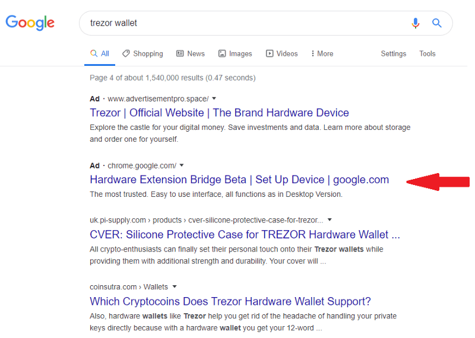

### Motivation and Purpose
We keep an eye on the type of attacks that come to cryptocurrency users on a daily basis and often write about our findings to help educate the community. We’ve seen various types of attacks on users, ranging from [simple trust-trading scams](/research-into-trust-trading-scams-on-twitter) to [SIM hijacking](https://medium.com/mycrypto/what-to-do-when-sim-swapping-happens-to-you-1367f296ef4d) to compromising and stealing funds from exchange accounts.



Recently, we’ve come across big campaigns pushing fake browser extensions to users and targeting well-known brands via Google Ads and other channels. Whilst this is not a new attack vector — and we’ve [written about malicious browser extensions](/the-dangers-of-malicious-browser-extensions) before — the brands targeted are new.

The goals of the research are:

* Educate “everyday-users” on what the different attack vectors are
* Report on big campaigns to make people aware
* Give “everyday-users” real-life examples of attacks so they are more likely to enforce security controls on their assets
* Help shut down scam campaign infrastructure
* Gather intelligence to feed into custom tools to help detection before victims are made

### Overview
We have found a range of extensions targeting brands and cryptocurrency users. Whilst the extensions all function the same, the branding is different depending on the user they are targeting. The brands we’ve found targeted with malicious extensions are:

* Ledger `<https://www.ledger.com/>`
* Trezor `<https://trezor.io/>`
* Jaxx `<https://jaxx.io/>`
* Electrum `<https://electrum.org/>`
* MyEtherWallet `<https://myetherwallet.com>`
* MetaMask `<https://metamask.io>`
* Exodus `<https://www.exodus.io/>`
* KeepKey `<https://shapeshift.io/keepkey/>`

Essentially, the extensions are phishing for secrets — mnemonic phrases, private keys, and keystore files. Once the user has entered them, the extension sends an HTTP POST request to its backend, where the bad actors receive the secrets and empty the accounts.

We’ve identified 14 unique [C2s](https://www.secpod.com/blog/command-and-control-servers-things-you-should-know/) (also known as a command & control server that continues to communicate with your compromised system) but by using fingerprinting analysis, we can link specific C2s to each other to conclude which of the phishing kits have the same bad actor(s) behind them. Some kits sent the phished data back to a GoogleDocs form. However, most hosted their own backend with custom PHP scripts. The C2s identified are:

* analytics-server296.xyz
* coinomibeta.online
* completssl.com
* cxext.org
* ledger.productions
* ledgerwallet.xyz
* mecxanalytic.co
* networkforworking.com
* trxsecuredapi.co
* usermetrica.org
* walletbalance.org
* ledgers.tech
* vh368451.eurodir.ru
* xrpclaim.net

Whilst some of the domains are relatively old, 80% of the C2s were registered in March and April 2020 (an even split). The oldest domain (ledger.productions) has the most “connections” to other C2s in terms of fingerprints, so we have some indication of the same backend kit (or same actors behind this) for the majority of the extensions.


We’ve also inspected some of the other C2s for common log files, and whilst most of them did not have them available on the web root, some issuing 403’s, there was one that belonged to `trxsecuredapi.co` that gave some small insight (if we take it all at face value):

* The server used for this C2 is `trxsqdmn`
* The admin email follows this mask: `b — 0@r — r.ru` — potentially indicating Russia-based actors
* The first log was 29-Mar-2020 10:43:14 America/New_York
* The C2 hosts files other than those to collect the phished secrets

Below is a video of how a malicious extension targeting MyEtherWallet users works. It looks the same as your typical MyEtherWallet experience until you type in your secrets. After you’ve submitted them, the malicious application sends your secrets back to the server controlled by the bad actor(s) before sending you back to the default view, and then does nothing, resulting in either:

* A user getting frustrated and submitting secrets again (maybe even different ones)
* A user uninstalling the extension and forgetting about the ramifications of typing their secrets until their wallet is drained of funds — which most likely will be after the extension is removed from the store so they cannot investigate where their security hole was.

`https://www.youtube.com/embed/kRoDFPu27cw`

Some of the extensions have had a network of fake users rate the app with 5 stars and give positive feedback on the extension to entice a user to download it. Most of the positive feedback by bad actors were low quality, such as “good,” “helpful app,” or “legit extension.” One extension did stand out by having the same “copypasta” around 8 times, authored by different users, sharing an introduction into what Bitcoin is and explaining why the [malicious] MyEtherWallet was their preferred browser extension (Note: MEW doesn’t support Bitcoin).

There was also a network of vigilant users who wrote legitimate reviews about the extensions being malicious — however, it is hard to say if they were victims of the phishing scams themselves, or just helping the community to not download.


Google Webstore has a report section and with our reports and with the assistance of [PhishFort](https://www.phishfort.com/), we’ve had the extensions removed within 24 hours.

An analysis from our dataset suggests the malicious extensions started to hit the store slowly in February 2020, increased releases through March 2020, and then rapidly released more extensions in April 2020.

* February 2020: 2.04% were published in this month from our dataset
* March 2020: 34.69% were published in this month from our dataset
* April 2020: 63.26% were published in this month from our dataset

This means that either our detection is getting much better, or that the number of malicious extensions hitting browser stores to target cryptocurrency users is growing exponentially.

An analysis from our dataset suggests Ledger is the most targeted brand — without speculating, it’s hard to say why.

* Ledger — 57% of malicious browser extensions in our dataset
* MyEtherWallet — 22% of malicious browser extensions in our dataset
* Trezor — 8% of malicious browser extensions in our dataset
* Electrum — 4% of malicious browser extensions in our dataset
* KeepKey — 4% of malicious browser extensions in our dataset
* Jaxx — 2% of malicious browser extensions in our dataset

### Where did the stolen funds go?
We’ve sent funds to a few addresses and submitted the secrets to the malicious extensions. However, they were not automatically swept. This could be for a couple of reasons:

* The bad actors are only interested in high-value accounts
* The bad actors have to manually sweep accounts

Even though our addresses weren’t swept, there have been public reports from users about losing funds to malicious browser extensions:

* https://support.google.com/chrome/thread/39247659?hl=en
* https://redd.it/fws38m
* https://forum.toshitimes.com/t/metamask-got-hacked/12767/3

If you suspect you have become a victim of a malicious browser extension, please file a report at https://cryptoscamdb.org/report/.

### How can I stay safe?
Whilst there are many different attack vectors for everyday cryptocurrency users that are not limited to malicious browser extensions, the following will be addressing only the malicious browser extensions.

#### I am an everyday user of cryptocurrency.
* Familiarize yourself with what permissions each of your browser extensions have by going to chrome://extensions/ and clicking on the “Details” tab for each extension.
* Understand the risks associated with each permission.
* Consider removing the extension if it has permissions that you feel are out of scope of the extension use.
* Limit extensions to only execute on [certain domains or when you click the extension icon](https://www.howtogeek.com/fyi/how-to-control-a-chrome-extensions-permissions/) in the top right corner of your browser.
* READ: A fake anti-cryptominer targeting MyEtherWallet[.]com and Blockchain[.]com domains — [hunting Huobi scams](/hunting-huobi-scams).
* READ: A fake cashback extension targeting popular cryptocurrency exchanges — [the dangers of malicious browser extensions](/the-dangers-of-malicious-browser-extensions).
* Consider creating a separate browser user that you use solely for cryptocurrency data — this will limit any attack surface scope, and a separation of concerns (personal and cryptocurrency profiles), increasing the privacy related to your cryptocurrency profile.

#### I am a team/company providing a solution to everyday users.
* Consider monitoring the browser extension stores if your product meets the criteria we’ve seen targeted — by using either in-house monitoring or partnering with a third-party that will investigate and take down these extensions on your behalf.
* Remind and enforce users to stay safe with their secrets.
* Deprecate the use of raw secrets (mnemonic phrases, keystore files, private keys) with your product and promote other signing mechanisms.
* Create a public list of all your products and links so users have a reliable source of trusted information.

### IOCS
Extension IDs:

```
afephhbbcdlgdehhddfnehfndnkfbgnm
agfjbfkpehcnceblmdahjaejpnnnkjdn
ahikdohkiedoomaklnohgdnmfcmbabcn
ahlfiinafajfmciaajgophipcfholmeh
akglkgdiggmkilkhejagginkngocbpbj
anihmmejabpaocacmeodiapbhpholaom
bhkcgfbaokmhglgipbppoobmoblcomhh
bkanfnnhokogflpnhnbfjdhbjdlgncdi
bpfdhglfmfepjhgnhnmclbfiknjnfblb
bpklfenmjhcjlocdicfadpfppcgojfjp
ckelhijilmmlmnaljmjpigfopkmfkoeh
dbcfhcelmjepboabieglhjejeolaopdl
dbcfokmgampdedgcefjahloodbgakkpl
ddohdfnenhipnhnbbfifknnhaomihcip
dehindejipifeaikcgbkdijgkbjliojc
dkhcmjfipgoapjamnngolidbcakpdhgf
effhjobodhmkbgfpgcdabfnjlnphakhb
egpnofbhgafhbkapdhedimohmainbiio
ehlgimmlmmcocemjadeafmohiplmgmei
epphnioigompfjaknnaokghgcncnjfbe
gbbpilgcdcmfppjkdociebhmcnbfbmod
glmbceclkhkaebcadgmbcjihllcnpmjh
gpffceikmehgifkjjginoibpceadefih
idnelecdpebmbpnmambnpcjogingdfco
ifceimlckdanenfkfoomccpcpemphlbg
ifmkfoeijeemajoodjfoagpbejmmnkhm
igkljanmhbnhedgkmgpkcgpjmociceim
ijhakgidfnlallpobldpbhandllbeobg
ijohicfhndicpnmkaldafhbecijhdikd
jbfponbaiamgjmfpfghcjjhddjdjdpna
jfamimfejiccpbnghhjfcibhkgblmiml
jlaaidmjgpgfkhehcljmeckhlaibgaol
kjnmimfgphmcppjhombdhhegpjphpiol
lfaahmcgahoalphllknbfcckggddoffj
mcbcknmlpfkbpogpnfcimfgdmchchmmg
mciddpldhpdpibckghnaoidpolnmighk
mjbimaghobnkobfefccnnnjedoefbafl
mnbhnjecaofgddbldmppbbdlokappkgk
nicmhgecboifljcnbbjlajbpagmhcclp
njhfmnfcoffkdjbgpannpgifnbgdihkl
noilkpnilphojpjaimfcnldblelgllaa
obcfoaeoidokjbaokikamaljjlpebofe
oejafikjmfmejaafjjkoeejjpdfkdkpc
ogaclpidpghafcnbchgpbigfegdbdikj
opmelhjohnmenjibglddlpmbpbocohck
pbilbjpkfbfbackdcejdmhdfgeldakkn
pcmdfnnipgpilomfclbnjpbdnmbcgjaf
pedokobimilhjemibclahcelgedmkgei
plnlhldekkpgnngfdbdhocnjfplgnekg
```

#### C2s

```
http://ledgerwallet.xyz/api.php
https://v1.ledgers.tech
https://coinomibeta.online/post/connexion.php
https://completssl.com/functions.php
https://completssl.com/ssnd_1.php
https://completssl.com/ssnd_el.php
https://completssl.com/ssnd_ex.php
https://completssl.com/ssnd_t.php
https://cxext.org/6721e14f0257a64f1f0a9114197d59ba/
https://docs.google.com/forms/d/1PXmiKeuYFdNS8D1q5yU1Cb7_9TwZQMbMCTl2PfSYhLI/formResponse
https://docs.google.com/forms/d/e/1FAIpQLSc1DTYAqXYnGTaUH0AIJa-rC2lk7V5nsE6tEdGIKXTKNm36HQ/formResponse
https://docs.google.com/forms/d/e/1FAIpQLScuQg9Rpct1ahMotYT12xBAt3MmcubQg-duV1a0BZ_vo1Tj4g/formResponse
https://ledger.productions/api_v1/
https://mecxanalytic.co/api_keystore.php
https://mecxanalytic.co/api_mnemonic.php
https://mecxanalytic.co/api_private.php
https://trxsecuredapi.co/api_ledger.php
https://usermetrica.org/api_v1/
http://vh368451.eurodir.ru/api/v1/
https://walletbalance.org/api_v1/
ws://analytics-server296.xyz:4367
```