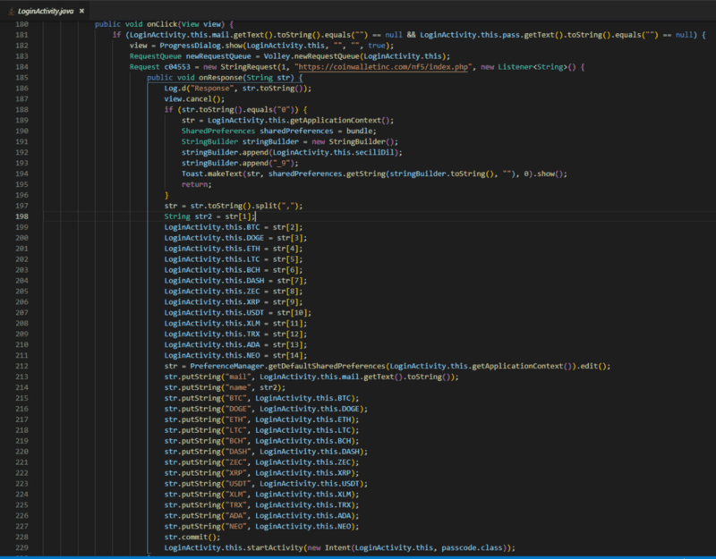
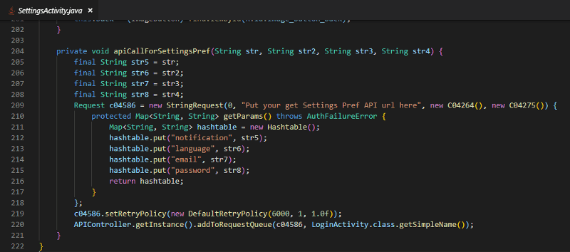
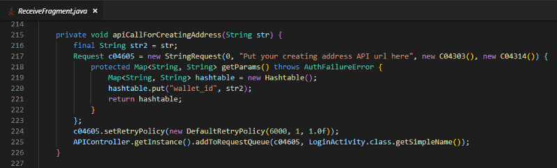

These fake apps will get you if you’re not careful. Always verify at a trusted source.
There are a lot of different ways you can lose your cryptocurrency, even if you think you are being super safe with your secrets. Today we’ll dive into a few malicious APKs in the Android ecosystem that are targeting cryptocurrency users.

For each of these APKs, I used the jadx decompiler to see what the code is doing.

### A fake Trezor wallet — com.trezorwalletinc.cryptocurrency

[Phishfort](https://www.phishfort.com/) notified me of a fake Trezor app in the Google Play Store. We decided to investigate.


I wanted to see if the app was Trezor-branded throughout, so I downloaded the app using BlueStack4 and gave it a whirl.

Surprisingly, the splash screen is branded differently, but the icon is still branded as “Trezor Wallet.”


This piqued my interest, as they are using the Trezor branding to get downloads but are offering a completely different product (branding wise).

I ran the APK through [HTBridge](https://www.immuniweb.com/mobile/?id=xwfz8hIJ) and their report told me it contacted a foreign domain coinwalletinc.com, which was registered earlier this year.

```bash
$ whois coinwalletinc.com
   Domain Name: COINWALLETINC.COM
   Registry Domain ID: 2355647446_DOMAIN_COM-VRSN
   Registrar WHOIS Server: whois.namecheap.com
   Registrar URL: http://www.namecheap.com
   Updated Date: 2019-01-26T12:53:03Z
   Creation Date: 2019-01-26T12:51:09Z
   Registry Expiry Date: 2020-01-26T12:51:09Z
   Registrar: NameCheap, Inc.
   Registrar IANA ID: 1068
   Registrar Abuse Contact Email: abuse@namecheap.com
   Registrar Abuse Contact Phone: +1.6613102107
   Domain Status: clientTransferProhibited https://icann.org/epp#clientTransferProhibited
   Name Server: DNS1.NAMECHEAPHOSTING.COM
   Name Server: DNS2.NAMECHEAPHOSTING.COM
   DNSSEC: unsigned
   URL of the ICANN Whois Inaccuracy Complaint Form: https://www.icann.org/wicf/
>>> Last update of whois database: 2019-05-09T15:45:34Z <<<
```

I used a file manager and transferred it to my other machine to unpack it. Using jadx decompiler and analysis tools, here’s what we found:

Since you need to use the app with an email and password, which suggests the wallet is custodial, I decided to look into sources/com/wallet/cryptocurrency/ActivityPackage/LoginActivity.java and I noticed a couple of things…

When you try to log in, it sends a request to coinwalletinc.com/nf5/index.php — which has a particular unprofessional default JSON response:


They are also exposing their error_log, which can be handy at gaining some intelligence — we know they are using a MySQL database to store things, and using the [PHP MySQLI](https://www.php.net/manual/en/book.mysqli.php) API to interact with it. We can also guess that the earliest hit was 2019–02–01.


Anyway, after it authenticates you, it populates some strings in the app for your wallet balances, email, and name.



Throughout the code, in multiple files, it looks like they forgot to alter some of the StringRequest parameters, as the URL is a placeholder. For example:



Pretty bizarre — surely this wouldn’t even pass UAT.

Anyway, I look to my receiving BTC address because “I want to start using this as a wallet because it has a really nice UI”...

It looks like the receiving address is hard-coded in the application to display and set the text of the clipboard.


In fact, there is a method stub to create an address for the user, but it is only a stub.



I created an account, grabbed a list of receiving addresses, uninstalled the app, reinstalled the app, created a fresh account, and grabbed a list of the receiving addresses. (The tickers aren’t incorrect, it’s how the app is showing them to me. Most of the addresses are invalid for their given ticker).

```txt
BTC - 1Lsj9BGpB3Nv15id9FWP71SRKKUFJPepfP0

DOGE - 17jAe7hTZgNixT4MPZVGZD7fGKQpD9mppi

ETH - DGf6dT2rd9evb4d6X9mzjd9uaFoyywjfrm

BCH - Lg64xV4Mw41bV3pTKc5ooBJ4QZ81gHUuJ6

DASH - qq9cjckr3r9wl5x4f3xcfshpcj72jcqk9uu2qa7ja2

ZEC - Xu6mkZNFxSGYFcDUEVWtUEcoMnfoGryAjS

LTC - 0x69919d83F74adf1E6ACc3cCC66350bEA4b01E92C

XRP - t1JKPTwHJcj6e5BDqLp5KayaXLWdMs6pKZo

USDT - raPXPSnw61Cbn2NWky39CrCL1AZC2dg6Am

XLM - 0x69919d83F74adf1E6ACc3cCC66350bEA4b01E92C

TRX - GDZ2AT7TU6N3LTMHUIX6J2DZHUDBU74X65ASOWEZUQGP7JMQ237KDBUX

ADA - TAm4fPA6yTQvaAjKs2zFqztfDPmnNzJqi2

NEO - DdzFFzCqrhswWLJMdNPJK8EL2d5JdN8cSU1hbgStPhxDqLspXGRRgWkyknbw45KDvT2EJJhoPXuj2Vdsj6V6WWM5JABoZ4UhR7vnRopn
```

Since I cannot find these strings hardcoded (except the BTC one mentioned earlier), I decided to revisit the SignupFragment.java file to see where it’s getting the addresses.


We know from the [Request Interface](https://github.com/google/volley/blob/ddbc32c04921df0973baadeee50f8d3099b12e14/src/main/java/com/android/volley/Request.java#L47) that method 1 is a POST request and we know it’s sending the context of SignupFragment. Looking at the way it handles the response, we can see it grabs the user addresses from the backend and puts them into the fragment properties and then commits them to the device [SharedPreferences](https://developer.android.com/reference/android/content/SharedPreferences.html) — a completely custodial wallet (not your keys, not your coins) with dodgy branding to bring in downloads.

### More fake wallets — com.coin.mycrypto, com.exchange.idex, com.wallet.metamask

We were recently notified on our Discord channel about a MyCrypto APK being indexed on search engines. It’s not on the Play Store, so you’d need to download it from a third-party store.


Again, we decompiled the APK to investigate, and it’s a simple branded phishing screen that uploads your secrets to a Firebase instance.

I remember being notified about a MetaMask one last year with very similar functionality, so I decided to search for a couple more...


The decompiled code for these are all very similar (only minor differences due to branding) but they function the same — all pushing secrets to (different) Firebase instances.


The Firebase instances are open, so let’s see what has been phished from these malicious APKs:

* Mnemonic phrases
* Private keys
* Keystore files & passwords
* Email addresses

We can graph when the phished addresses were last “seen” by the network, and get a clue on how active the backend was monitored and what timeframe the phishers were most active.

A total of 244 unique secrets were phished for the 3 malicious APKs ( com.coin.mycrypto , com.exchange.idex, com.wallet.metamask ) and we scanned the first 5 paths for all mnemonic phrases for mainnet network activity — a total of 302 phished addresses.

We can use [DuneAnalytics](https://explore.duneanalytics.com/public/dashboards/O7kLMeJ44CQEFNkb5R4VEGKjuZgrGZa8C02kRiQx) to graph the activity of these addresses and see when they were last active (minus any [WHG_1](https://etherscan.io/address/0x69670b0c1b100739812415dd474804bb32b3aeca) sweep activity). The [earliest activity](https://etherscan.io/tx/0x0e38f810449832cbd6b3d24a333b22affcd5627ee0806f9123b0de4cad50779e) on these addresses was at block 5,084,303.

Surprisingly, a lot of them are active pretty recently, and the most recent was in block 7,759,898. Coincidentally, [the address](https://etherscan.io/address/0x7f893d78d2e7d4667c3c068b4129525a29047f8e) was involved in another type of phishing scam that [Dave](https://twitter.com/AppletonDave) and I covered back in November 2017 —read: [is this a phishing scam?](https://medium.com/@Dave_Appleton/is-this-a-phishing-scam-119e68ce2f40) — and similar was covered by [r/cryptopolice in 2018](https://www.reddit.com/r/CryptoPolice/comments/8zp34q/new_interesting_type_of_fraud/).

When we run our query at the time of block 7,760,355 — we get some nice data (this is a dump of the first 15 results — see more on the [DuneAnalytics Dashboard](https://explore.duneanalytics.com/public/dashboards/O7kLMeJ44CQEFNkb5R4VEGKjuZgrGZa8C02kRiQx)).

```txt
address: 0x7f893d78d2e7d4667c3c068b4129525a29047f8e
block: 7,759,898

address: 0x5e9ee17f885d4f330fcb5d795bd0d327b879a825
block: 7,748,166

address: 0x05475a982140d70026662270d51e1dadf85d87b1
block: 7,745,323

address: 0xfb17695c25ce2fafedcb158d0649fbde1f2f8137
block: 7,742,000

address: 0xba47a8098636cb62c22948a74a8622ebb6313db7
block: 7,741,993

address: 0x242868db6074fa6428bc25187c3d6fa29eb3a17c
block: 7,741,984

address: 0x70928cf142dd54443812c3e5593df84d0fae2598
block: 7,741,980

address: 0xff80ea0919affce235534297e5cd0e81d54914eb
block: 7,741,962

address: 0x498dc72d94d230a2f6a9fe53a4837b3e50352458
block: 7,741,954

address: 0xe366f2d6a219561d88f27c3d50a842ff5bd5aef6
block: 7,741,941

address: 0xf48f3fb224e7e584648f9af1ae167ff99e22aeb1
block: 7,741,933

address: 0xf95326cc928a241102085bb02d1e886e8e8ffb5b
block: 7,741,914

address: 0x697169b1e871e7f3c0b2801110e072eabe32e3a8
block: 7,741,912

address: 0x2d0afa35b1542ab39321d599cf5122af0bf3fde4
block: 7,741,909

address: 0x6499a1e10693ed7daba1ebb4b8402a1ee29a7dee
block: 7,741,909
```

As these APKs are a year old, the sweep addresses have mostly been identified.

For example, [this transaction](https://etherscan.io/tx/0xb5daa46a014f326d2556e53c9090b8351864907ba79dee56e2958bb92bbfdd72) where the sender private key was found in `com.exchange.idex` Firebase instance goes to a [marked Etherscan address (Fake_Phishing397)](https://etherscan.io/address/0xa0bf76c8de60a1089fbb8567b2beeca6ec01ca32) which has 20 inputs from the phished addresses (not counting token transfers)

```json
{
	"address": "0xa319fb522330d8fa3f82d8e6e5a3365e9241d618",
	"msg": "This account was compromised in a fake Idex andriod app - Harry",
	"sig": "0x654fa929992c74091080989fe67ac46e4268bf9f63b92e33fd47a2461f41ad5f3937ee46de212a1c022894af53e05ee7495ef410bd98a891fa7e7d40325901111b",
	"version": "2"
}
```

### A 2019 MetaMask phishing app

Whilst looking at the APKs above, I came across another MetaMask APK that was published in 2019 — looking at it, it behaves different to the others.


This application behaves differently because instead of directly interacting with a Firebase instance to store keys, it actually loads a Ngrok server with webview, imitating the MetaMask UI to phish for keys.


What’s super interesting is that Ngrok provides a tunnel to a localhost — and can be closed and opened at will. Because of this, it’s very hard to investigate.

This type of infastructure to phish users isn’t new, we saw it being used on Cryptopia users, which I tweeted about (see embedded thread below), and [to phish users keys under the guise of testing a new exchange](https://urlscan.io/result/2cf9bc01-e198-4b88-a26e-22da93679d12/).

### How can I keep my cryptocurrency safe?

There are a lot of attack vectors that a cryptocurrency user needs to be aware of so they can best adjust to keep their funds safe and secure — we have an [extensive guide written](https://medium.com/mycrypto/mycryptos-security-guide-for-dummies-and-smart-people-too-ab178299c82e), but let’s focus on mobile wallets.

* Only download reputable wallets from trusted stores (i.e, App Store, Play Store).
* Seek out the legitimate app for the brand you want to use — if they don’t have an application advertised, they don’t have one published, so don’t trust a random someone on Discord telling you xyz is legitimate.
* Use a mobile wallet as a hot wallet, like you’d treat physical cash notes. Don’t store more than you’re willing to lose — it’s not cold storage.