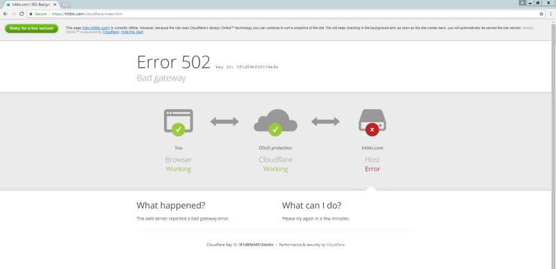

Welcome to part 2 of 1000 of “Harry follows phishers”

One of our bots recently found a new, relatively sophisticated HitBTC phishing kit. We decided to dissect it.

#### What is HitBTC?

HitBTC is a cryptocurrency exchange doing, on average, over $250mln daily volume.

Like most cryptocurrency exchanges, HitBTC utilizes Cloudflare for DDOS protection and, like most cryptocurrency exchanges, it has a tendency to go down during periods of high traffic. During these times it is not unusual for users to see the Cloudflare anti-DDOS waiting screen, the Cloudflare snapshot page, or other Cloudflare error pages. You will see why this is relevant shortly.

### The Phishing Kit

The logic behind this phishing kit is clever as it not only tricks you into handing over your details to steal your login details and 2FA codes, but it makes it quite hard to detect that you weren’t on the legitimate domain.

The phishing domain is currently hiding behind Cloudflare proxy — we have issued takedown requests — but here’s what a victim would experience.

* User enters their email and password into the login form on the phishing site.
* User clicks the "Sign In" button. If we de-obfuscate the JavaScript, we can see the following code is run when we press "Sign In".
* An iframe of a screen mimicking a CloudFlare waiting screen is shown whilst the user details are sent to a backend script that attempts to login at HitBTC.

If the log in is successful (because the user **does not** have 2FA enabled), the user is shown a 502 Cloudflare error screen. Six seconds later, they are redirected to the legitimate HitBTC domain. At this point, **user login details have already been stolen.**

* If log in is not successful (because the user **does** have 2FA enabled), the user is shown a Cloudflare wait screen. Seconds later, they are shown a 2FA form.
* Once the user inputs their 2FA code, the code is sent to the attacker’s backend, tests the login, and redirects the user back to the legitimate domain.

Regardless of whether or not a user has 2FA enabled, once the phishkit has the login details, it will display the Cloudflare 502 error and redirect the user back to the legitimate domain.

What makes this phishkit especially dangerous is that a user is unlikely to detect that they have just been compromised:

* Even if the user suspects something may be amiss and decides to check the URL, they are now on the legitimate domain. They would have to view their browser history to see that they previously entered their details on a phishing website.
* It’s very easy to write the experience off as a glitch and assume something went wrong during the login process. This is especially plausible because of how the phishkit utilizes the familiar Cloudflare wait/error screens while they are testing the logins.

### Diving Deeper

When we investigate the backend scripts, we see that they have an application running on port 5000. We know this because a regular error view brings up the traditional Nginx page:

However, if we navigate to anything with a path of `/^twofa/` then we get a different view:

The known background scripts (called via XHR) are:
* `POST /register`
* `POST /twofa_short`
* `GET /getcsrftoken`

### Playing The Victim

I created a throwaway HitBTC account (without 2FA enabled) and submitted my details. Here’s the network log:

As you can see, the background script (called with `POST /register`) responded with an OK response — meaning their backend app was able to login to my HitBTC account. I was then shown the Cloudflare wait screen and then redirected to the legitimate domain via a 302 Found redirect.

Now that the bad actors have my details, I assumed they would create an API key that would grant them full access to my account. They would then use this access to, perhaps, buy-up shitcoins at a huge margin, [like we saw with Binance](https://www.reddit.com/r/BinanceExchange/comments/82pj5p/please_read_regarding_unauthorized_market_sells/). That said, at time of writing, no API key was created. It’s possible that they only create API keys if there are any coins or funds in the HitBTC account.

### What can you do to stay safe?

As you probably gathered by now, the internet is “the wild-west” and even more-so when dealing with cryptocurrency. The attackers are getting increasingly sophisticated and it’s becoming more difficult for you to detect that you are on a phishing website.

* Never keep all your funds on an exchange.
* Employ the use of cold-wallets with any coins you’re not actively trading.
* Spread the coins across multiple exchanges and utilize different usernames, email addresses, and passwords.
* Always use 2FA (even though it wouldn’t have necessarily helped in this case).
* Always check the URL **before** entering your login details.
* Navigate to your crypto websites via bookmarks that you create yourself.
* Regularly go through your accounts and check for unnecessary API keys that you either do not use anymore or do not remember creating.
* Close any active sessions to your accounts that you do not need anymore.
* Turn on all available alerts and notifications for the exchanges. Things like buy/sell orders, creation of new withdrawal addresses, creation of new API keys, logins from unidentified devices, and whatever other features an exchange provides. It’s best to be notified if something changes as soon as possible.
* If something feels off, take the time to look more closely (e.g. check the URL, check your browser history.) Don’t rush yourself into making a mistake and don’t ignore things.
* Install [EtherAddressLookup](https://chrome.google.com/webstore/detail/etheraddresslookup/pdknmigbbbhmllnmgdfalmedcmcefdfn), which will block you from visiting URLs that are known to be malicious (like the phishing website above!)
* Report scams and malicious phishing websites to https://etherscamdb.info. We also index all these phishing websites there if you want to check something or look deeper at the diversity of scams.