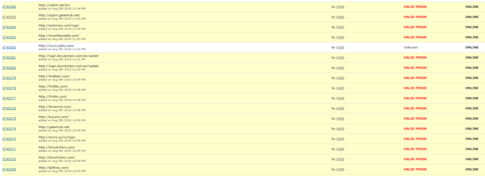
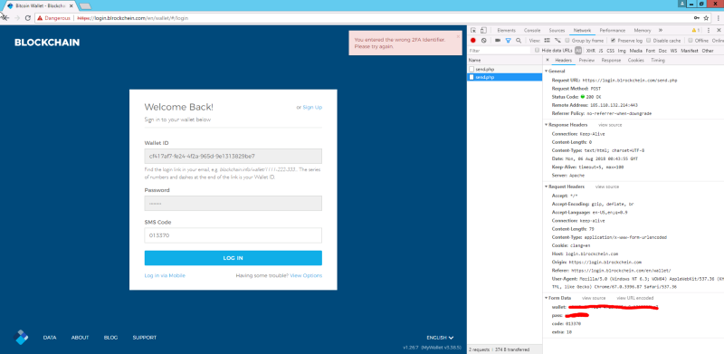

It’s been about a year since I started taking a major interest in phishing within the cryptocurrency scene, namely Ethereum. During that time, I’ve built relations and a great network of people passing data between each other to help better protect users against phishing.

Today, I was forwarded another MyCrypto phishing domain from a very good friend, Jeremiah—a security researcher from Cisco. He sent me mycryrptto.com (among many others). So I went to issue takedown notices with the hosting service provider and noticed their nameservers were a little suspicious.

I’m pretty familiar with the name hostinger, but hosstinger with two S’s? I’ve not heard of that before. I loaded up a VPN and navigated to their domain to see if maybe my memory was incorrect and that’s how you spelt the hostinger name — it’s not, and to my surprise, I was given a gift.

A whole list of phishing domains are exposed as they didn’t close off their DirectoryIndex option within their Apache webserver configuration. Bingo!

Targets include; Bittrex, Blockchain.info, Exmo, Gatehub, Kucoin, Binance, Hitbtc, Kraken, Poloniex, Yobit, MyEtherWallet, and MyCrypto.

So, I did some recon on the domains and all of them were serving phishing content designed to steal your exchange logins — more on that in a second!

I noticed that all the domains listed didn’t have SSL certificates applied — I’m suspecting this is so we couldn’t catch them by monitoring the certstream — you can view an example of one here: https://certstream.calidog.io/

After confirming their phishing content, I immediately blacklisted these domains on [EtherAddressLookup](https://github.com/409H/EtherAddressLookup#etheraddresslookup) and [MetaMask](https://metamask.io/), and [indexed them](https://github.com/MrLuit/EtherScamDB/commit/4717a1f2fb6289654b6370495e3e1306ff01ad2d) on our scam database. I submitted them to the Phishtank also and they were very quickly confirmed as VALID PHISH from the community — which other products use to further protect the community.

### So, what did these domains do?

I [recently wrote about a phishing kit that was utilized on a HitBTC domain](/dissecting-a-hitbtc-phishing-site) but lets inspect some of the new ones we found to see if they’re similar and to see if we can find more secrets.

Note that none of these domains served under SSL/TLS, which should be one of your first clues that it’s not a legitimate domain if you landed on it.

The server also has a MySQL database (https://www.shodan.io/host/185.110.132.214) which I assume is being used to store the login information.

### bjlttrex.com

This one is similar to the HitBTC phishing kit, but not as sophisticated — you will see why — and they don’t seem to attempt to issue a login.

Now, let’s create a throwaway Bittrex account and see if they attempt a login. A simple `POST /Account/Login` with a UserName and Password postbody.

So they now have my Username and Password. On this throwaway account I do not have any 2FA codes, but they ask for it anyways — so let’s input something random.

Now, let’s issue a real 2FA code…

So this kit isn’t *as* sophisticated as the previous HitBTC one as they always ask for 2FA codes, and if you don’t have it, they don’t redirect you back to the real domain.

My Bittrex account didn’t reveal any bad actor login attempts, but they do have my username and password. If they tried to login, we would see a LOGIN_B4_2FA event logged.

### blrockchein.com

This phishing kit is pretty much the same as the previous, just skinned with the Blockchain views.

When I login, it sends a `POST /send.php` request with `wallet=<wallet_id>&pass=<password>&code=&extra=2`

I currently do not have 2FA setup on my throwaway blockchain account, so let’s input jibberish.

Interesting! Before I could setup the 2FA, I get the following email.

Their IP is 91.234.35.195 — which has RDP enabled — it’s located in Ukraine. Shodan has the following information:

I didn’t authorize the login attempt, but they tried 2 more times. I enabled all the logging I could within the security section on Blockchain.info and authorized their request (2018–08–06 00:55:22). Although, they probably logged out as soon as they saw there were no funds in it.

I am still trying to rule out this IP not being me as no other kits on the server have shown this behavior— though none of my VPNs are located in Ukraine.

### lbinanrce.com

I went ahead and created a fresh new Binance account with 2FA enabled. Time for us to “get phish’d”.

What caught my eye is the requests being made when I focus on an input. It sends the following request: `GET http://lbinanrce.com/test?data=eyJkaXN0a...`

The file test responds with the default Apache 404 error page, but test.php responds with a “custom” 404 error page — I think the phishers forgot the file extension… clumsy.

Which is a base64 encoded string which contains the following data — trying to fingerprint me. I couldn’t see this anywhere on the legitimate Binance domain, but it might be there.

Same kind of backend process as before. Login with my email and password, and they ask for the 2FA codes.

Once the 2FA is successfully stolen, they then redirect you to the legitimate domain.

Now, I wait a while until they action a login on Binance… They never did, even after waiting 30 minutes :(

### How do I stay safe?

* Keep your eye on the address bar to notice anything unusual about the domain and certificate **before** you enter your login details!
* Always use bookmarks that you trust.
* If you get redirected back to the login screen after logging in, monitor your stuff!
Turn on all available alerts and notifications for the exchanges. Things like buy/sell orders, creation of new withdrawal addresses, creation of new API keys, logins from unidentified devices, and whatever other features an exchange provides. It’s best to be notified if something changes as soon as possible.
* Install [EtherAddressLookup](https://chrome.google.com/webstore/detail/etheraddresslookup/pdknmigbbbhmllnmgdfalmedcmcefdfn), which will block you from visiting URLs that are known to be malicious (like the phishing website above!)
* Report scams and malicious phishing websites to https://etherscamdb.info. We also index all these phishing websites there if you want to check something or look deeper at the diversity of scams.