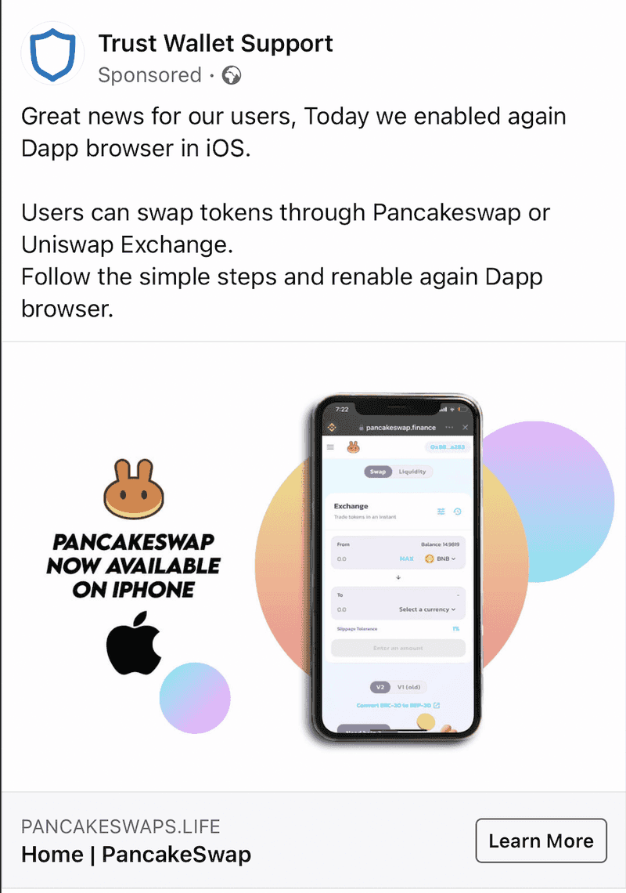

Back in 2018, I published a [research article](/you-need-to-stop-trusting-links) about how many click-throughs we managed to track through to scams utilising popular link shorteners. This article aims to be supplemental to that and demonstrates why you should not blindly trust links that you find on social media platforms, especially in the blockchain industry.

### What is “Unfurling”?
When you post a link to a social media platform, that platform conducts a process called unfurling, which, among other things, is the process of fetching the link information from the [OpenGraph meta tags](https://ogp.me/) on the remote server to render a link card for you to show a graphic, the website URL, and some small description of the website.

This process is done to deliver a better user experience and can sometimes keep users within the application, as unfurling [can even render videos](https://api.slack.com/reference/messaging/link-unfurling#classic_unfurl). Keeping users within your application (instead of shipping them off to a third party) is generally the goal of an application, as user retention is typically tracked.

However, as great and useful as unfurling is, it can be abused by bad actors to trick someone into believing where a link will send them. Users typically have inherent trust that the application they are using will show them the “correct” data.

### Twitter
Social media platform Twitter has a large sub-community known as “crypto twitter” (or CT), which attracts many good actors but also bad actors waiting to try and scam individuals out of their crypto holdings. In fact, I have an entire [research article on reply scam rings](/investigating-twitter-reply-scam-rings) within Twitter that specifically target crypto users.

I recently [tweeted with a link to Uniswap](https://twitter.com/sniko_/status/1456320221564780550) (or did I?) to educate the community (specifically the CT community) on how easy it is to be fooled by a link card that Twitter renders on the client side.

If a bad actor uses [Twitter Ads](https://business.twitter.com/en/advertising.html) (or a RT bot farm) to promote a tweet with an abused link (like above) in it, it can be very costly to the end users who inherently trust that a multi-billion dollar company would serve them the correct unfurled link.

The best advice we can give to a crypto user on Twitter is to never trust anyone (read: verify, don’t trust), even those with blue verification badges. Accounts are often sold and used to target crypto communities via malicious links, support help, and bad advice to pump shitcoins.

### Facebook
Social media giant Facebook also has crypto groups, most of which are “cesspools” of scams, and their unfurling engine can also be abused to show a different endpoint than what you will be directed to - just like Twitter. However, their status engine is a little different, as you can delete the link after the link card is added to the status.

https://twitter.com/sniko_/status/1456362602926379011

If you’re part of a crypto-oriented group on Facebook, chances are you will be targeted with ads - most of which will be scams. In fact, recently we noticed three types of scams on Facebook.

Although [I wrote about this in 2020](https://v1.harrydenley.com/cryptocurrency-ads-on-facebook-in-2020/), it is still pretty common to see these types of scams that advertise an insane amount of income per week by signing up to a Bitcoin service. These services are advertised with a fake news article and a sensationalized news video that reinforces the legitimacy of their platform by piggybacking off Bitcoin’s brand.

Some scams we see are targeted at those who want to start in crypto with self-custody and know some of the brand names in the space. We see ads (such as the following) that try to profit off established project names in the space to steal [secret recovery phrases](https://support.mycrypto.com/general-knowledge/cryptography/how-do-mnemonic-phrases-work/) of users. They typically mix established branding into their sponsored ads.

Another [common scam](https://twitter.com/sniko_/status/1414735578344706053) involves bad actors targeting users who are more familiar with technological terms involving smart contracts. They usually direct people to a video-hosting platform and explain how to use an already-created smart contract to perform a [flash-loan attack](https://decrypt.co/resources/what-are-flash-loans-the-defi-lending-phenomenon-explained), often on Binance Smart Chain. These contracts are written to deposit ETH (or in this case, BNB) into a contract that simply forwards it to an [EOA](https://ethereum.org/en/developers/docs/accounts/#types-of-account). In the example below, the contract that they get you to deploy will send funds to [`0xE460cd9b2d44951A6A06f36D691C8051aA830c83`](https://blockscan.com/address/0xE460cd9b2d44951A6A06f36D691C8051aA830c83).

### Discord
Many crypto groups host their own Discord servers to engage more easily with their community, but these servers can quickly become hotspots for crypto scammers.

Recently, we’ve seen bad actors mimicking a popular Crypto-to-Discord integration called “CollabLand” to phish for users' secrets by copying CollabLand and MetaMask branding. CollabLand is an integration that allows users to match their Discord accounts to their web3 accounts to gain access to specific channels reserved for those who, for example, hold a certain NFT.

### After You’ve Clicked the Link
Once you’ve landed on the webpage that the bad actor wants you to land on, they’ll try to get access to your crypto assets. There are a number of ways in which a bad actor can do this, including attempting to get your [secret recovery phrase](https://support.mycrypto.com/general-knowledge/cryptography/how-do-mnemonic-phrases-work/).

A misconception in the space is that bad actors can only steal your assets if they have your secret recovery phrase, but widely-adopted standards - especially those that implement `approve()` and [`permit()`](https://eips.ethereum.org/EIPS/eip-2612) functions within their interfaces - have changed all that. This means that as a user you need to be cautious with what you are signing, even off-chain.

The most common tactic a phisher uses is trying to get you to type your secret recovery phrase into a webform. They typically do this by [imitating the MetaMask UI](https://twitter.com/sniko_/status/1281247618102853639) and ask for it, and it is quite successful. Once they have your secrets, they’ll then sweep all your assets (or at least the most valuable ones).

Also prevalent, you might be led to believe you have [“airdropped” tokens that you can seemingly swap for a huge sum](https://twitter.com/sniko_/status/1438643879851528199), but are required to go to a specific swap website controlled by the scammer. Once there, the UI shows you that you’ll be getting $xx,xxx after you confirm the swap - however, you’re then asked to sign a message in your wallet provider, which is calling approve() on your most valuable (in USD terms) token so that they can sweep it at a later date. As well as coming across our radar, they have got the attention of [Coinbase Security Team](https://blog.coinbase.com/security-psa-airdrop-phishing-campaign-38b880c0298a).

Moral of the story? Don’t trust links. Verify.