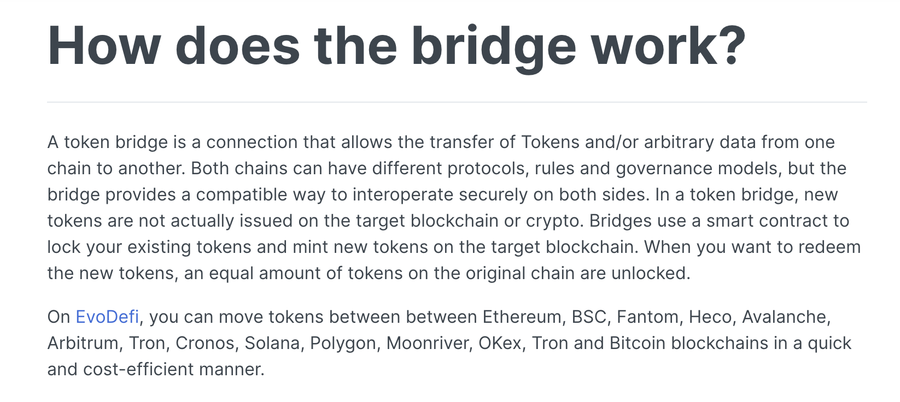
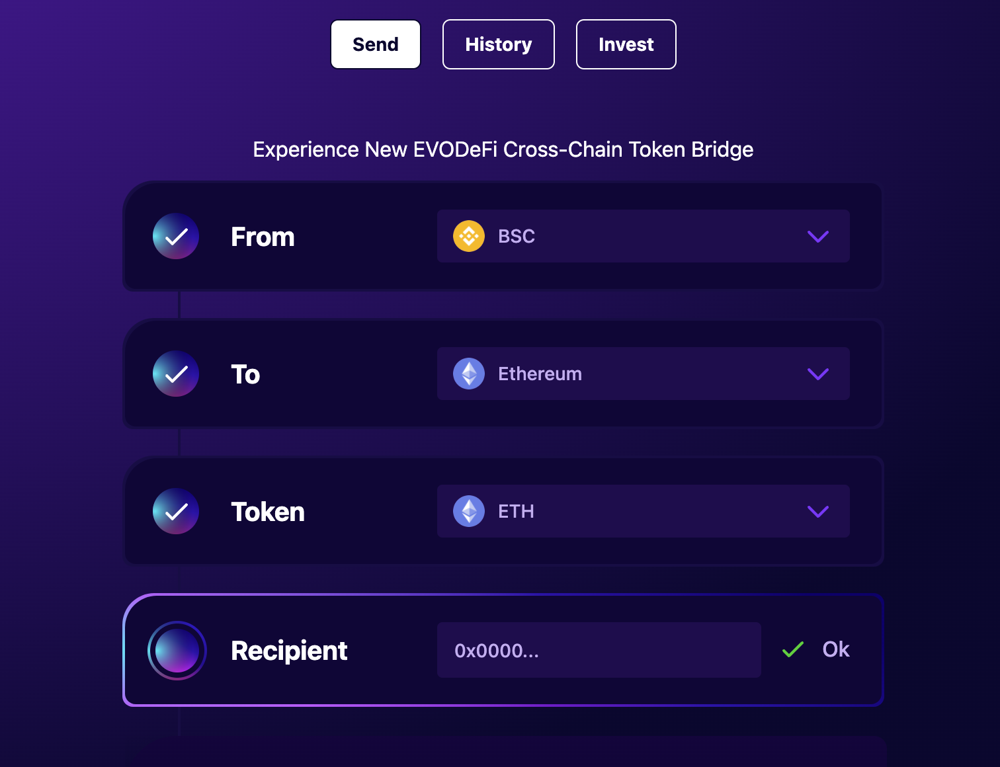
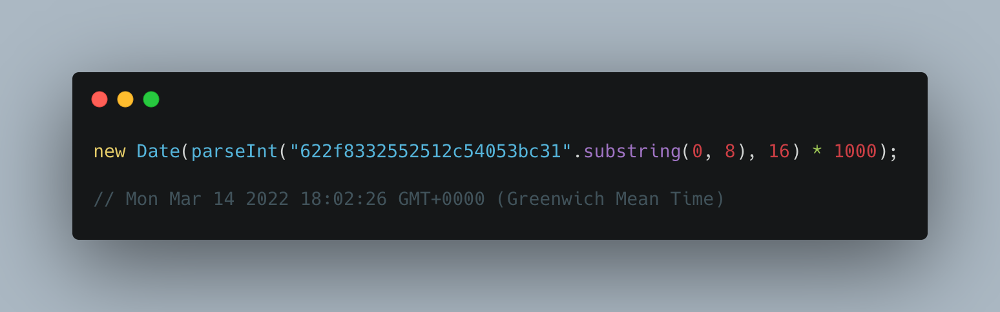
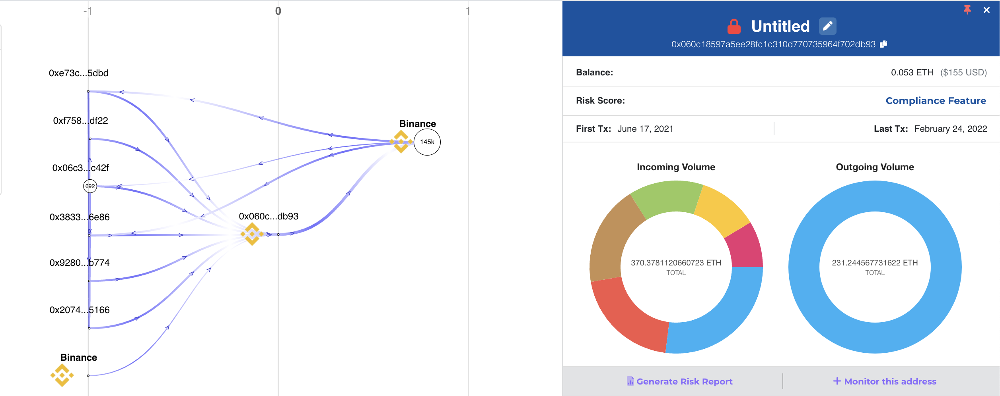
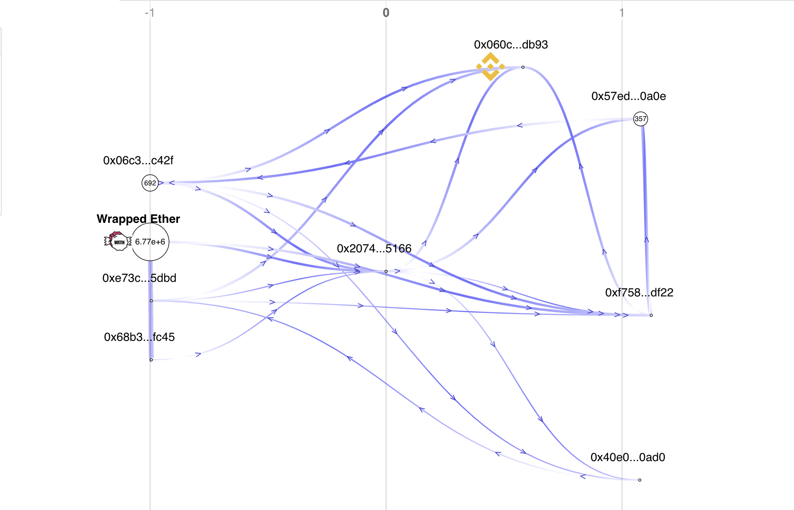
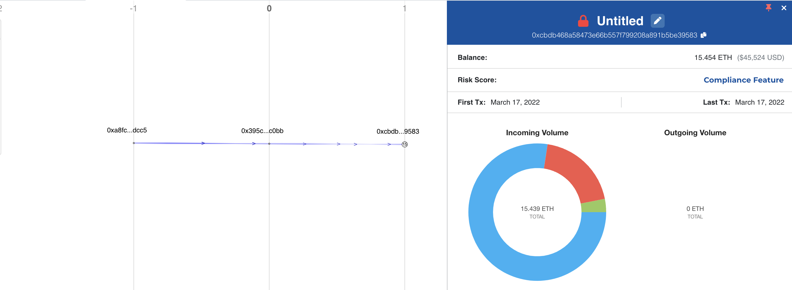
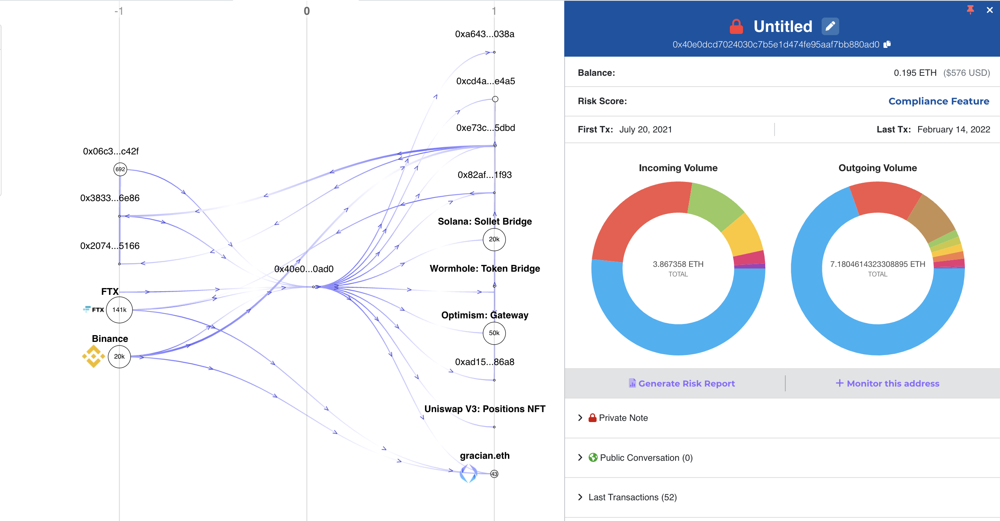
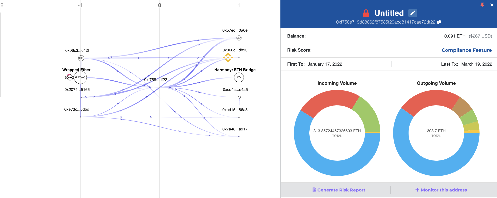
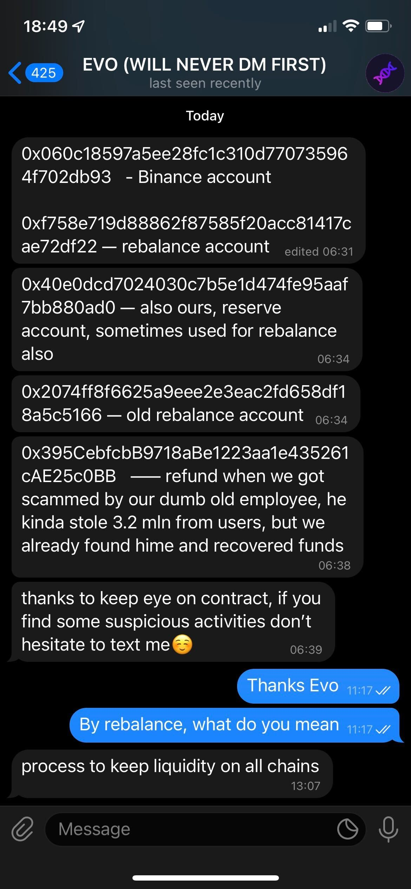

I have started looking at different cross-chain bridges to understand how different bridges have different setups and understand if the risks are properly communicated to the users using them and the teams operating them.

I came across EvoDefi from this tweet in my Twitter timeline and thought it warranted some more eyes on it.

https://twitter.com/0xtroll/status/1497687274146136065



Whilst reading the docs for EvoDefi, I notice that the "how does the bridge work?" does not actually explain _how_ it works, especially the technical side. This got me interested and to poke around.

### Fetching the Bridge Addresses



When a user wants to bridge, they are presented a UI from EvoDefi and the relevant bridge contract address is fetched from their HTTP API `GET //api.evodefi.com/bridge/v1/settings`. 

Conviently, the response to this request has an `_id` field, which _looks_ like a MongoDB ID field. From here, we can extract the timestamp from this object - which is when the document was inserted into MongoDB. 



As the document was updated recently, we could maybe assume it is because they have added/updated tokens to the document.

However, this does raise a concern;

* How is the MongoDB instance secured?
* Who has access to the MongoDB instance?
* Is access to this MongoDB audited?
* What's their security policy on authentication?
  * Is authenticating keys rotated? If so, how?
* What other applications make use of this MongoDB instance?
  * Have they been audited for any vulnerabilities that allow write access to the same collection as these documents are held?

Do they have good security practices to prevent an unauthorised change to the database record of the `bridge` value for any chain.

```json
{
	"_id": "622f8332552512c54053bc31",
	"networks": [{
		"id": 0,
		"bridge": "0x06c30Af8A82AAf9cFd319f8644584276Bfbec42f",
		"name": "BSC",
		"icon": "https://api.evodefi.com/bridge/img/bnb.png",
		"explorer": "https://bscscan.com/tx/",
		"confirmations": 20,
		"bonus": 0,
        ...
    }]
}
```

#### Bridge Contracts

* Arbitrum: `0x06c30Af8A82AAf9cFd319f8644584276Bfbec42f`
* Avalanche: `0x06c30Af8A82AAf9cFd319f8644584276Bfbec42f`
* BinanceSmartChain: `0x06c30Af8A82AAf9cFd319f8644584276Bfbec42f`
* Cronos: `0x06c30Af8A82AAf9cFd319f8644584276Bfbec42f`
* Ethereum: `0x06c30Af8A82AAf9cFd319f8644584276Bfbec42f`
* Fantom: `0x06c30Af8A82AAf9cFd319f8644584276Bfbec42f`
* Gnosis: `0x7ccA0859058Aa03301106aB8ABA1707A16a30821`
* HarmonyOne: `0x7ccA0859058Aa03301106aB8ABA1707A16a30821`
* Heco: `0x06c30Af8A82AAf9cFd319f8644584276Bfbec42f`
* Moonriver: `0x06c30Af8A82AAf9cFd319f8644584276Bfbec42f`
* OKExChain: `0x06c30Af8A82AAf9cFd319f8644584276Bfbec42f`
* Oasis: `0x7ccA0859058Aa03301106aB8ABA1707A16a30821`
* Optimism: `0x7ccA0859058Aa03301106aB8ABA1707A16a30821`
* Polygon: `0x06c30Af8A82AAf9cFd319f8644584276Bfbec42f`
* Solana: `G9NyMJzQrRAcSm4T16tuRjyfCjXgHEw1njeYDLhLDryZ`


### Notables from the Bridge Smart Contracts

I'll make some notes about some of the smart contracts on different chains.

**BinanceSmartChain**

* Bridge: [`0x06c30Af8A82AAf9cFd319f8644584276Bfbec42f`](https://bscscan.com/address/0x06c30Af8A82AAf9cFd319f8644584276Bfbec42f)
  * Contract is verified

**Ethereum Mainnet**

* Bridge: [`0x06c30Af8A82AAf9cFd319f8644584276Bfbec42f`](https://etherscan.io/address/0x06c30Af8A82AAf9cFd319f8644584276Bfbec42f)
  * Contract is not verified

**Polygon**

* Bridge: [`0x06c30Af8A82AAf9cFd319f8644584276Bfbec42f`](https://polygonscan.com/address/0x06c30Af8A82AAf9cFd319f8644584276Bfbec42f)
   * Contract is not verified

For assets to move from each bridge, an EOA address has to initate a `withdraw()` call. The structure of this call is `withdraw((bytes32,address,uint256,uint256,address,uint256[],address[])[])`.

You can see some examples here:

* https://polygonscan.com/tx/0x9abd99a0de788470d6ae9b6aa1a7b64dddfa975c82de95556b2b31754025e89d
* https://bscscan.com/tx/0x6b9dce481f0419a5f0d915b9906f53750c8c01ef6e11089e41a66a99a2ba6de3
* https://etherscan.io/tx/0x30029fc145b773b9c5d2fa8ef2a2083930fd7aa93364f3fd77cf3e8b34a998f8

 function requiring a withdrawer EOA or withdrawer contract only to operate")


As of block `16207286`, on **BinanceSmartChain**, [there are 7 operators](https://dune.xyz/queries/519272), and 3 of them are capable of calling `withdraw()`.

```
0xad158b08348b46b94f2c36b34ab9c1e1ad4086a8 (EOA) (withdrawer)
0xcd4a15841a4906ff78d3f2aa8e55936f1a7ae4a5 (EOA) (withdrawer)
0xea79307d2b91c1d8a36062b1801ec55c11a56d58 (EOA) (withdrawer)
```

As of block `14419600`, on **Ethereum Mainnet**, [there are 6 operators](https://dune.xyz/queries/519278), and 2 of them are capable of calling `withdraw()`.

```
0xad158b08348b46b94f2c36b34ab9c1e1ad4086a8 (EOA) (withdrawer)
0xcd4a15841a4906ff78d3f2aa8e55936f1a7ae4a5 (EOA) (withdrawer)
```

As of block `26126438`, on **Polygon**, [there are 15 operators](https://dune.xyz/queries/519279), and 11 of them are capable of calling `withdraw()`.

```
0xea79307d2b91c1d8a36062b1801ec55c11a56d58 (EOA) (withdrawer)
0xad158b08348b46b94f2c36b34ab9c1e1ad4086a8 (EOA) (withdrawer)
0xcd4a15841a4906ff78d3f2aa8e55936f1a7ae4a5 (EOA) (withdrawer)
0xfab76435b43963afd421f0efa24fc090ccc6908e (EOA) (withdrawer)
0x772a8de4aae958f37987765fcee41b4abd19fdc0 (EOA) (withdrawer)
0x165ecc16fc12e796f1a22457049631e97924956e (EOA) (withdrawer)
0x92375877c6456a84bd7e0b6fe34c3a1806fbbc84 (EOA) (withdrawer)
0xcb59d26cfc6fd0d2459b0751fc40f7f557b5558c (EOA) (withdrawer)
0x558abff2dea0daeabb8a55f11747e8a29ba3c789 (EOA) (withdrawer)
0xbb101237b3a0405d41bd4891be27f562eeea56b2 (EOA) (withdrawer)
0xb35459b44affa7d4b29d26161d219e3775e627ad (EOA) (withdrawer)
```

Although there are all of these `withdrawer` operators, there are some operators that have no restrictions on taking any asset - other than being an authorised `taker`.

 function requiring a taker operator to operate. Can withdraw _any_ asset from the contract")

As of block `16207286`, on **BinanceSmartChain**, [there are 7 operators](https://dune.xyz/queries/519272), and 3 of them are capable of calling `take()`.

```
0x40e0dcd7024030c7b5e1d474fe95aaf7bb880ad0 (EOA) (taker)
0x2074ff8f6625a9eee2e3eac2fd658df18a5c5166 (EOA) (taker)
0xf758e719d88862f87585f20acc81417cae72df22 (EOA) (taker)
```

As of block `14419600`, on **Ethereum Mainnet**, [there are 6 operators](https://dune.xyz/queries/519278), and 3 of them are capable of calling `take()`.

```
0x40e0dcd7024030c7b5e1d474fe95aaf7bb880ad0 (EOA) (taker)
0x2074ff8f6625a9eee2e3eac2fd658df18a5c5166 (EOA) (taker)
0xf758e719d88862f87585f20acc81417cae72df22 (EOA) (taker)
```

As of block `26126438`, on **Polygon**, [there are 15 operators](https://dune.xyz/queries/519279), and 3 of them are capable of calling `take()`.

```
0x40e0dcd7024030c7b5e1d474fe95aaf7bb880ad0 (EOA) (taker)
0x2074ff8f6625a9eee2e3eac2fd658df18a5c5166 (EOA) (taker)
0xf758e719d88862f87585f20acc81417cae72df22 (EOA) (taker)
```

This means, the same 3 accounts can essentially rug pull;

* [~$23,485,000 on BinanceSmartChain](https://bscscan.com/tokenholdings?a=0x06c30af8a82aaf9cfd319f8644584276bfbec42f)
* [~$17,000,000 on Ethereum Mainnet](https://etherscan.io/tokenholdings?a=0x06c30af8a82aaf9cfd319f8644584276bfbec42f)
* [~$8,317,000 on Polygon](https://polygonscan.com/tokenholdings?a=0x06c30af8a82aaf9cfd319f8644584276bfbec42f)


In fact, [`take()` has been called over 120 times](https://dune.xyz/queries/519328) on Polygon, with the [beneficiaries](https://dune.xyz/queries/519352) being;

```txt
0x2074ff8f6625a9eee2e3eac2fd658df18a5c5166
0x40e0dcd7024030c7b5e1d474fe95aaf7bb880ad0
0xab0fdacb3fb80a70f510781df57211be25d8be00
0xc88dfb2e76569166a74ae118c16b2684237e5c39
0xf4f3572a2a27c1786133743e55fd64298300fba4
0xf758e719d88862f87585f20acc81417cae72df22
```

Here's a snapshot of funds taken from the Polygon Bridge using `take()` and sent to [`0x2074ff8f6625a9eee2e3eac2fd658df18a5c5166`](https://polygonscan.com/address/0x2074ff8f6625a9eee2e3eac2fd658df18a5c5166) (A random address I chose from the above beneficiaries).

* A total of 1,700,200 USDC 
* A total of 780,300 USDT
* A total of 173 WETH
* A total of 49999 anyUSDT

At current prices, this equates to **$3,042,149 that has been taken from the bridge** and sent directly to a beneficiary. Note that on Polygon alone, there is 6 different beneficiaries.


Also, [`take()` has been called over 90 times](https://dune.xyz/queries/519381) on Ethereum Mainnet, with the [beneficiaries](https://dune.xyz/queries/519386) being;

```txt
0x060c18597a5ee28fc1c310d770735964f702db93
0x2074ff8f6625a9eee2e3eac2fd658df18a5c5166
0x395cebfcbb9718abe1223aa1e435261cae25c0bb
0x40e0dcd7024030c7b5e1d474fe95aaf7bb880ad0
0xf758e719d88862f87585f20acc81417cae72df22
```

A total of 1667.1951538 ETH ($4,923,327) has been taken from the bridge and sent to different beneficiaries. 

#### 0x060c18597a5ee28fc1c310d770735964f702db93




#### 0x2074ff8f6625a9eee2e3eac2fd658df18a5c5166



Other direct beneficiaries for this address are: `0x57ed6bd35a6ce815079855cd0b21331d1d5d0a0e`, `0xf758e719d88862f87585f20acc81417cae72df22`, `0x40e0dcd7024030c7b5e1d474fe95aaf7bb880ad0`.

#### 0x395cebfcbb9718abe1223aa1e435261cae25c0bb



The only beneficiary is `0xcbdb468a58473e66b557f799208a891b5be39583`.

#### 0x40e0dcd7024030c7b5e1d474fe95aaf7bb880ad0



Other direct beneficiaries for this address are: `0xa6439ca0fcba1d0f80df0be6a17220fed9c9038a`, `0xcd4a15841a4906ff78d3f2aa8e55936f1a7ae4a5`, `0xe73c4e077a9fcd02b590f8c275773401e5f95dbd`, `0x82afc7e1172fd866c5f1317faef36b08f96e1f93`, `0xad158b08348b46b94f2c36b34ab9c1e1ad4086a8`, `0x4cd977fdad7acc7b515dfd5637c28afddef8b072`.

#### 0xf758e719d88862f87585f20acc81417cae72df22



Other direct beneficiaries for this address are: `0x57ed6bd35a6ce815079855cd0b21331d1d5d0a0e`, `0x57ed6bd35a6ce815079855cd0b21331d1d5d0a0e`, `0xcd4a15841a4906ff78d3f2aa8e55936f1a7ae4a5`, `0xad158b08348b46b94f2c36b34ab9c1e1ad4086a8`, `0x7a46410e606c08fd106031701d8bd0c44657a917`.


So, from the small data we have analysed, a total of $7,965,476 has been taken from the bridge deposits and sent to specific beneficiaries. And, there is more `take()` that we haven't included in these stats on Polygon and Ethereum Mainnet, and I haven't included data from all the other chains they support, so the figures are likely much larger.

As far as I can tell, this `take()` functionality and it's justification of being there is not documented. 

From what I can see, the funds that are taken are moved across chains, to centralised exchanges, and to other addresses. With funds being taken from the bridge without the need for a deposit (since there's no check in the code), this causes a financial inbalance in the bridge assets.

I did reach out to EvoDefi on 2022-03-20 and one of their admins (@darwinEva) replied with the following:



> 0x060c18597a5ee28fc1c310d770735964f702db93   - Binance account
> 
> 0xf758e719d88862f87585f20acc81417cae72df22 — rebalance account
> 
> 0x40e0dcd7024030c7b5e1d474fe95aaf7bb880ad0 — also ours, reserve account, sometimes used for rebalance also
> 
> 0x2074ff8f6625a9eee2e3eac2fd658df18a5c5166 — old rebalance account
> 
> 0x395CebfcbB9718aBe1223aa1e435261cAE25c0BB   —— refund when we got scammed by our dumb old employee, he kinda stole 3.2 mln from users, but we already found hime and recovered funds
> 
> thanks to keep eye on contract, if you find some suspicious activities don’t hesitate to text me ☺️

I have not yet investigated if the "rebalancing" is correct and reflects on chain with keeping bridge funds balanced.

