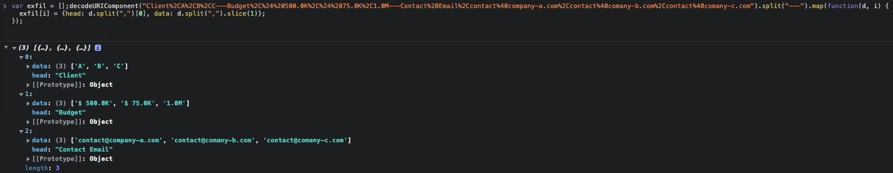

A good tool that companies use to track and visualise data is through spreadsheet software. Today, I'm going to demonstrate a quick way a malicious employee can still have access to the data even if they get removed from the company and their access is revoked - and it's somewhat hard to detect.

This is harder to detect as this can be put in 1 cell anywhere in the spreadsheet and formatted visually to be pretty much invisible (ie: white text on a white background).

Let's assume we have a sheet with sensitive data like this:


It would be great if someone could exfiltrate all the data in these columns on every data update, wouldn't? And it doesn't require having an "Apps Script", it is more incognito than that.

A simple formula to hit a remote server with `importdata()` and concatenating the data ranges to make it easier to parse is as simple as this.


Now, on every cell update within range `A:C`, the remote server gets hits.


We can see that within the `data` query string, the data is present from the Google Sheet (even after adding a new row for `Client C`). And to visualise, we can write a simple JS 1 liner to organise the data more readable...

```js
var exfil = [];decodeURIComponent("Client%2CA%2CB%2CC---Budget%2C%24%20500.0K%2C%24%2075.0K%2C1.0M---Contact%20Email%2Ccontact%40company-a.com%2Ccontact%40comany-b.com%2Ccontact%40comany-c.com").split("---").map(function(d, i) {exfil[i] = {head: d.split(",")[0], data: d.split(",").slice(1)};});
```

Now all the data is in an array and much easier to manage - this could be on the remote server to organise the data and then sent/stored.

