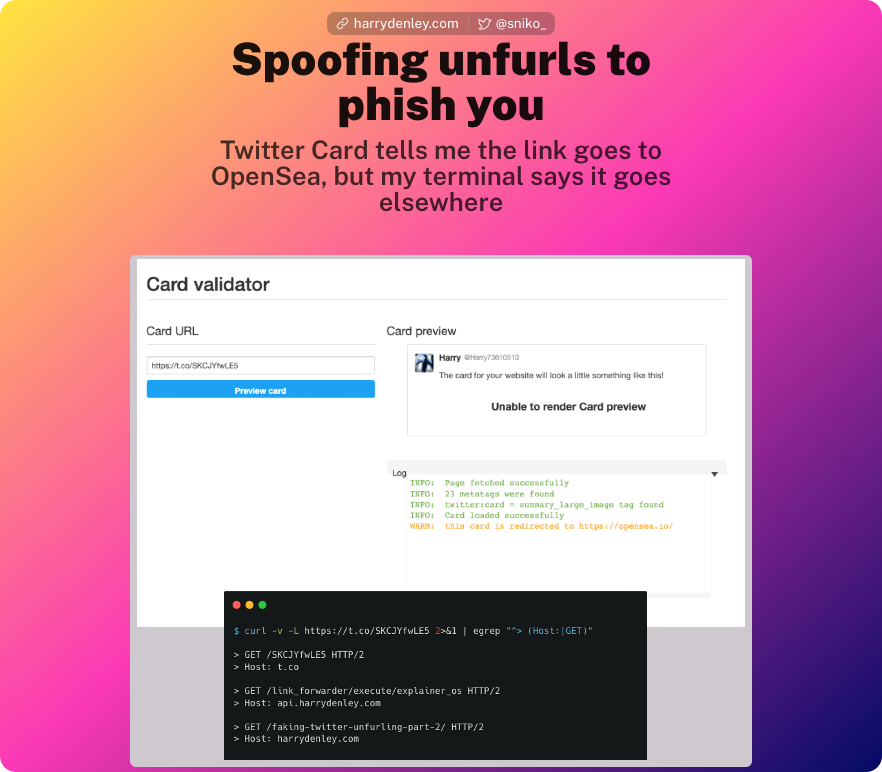

Hey, you thought you'd be some place else because a tweet told you so? This is an experiment to see how many people will click a link because a "trusted" source tells you to goes somewhere.

I am testing crypto-twitter ([again](https://harrydenley.com/faking-twitter-unfurling/)) to educate users on the pitfalls of unfurling and to see how many click-throughs my various tweets get.

Although a trusted source tells you a link goes somewhere and therefore you inheritly trust it, this trust is very easily broken, as I have demonstrated with you landing on this page instead of what the tweet told you.

