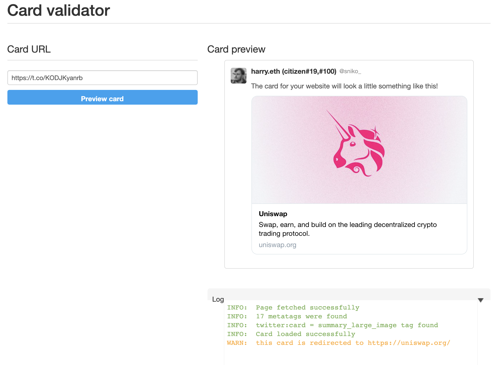
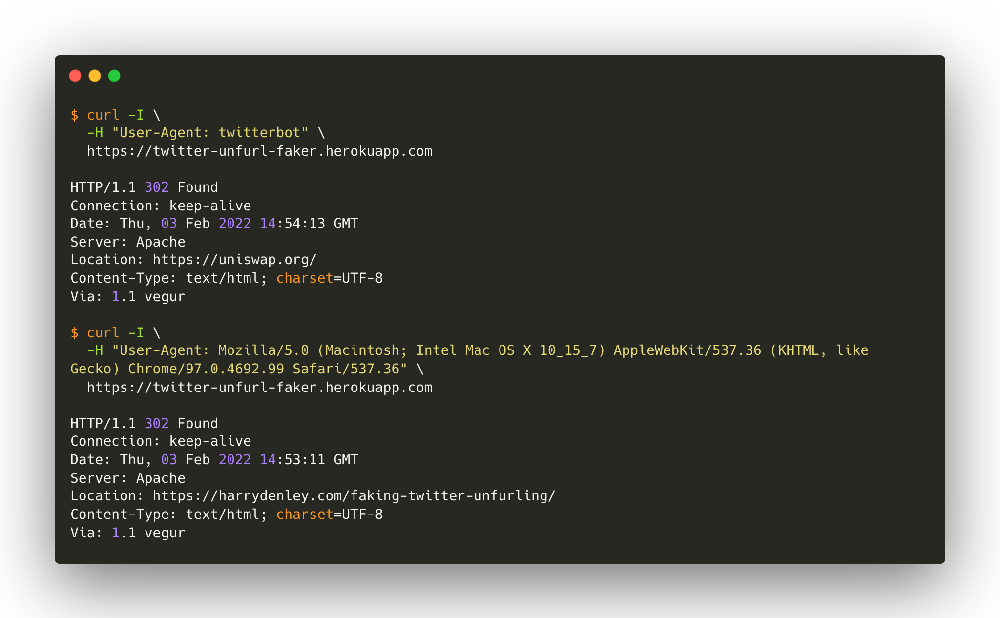
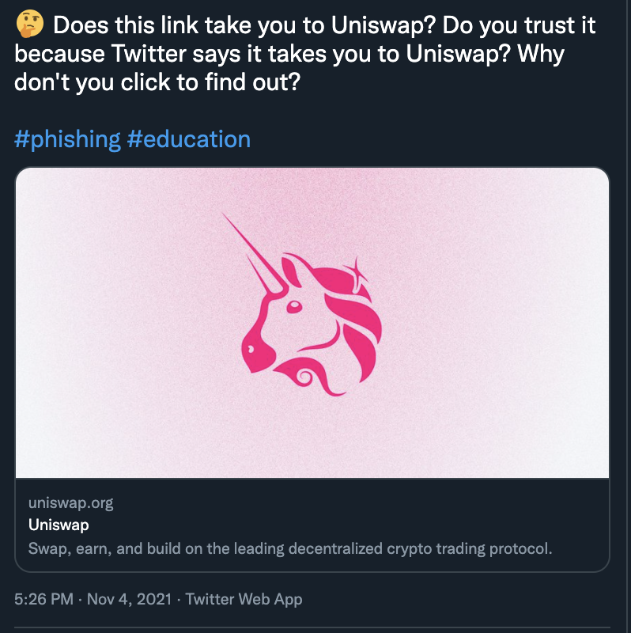

**Do you trust links? Well, you shouldn’t.**

Do you trust this link: https://t.co/KODJKyanrb

Twitter says this link should take you to Uniswap, nobody would be none-the-wiser because we trust Twitter. However, if you clicked on the link card, it would take you here. To harrydenley.com.

Of course, my original Tweet wasn’t too great at catching people out, and the end page wasn’t either - it doesn’t even look like Uniswap. BUT bad actors would design their campaigns like this to trick you to thinking you’re on Uniswap by utilising a little trick in Twitters unfurling technique. For example, they could make their tweet look like Uniswap and show you a link card that takes you to Uniswap and ask you for seed phrases or even have a fully functional Uniswap page and when you confirm a swap, it just sends your assets to their EOA.

### How?

Twitter unfurls the domain on their server side and attaches a `HTTP_USER_AGENT` to the request. You can write some simple server-side code on your link to check if this value contains `twitter` and if it does, fire off a `Location: x` header. If the `HTTP_USER_AGENT` header does not include `twitter`, then I redirect to this page.

I then tweet the full domain (ie: `https://twitter-unfurl-faker.herokuapp.com/`) from a burner account and copy twitters shortened link to that domain through `t.co`. By default, this link contains `?amp=1`, so if you tweet the link with this query string, it will show you `https://twitter-unfurl-faker.herokuapp.com/` in the Tweet. All the bad actor has to do now is remove `?amp=1` from the tweet and you get something like that looks like this on Twitter, fooling pretty much everyone.

