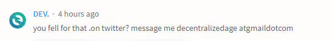
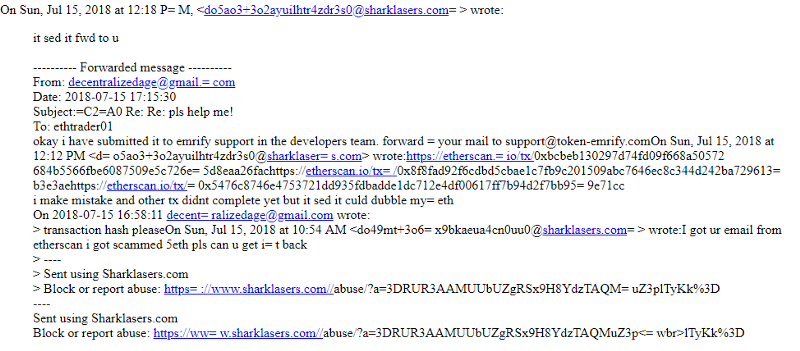
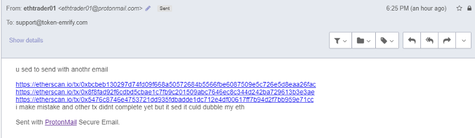
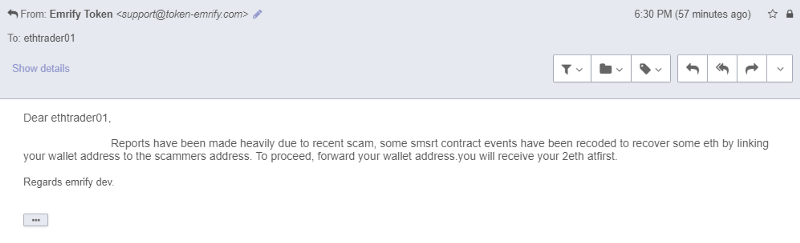
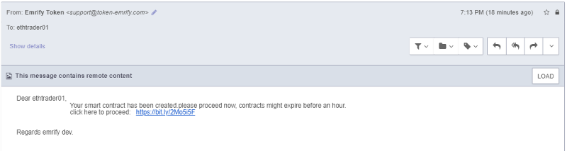
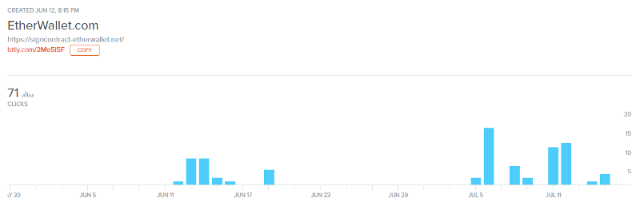
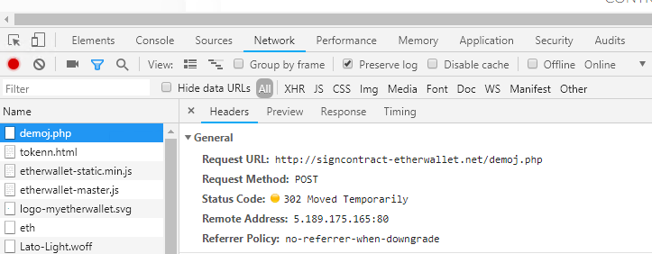

I was browsing etherscan.io comments recently while hunting for scammers and came across a suspicious account — one with a MyEtherWallet logo avatar and the username “DEV.” They seemed to offer off-site help over email which is very suspicious to me as they usually get you to send ETH to “fund a smart contract to power a transaction reversal.”

I wanted to see where it lead. **So, I took a bite and emailed them.**

They wanted transaction hashes to prove I lost the ETH I claimed to have lost, so I went to https://etherscamdb.info/, searched up a few known trust-trading scam addresses, and found some transactions that came from the Binance hot wallets.

This is where it got interesting. They said that they forwarded my email, but the email address that they forwarded it to belongs to a MyEtherWallet phishing site that we recently caught and indexed on EtherScamDB — https://etherscamdb.info/domain/token-emrify.com.

They requested I continue to chat to them with a different email provider as Sharklasers isn’t too secure/privacy-minded. I did as they requested and moved over to ProtonMail.

So I continued the conversation by sending them the random transaction hashes I found earlier and they emailed back.

The tactic of throwing random jargon out there to confuse the reader is pretty commonplace in these types of email phishing campaigns. I continued to email even though their response didn’t *really* make sense.

So the story continued and they wanted me to obtain a fresh address that I would receive my 2ETH to. It would be sent from their smart contract that is supposed to recover ETH from trust trading scam site addresses. I’ve hit the jackpot!

After some time, their smart contract was “ready” and all I had to do was go to this link… except this link took me to a MyEtherWallet clone — one that looked very similar to a recently-flagged phishing domain: https://etherscamdb.info/domain/token-emrify.com

This illustrates that I’m not the first to be sent this site — around 71 other people have been emailed the same bullshit and possibly fallen victim. The website leaves a few clues as to how we can find the identity of these guys.

Their contract address, funded with ETH as promised, is 0xbde430F54A63016D8A5F31F243761653728086A2 — funded with a Binance account, as well as another EOA — 0xb3792b871808e724132efff38375e056a9da7b21 — which is also funded by a Bittrex account. Both of these exchanges employ KYC/AML routines, but of course it’s totally possible that these addresses do not belong to the bad actors and they just found a random address with ETH in it.

Anyway, I loaded up my VPN, logged into my proxychain, created a fresh throwaway 0x address, and did as they said.

Turns out that it is the same scripts running the recently flagged https://etherscamdb.info/domain/token-emrify.com — even down to `POST /demoj.php` with the 302 redirect to `/tokenn.html` page.

## So, how can I stay protected?

* Never reach out to someone offering off-site help/support. If you do, **always** create/use a temporary email address — you do not want to open yourself up to phishing attacks by these guys from your favorite exchanges!
* Be vigilant and always read communications carefully. Try to understand the jargon they are throwing around and see if it makes sense.
* If something seems to be too good to be true, it probably is.
* Never comply and use url shorteners especially in the cryptocurrency world.
* You can always expand a bit.ly or goo.gl link by putting a + at the end and it will give you the statistics and destination address (example: https://bitly.com/2Mo5i5F+)
* Never input your private keys into a domain that was sent to you — even if the interface looks familiar.
* MyCrypto has a desktop application that you can use as your primary interface that you can verify builds with: https://medium.com/mycrypto/mycrypto-launches-desktop-applications-w-hardware-wallet-support-efac86c962a8
* Ask the people if something seems suspicious. Delaying a click/input by 5 minutes to get clarification from someone you trust could save you from losing all your assets.
* You can search any suspicious domain on EtherScamDB — we try to index everything — https://twitter.com/MyCrypto/status/1017174673795108864
* Run EAL in your browser (load it manually if preferred) to protect you against known phishing/scam domains — https://github.com/409H/EtherAddressLookup#installations