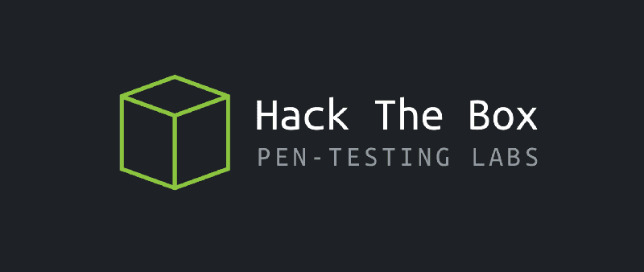
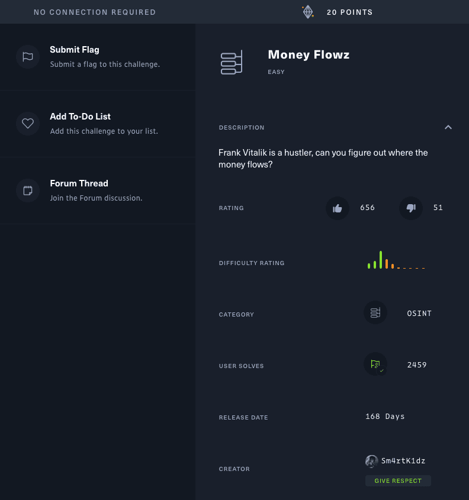
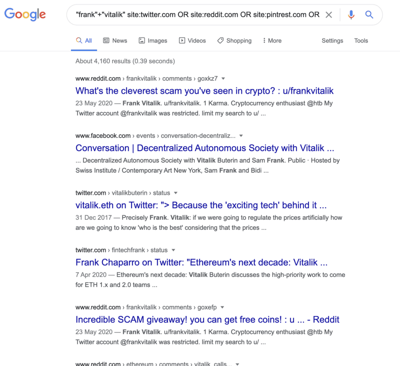
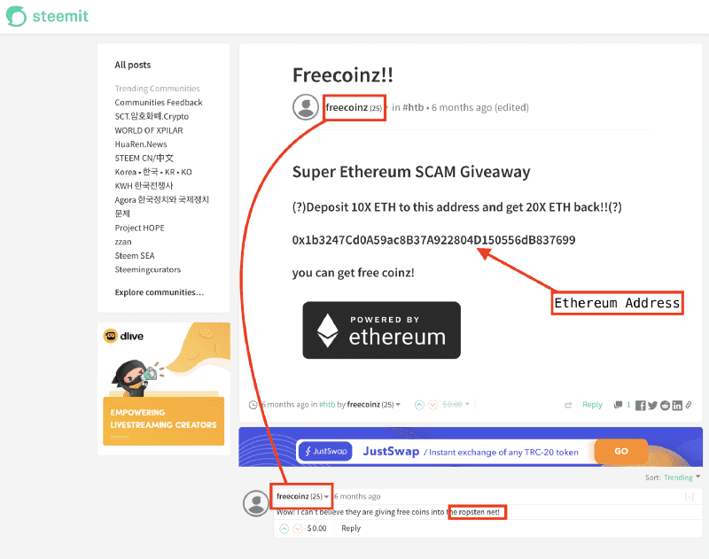
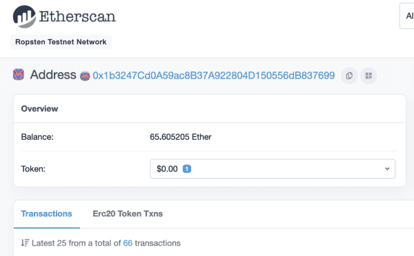
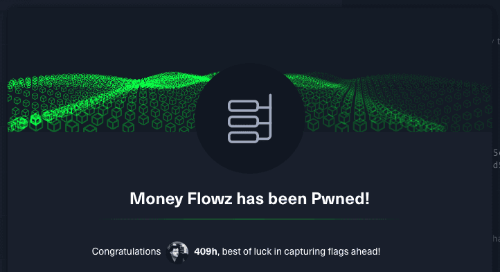

### What is HackTheBox?
HackTheBox is an online platform that allows its users to analyze, train, and enhance their penetration testing skills, as well as exchange ideas and methodologies with other members of similar interests.

They offer many different challenges with a wide array of various types of penetration testing, including reverse engineering, steganography, website penetration, forensics, OSINT, cryptography, hardware hacking.

https://www.hackthebox.eu/

### The Challenge
This challenge was opened by Sm4rtK1dz on 2020-May-14. It is a challenge in the OSINT (OpenSource Intelligence) category. It is worth 20 points.

We have the following description to work with:

> Frank Vitalik is a hustler, can you figure out where the money flows?

So:

* We can probably find the flag without any special tools, considering it is an OSINT task and no connection to the HTB is needed
* We are in search of a flag, formatted HTB{...}

### The Search

We know that we are after a person called “Frank Vitalik,” which means we will probably need to search some social media sites. With the assistance of Google, we can quickly search, and interestingly enough, the top result looks like it might be of help! We find a Reddit post by frankvitalik that talks about money.

Pivoting from the Reddit post to [view the author’s post history](https://www.reddit.com/user/frankvitalik) shows a post on self.frankvitalik, which has a link in the textpost to point to a [post on Steemit](https://steemit.com/htb/@freecoinz/freecoinz) with an Ethereum address and a comment telling us the network this is on.

Ethereum has multiple networks, with the “production” one being “mainnet,” and some public testnets called “Goerli,” “Rinkeby,” “Kovan,” and **“Ropsten**.”

So, now we have a pivot point from the name “Frank Vitalik” — an Ethereum address on the Ropsten network. Since the Ethereum blockchain is public, we can head to a reputable block explorer (ropsten.etherscan.io) and check the activity of this address.

We can see the address is involved with 66 transactions (inbound and outbound). However, since anyone can send a transaction to the address, we can rule these out as noise as the flag would be given by Frank Vitalik — that is, something to do with an outgoing transaction.

Since there are not a lot of transactions on this account, we can use the Etherscan web UI to find the outgoing transactions (otherwise we may interrogate a node/API with code to fetch all the outgoing transactions).

We notice some early transactions outgoing from when the address first “joined” the network. Let’s check the first outgoing transaction ([0xe1320c23f292e52090e423e5cdb7b4b10d3c70a8d1b947dff25ae892609f2ef4](https://ropsten.etherscan.io/tx/0xe1320c23f292e52090e423e5cdb7b4b10d3c70a8d1b947dff25ae892609f2ef4)) to see if they included any additional data with their transaction.

**Learning point:** As Ethereum is a smart-contract blockchain, [the input data to a transaction is typically used to instruct a smart-contract](https://medium.com/mycrypto/why-do-we-need-transaction-data-39c922930e92)/program on what to do. However, in simple transactions (i.e., not interacting with a smart-contract), we can add anything we want. In the past, [Chinese citizens have used this field to circumvent censorship and talk to the outside world](https://qz.com/1260191/metoo-activists-in-china-are-turning-to-the-blockchain-to-dodge-censorship/) during the #MeToo movement.

The chain returns this data in hexadecimal format, and Etherscan has a nice converter to show the text, revealing the HTB flag.

