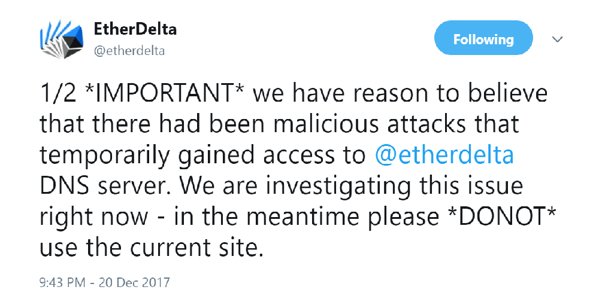

Recently EtherDeltas' DNS was compromised which meant when you went to etherdelta.com it didn't resolve to a server they
controlled.



The attack was sophisticated because people believed they were on etherdelta.com so they were comfortable using it the
way that they've previously used it. This caused to a big theft as the source was modified to drain users wallets if they
loaded their wallet with their private key.

There are a couple ways to keep yourself protected from such attack vector though.

## Check the nameservers

As the attack was a redirect to the attackers server using the nameservers (DNS) you can check to see if the domain is
using the legitimate IPs before using the domain.

The legitimate IPs are;

```
104.20.224.58
104.20.225.58
```

You can run a `dig etherdelta.com` on the domain on your machine and check the IPs.


If you get something else, you can set your DNS server to [Google's public DNS](https://developers.google.com/speed/public-dns/)
which _may_ have the correct IPs resolved.

## Run EtherDelta locally (preferred method)

There's no reason to rely on etherdelta.com when the source code is open and you can run the GUI locally in an environment
you trust.

```
git clone https://github.com/etherdelta/etherdelta.github.io
```

Or manually download the source: [https://github.com/etherdelta/etherdelta.github.io/archive/master.zip](https://github.com/etherdelta/etherdelta.github.io/archive/master.zip)

Then follow this awesome tutorial: [https://www.youtube.com/watch?time_continue=29&v=kXOTke0gFwc](https://www.youtube.com/watch?time_continue=29&v=kXOTke0gFwc). Now you have the GUI on your local machine that is talking to the Ethereum smart contract, you know you can trust it.

*Or*, if you're running [Bash on Windows](https://www.howtogeek.com/249966/how-to-install-and-use-the-linux-bash-shell-on-windows-10/), you
can install `apache2`, and create a Virtual Host.

```
sudo apt install apache2
sudo cp /etc/apache2/sites-available/000-default.conf /etc/apache2/sites-available/etherdelta.conf
sudo nano /etc/apache2/sites-available/etherdelta.conf #change the DocumentRoot path (ie: /mnt/c/Users/harry/Documents/etherdelta.github.io)
sudo a2ensite etherdelta.conf
sudo service apache2 restart
```

Now open up `C:\Windows\System32\drivers\etc\hosts` in Notepad++ (or equivalent) and add a local entry at the bottom of the file.

```
127.0.0.1	etherdelta.local
```

Now flush your local dns and everything is setup.

* Open `cmd` on Windows
* Run `ipconfig /flushdns`


Running it locally means you won't get any automatic updates that are pushed to production (etherdelta.com) automatically
unless you re-download/reset the branch to `origin/master`, so it's best to [follow @etherdelta on Twitter](https://twitter.com/etherdelta) to
keep up to date with new releases.