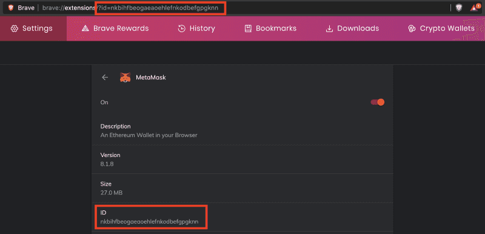

I’ve written this as a reaction to [the recent news of an attack on a member of the community](https://twitter.com/NexusMutual/status/1338441873560571906) resulting in a loss of ~$8,000,000 in personal funds. After the story came to light, many people in the community were concerned and wanted to know if they were running a legitimate version of MetaMask.

First, let’s break down the facts of the recent event. Then we’ll discuss different ways you can ensure you’re running an authentic version of MetaMask (or any other browser extension).

### What we know happened

* $8,000,000 worth of NXM was transferred to an address that the user did not intend.
* The bad actor who received the $8,000,000 had somehow planted a malicious payload into the user’s MetaMask instance.
* It is reported that the bad actor gained remote access to the user’s machine to “install” the malicious payload.
* It is reported that the user was not running MetaMask with the namespace `nkbihfbeogaeaoehlefnkodbefgpgknn` — which would indicate being installed directly from the extension store — but was running an unpacked version (browser in developer mode and extension file installed manually).
* It is reported that the user was using a hardware wallet (specifically a Ledger device) with MetaMask to interact with, presumably, an internet-connected app.
* The bad actor looks to have no intentions of accepting the proposed $300k bounty [as of block 11462317](https://etherscan.io/tx/0xcc931f47a1849d060f1e9ac38a4fe16aec728c968a75dd9115852c6db3568985).

Read our [summary thread](https://twitter.com/MyCrypto/status/1338694295641976832) for more details:

https://twitter.com/MyCrypto/status/1338694295641976832

### How to Verify Your MetaMask Extension
There are some security controls in place within the browser extension system.

However, if a malicious actor gains remote access to the machine that you conduct cryptocurrency activity on… then you will need to do a much more in-depth audit of your system. For this purpose, we’ve published a lengthy resource, “[MyCrypto’s Security Guide For Dummies And Smart People Too](https://medium.com/mycrypto/mycryptos-security-guide-for-dummies-and-smart-people-too-ab178299c82e),” that outlines the steps that you can take to buff up your security practices.

There are a few different ways to check your instance of MetaMask:

#### Check the namespace of the extension you are running
This is critical to ensure you are running the extension published by the MetaMask team, especially since [we have come across many malicious clones of browser extensions](/discovering-fake-browser-extensions-that-target-users-of-ledger-trezor-mew-metamask-and-more). As long as the author of the extension within these browser stores remains the same (as it should), the following namespaces will remain accurate.

**Chromium (Brave, Google Chrome)**
* Namespace: `nkbihfbeogaeaoehlefnkodbefgpgknn`



**Firefox**
* Extension Name: ether-metamask


### Check the integrity of the files you’re running
This is especially important if you are running your browser in developer mode and manually installed the extension from source (or downloaded the release zip from GitHub) — this is known as [running an unpacked extension](https://stackoverflow.com/a/24577660/3000179).

You will need to generate a hash of each file used by the MetaMask extension and check the hashes against known-good hashes. This is an [integrity check](https://blog.logsign.com/how-to-check-the-integrity-of-a-file/) — and if the hashes differ for any file then this is a cause for concern!


We can run a command called [mtree](https://linux.die.net/man/8/mtree) with specific arguments to create an integrity hash (sha256digest) for each file.

The Chromium engine does a checksum on the extension files before running the installed extension (known as “Extension Content Verification”). If the verification fails, then you will get a notification about the extension becoming corrupted and prompted to reinstall.

*Note: The below instructions are assuming you have the extensions loaded manually (unpacked extension) — the browser’s Extension Content Verification is an adequate security control against malware modifying extension content that is downloaded from the web stores. If you have changed some settings/flags (i.e., brave://flags/#extension-content-verification) to disable/relax the ECV then you will need to evaluate your system and threat models some more and consider enforcing ECV.*

*Note: Your version numbers will change, consider the path in the code blocks below to be an example.*

**MacOS/*nix**

```bash
mtree -c -K sha256digest -p ~/Downloads/Extensions/MetaMask/chrome/8.1.6 > 8.1.6.mtree
```

**Windows (you can [open powershell by typing it in the address bar](https://v1.harrydenley.com/assets/videos/how-to-open-powershell-at-specific-path.mp4))**

Open powershell and navigate to the folder/directory where you have the MetaMask files. Then, run the following command:

```bash
Get-ChildItem -File -Recurse | Get-FileHash -Algorithm SHA256 | Select-Object @{name="Name";expression={$_.Path}}, @{name="sha256";expression={$_.Hash}} | ConvertTo-Json | Out-File -FilePath ..\8.1.6.json
```

This will generate a JSON file in the parent directory with filename and sha256 hash properties.

Once you have generated this file, you will see an output of the filenames and their corresponding hashes. You can then compare them against known good hashes below. Keep in mind that these hashes will change for each version of MetaMask.

**MacOS/*nix**
* [metamask_chrome_8.1.6](https://gist.github.com/409H/332e5535f4d0c1b424323dd9fd0d5d70#file-metamask_chrome_8-1-6-mtree) (mtree)
* [metamask_firefox_8.1.6](https://gist.github.com/409H/332e5535f4d0c1b424323dd9fd0d5d70#file-metamask_firefox_8-1-6-mtree) (mtree)

**Windows**
* [metamask_chrome_8.1.6](https://gist.github.com/409H/332e5535f4d0c1b424323dd9fd0d5d70#file-metamask_chrome_8-1-6-json) (json)
* [metamask_firefox_8.1.6](https://gist.github.com/409H/332e5535f4d0c1b424323dd9fd0d5d70#file-metamask_firefox_8-1-6-json) (json)

### Recommended Security Practices

* Read [this additional great resource](https://www.fireblocks.com/blog/4-ways-nexus-mutual-couldve-prevented-yesterdays-attack/) about this specific incident and methods to protect against it.
* Ensure the “Extension Content Verification” flag is enabled and enforced on your browser.
* Be cautious of malicious browser extensions impersonating a brand you trust.
* Be aware of the risks of enabling developer mode on your browser profile.
* Disable/remove any remote access tools from your machine.
* Whilst it is possible for an attacker to [gain the encrypted vault of MetaMask](https://metamask.zendesk.com/hc/en-us/articles/360018766351-How-to-use-the-Vault-Decryptor-with-the-MetaMask-Vault-Data) and especially so if the attacker has injected malicious JS, it is paramount you have an entropy strong master password.
* Refresh your security hygiene knowledge by following [MyCrypto Winter](https://winter.mycrypto.com/) and [reading our security materials](https://support.mycrypto.com/staying-safe).