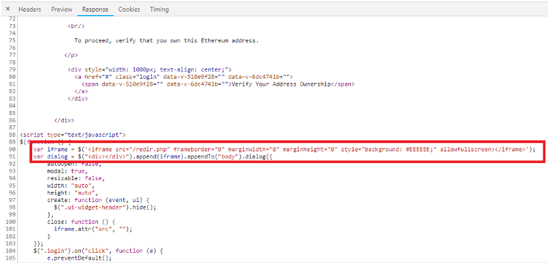
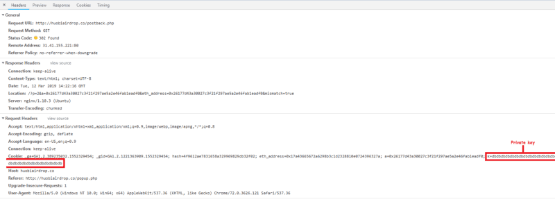
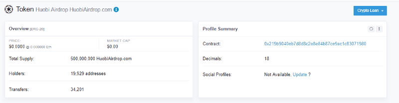
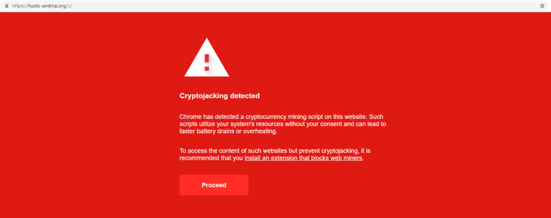
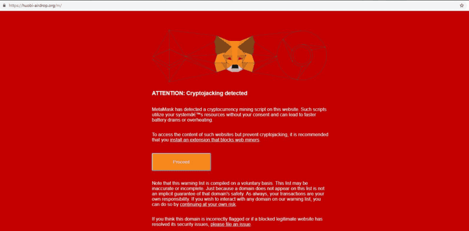
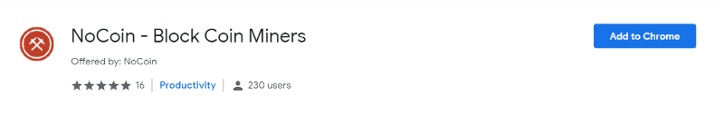
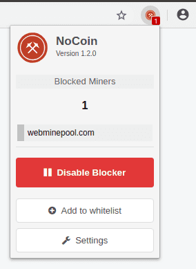
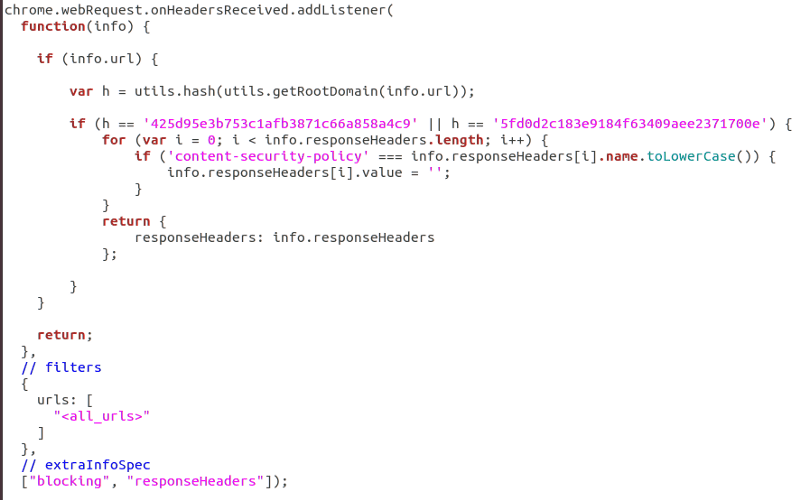
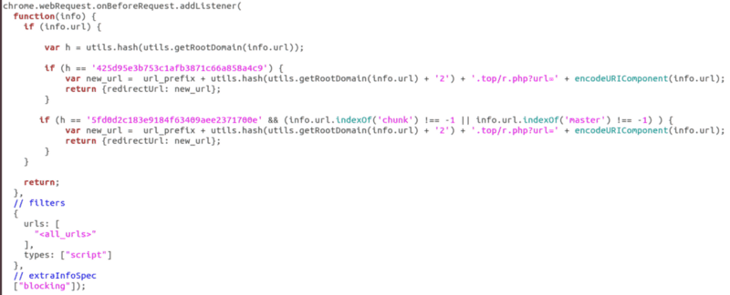
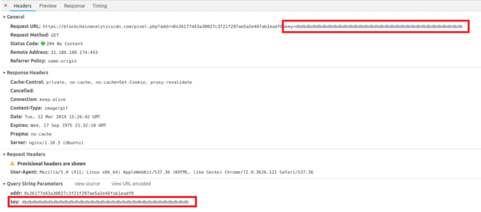

Huobi-related scams aren’t seen very often, but they’re still just as dangerous as every other scam.

I recently discovered an airdrop site for Huobi that used a different MyEtherWallet phishing kit to what I am used to finding.

It asked for a public address and checked to see if you have Huobi Airdrop tokens (which are actually fake tokens related to another Huobi scam, below). If you enter an address that doesn’t have the tokens required, you can still find the phishkit in the server response.

When you input your public address, it requests their server and returns a new HTML document — a HuobiGlobal phishing site that also brings up a fake MyEtherWallet. This HTML document contains a link to a PHP script that caught my attention.



This MyEtherWallet kit stores your private key into a Cookie and hits another PHP script.



If you input your private key, it would be accessed, and you would lose your funds.

Since I haven’t come across that many Huobi phishing/scam domains, I decided to look for more. I came across an [ERC20 token](https://etherscan.io/token/0x219b9040eb7d8d8c2e8e84b87ce9ac1c83071980) that was advertising a website that was airdropped to ~20,000 Ethereum addresses.

With some capital, this is a method to advertise in the blockchain space.



If we look at the address funding the transactions (via 19 proxy addresses (i.e.: [0x0b88a083dc7b8ac2a84eba02e4acb2e5f2d3063c](https://etherscan.io/address/0x0b88a083dc7b8ac2a84eba02e4acb2e5f2d3063c)) and contract creation from [0x15ccc4ab2cfdb27fc4818bf481f7ed0352d8c6b3](https://etherscan.io/address/0x15ccc4ab2cfdb27fc4818bf481f7ed0352d8c6b3), we can see that the bad actor has:

* Created 18 contracts between block 6,708,041 and 7,249,374
* All but 1 contract address advertises huobiairdrop.com — the other is [just a test](https://etherscan.io/token/0x065fb62a74dc7acda7c5e24e5aeced1d31242954).
* 62,132 addresses were sent a token that advertises huobiairdrop.com

Here’s a dump of contract addresses that were created by 0x15cc...c6b3 and advertising `huobiairdrop.com` as of block 7,362,119.

```txt
0x219b9040eb7d8d8c2e8e84b87ce9ac1c83071980
0xb331728743d45a6470b8798320f2c173d41e4bfb
0x6727816581215d1a7389bb1e9afc7ae7bf2fd5d1
0x596f83e44d6e62fc886222afea468e14f4c3fec7
0x36794518b3ef84c4b1a40af9540a03292f692c38
0x8fa86218ec14bb207b5ae404c60a836c3d7cbb3a
0x7f30f5955b7605b96421e7c170edbbc45b373cd9
0x53e00c6a2887f71bed5340ce369675ddaff4f42a
0x9c6625dc8333b633c40a0c2f2a49379363763ba0
0x6c3bb918a1242ba4e32908d7bf4addd7ef651e74
0x7d4bf678252c1c85aa46e032bf70e76439ee1708
0x697a260ba6365ab241f7aef057da3587f0c255ca
0x7db95f8d8d80a75d768a2f8b0be392ff901d3fc8
0x409de70d8ad0135e6fd91f343899b93d903c998b
0xbd806a9a7ad8ce9d36048861dd63a295a3c9d5f2
0x203daffa152dafaf2a859029f729b364fc8540f8
```

Here’s a dump of proxy addresses used to airdrop the tokens — all funded from the 0x15cc...c6b3 address — all these proxy addresses hold similar values (after being funded with 5 ETH and sending x transactions) so assuming this is all scripted.

```txt
0xb179778356bebad15bd4b238f1384288cb477378
0x65d471996e4925e0acd113c6bb47cbf96fbc581f
0x2e5b15ea47129fdcc351360c896563ff0aa5b2fc
0x0e464ba1d597ac772b86fb5a93a82bb397e8c438
0x0b19448105c56dc68244e5715b5a78b5e06ccc9d
0x24e55688d74f902e478e638b8bf4339cd92adc8b
0x0ef221408918939419e03f48b126436fd72051ca
0x5ed89913028bb07d3c0b0cb68a78234027563ef8
0xe82ac313c98be7c7f921fee5ef52da868fdb79dd
0x348413142a330edc6e8f4fb932ab656a63a1a9b4
0x4fbf7701b3078b5bed6f3e64df3ae09650ee7de5
0x691da2826ac32bbf2a4b5d6f2a07ce07552a9a8e
0xa33b95ea28542ada32117b60e4f5b4cb7d1fc19b
0xe06ed65924db2e7b4c83e07079a424c8a36701e5
0x1b1b391d1026a4e3fb7f082ede068b25358a61f2
0xbbfd8041ebde22a7f3e19600b4bab4925cc97f7d
0xecd91d07b1b6b81d24f2a469de8e47e3fe3050fd
0x2ef1b70f195fd0432f9c36fb2ef7c99629b0398c
0x0b88a083dc7b8ac2a84eba02e4acb2e5f2d3063c
0xc2e90df58f0d93d677f0d8e7e5afe3b1584bb5ab
```

### Looking at huobiairdrop.com

*TL;DR: It gets you to install a browser extension which injects malicious scripts into MyEtherWallet.com and Blockchain.com by hijacking the CSP headers and network requests.*

So, I loaded up a VM and hit the domain and I saw a legitimate looking Google Alert view that had me confused — I didn’t know Google detected Cryptojacking like this...



I decided to enable MetaMask and they changed the view to fake a MetaMask warning — something I know MetaMask doesn’t warn against.



Anyway, I decided to view the source and saw that it was linking me to a Google Chrome Browser Extension — extension ID:coigcglbjbcoklkkfnombicaacmkphcm (NoCoin — Block Coin Miners)



I thought this was very weird — Google AND MetaMask “referring” users to this Browser extension. I decided to investigate.

### Looking into “NoCoin — Block Coin Miners”

I decided to launch a fresh VM (since I didn’t know what it would do and I came from an untrusted/suspicious source) and investigate.

From the start, it looked like it did what it should — it was detected various CryptoJacking scripts (CoinHive, MinerAlt, WebminerPool) and there was a nice UI to let me know it was doing its job.



I thought there had to be more to it since my suspicious user-journey to install it.

I looked into the source of it and noticed two things:

* It monitors/hijacks all web requests by attaching an [EventListener](https://developer.mozilla.org/en-US/docs/Web/API/EventListener) to `onBeforeRequest` and `onHeadersReceived`
* Depending on the network activity, it would construct a domain on the .top TLD (known to host a lot of [spam according to SPAMHAUS](https://twitter.com/sniko_/status/1105213773021921280))

This seemed weird because it looked like this code was out of the scope of detecting CryptoJacking. I decided to debug this.

First, I wanted to know what the EventListener was doing for onHeadersReceived because it was overwriting the [Content-Security-Policy](https://content-security-policy.com/) value.



I decided to modify the code so it would execute the logic on every request.

`youtube:https://www.youtube.com/embed/S_vYnk1cBaM`

Yikes! Ok, so it overwrites the CSP so it can “safely” inject code from untrusted sources… seems very out-of-scope for a CryptoJacking detection extension.

Now, let’s see what it does with the onBeforeRequest EventListener. It checks to see if the URL is equal to a specific hash, then tells Chrome to load a separate resource by using [redirectUrl](https://developer.chrome.com/extensions/webRequest#type-BlockingResponse)



But this logic only runs if the URL hash is one of 2 — but what are these hashes?

```bash
echo -n blockchain.com | md5sum
425d95e3b753c1afb3871c66a858a4c9

echo -n myetherwallet.com | md5sum
5fd0d2c183e9184f63409aee2371700e
```

Ok, so it hijacks requests for things on blockchain.com and myetherwallet.com domains.

Here’s a list of domains that the extension hits that are in control of the bad actor

```txt
blockchainanalyticscdn.com
5b0c4f7f0587346ad14b9e59704c1d9a.top
925e40815f619e622ef71abc6923167f.top
```

### Looking at MyEtherWallet.com

So now we know `myetherwallet.com` is a target, and it hijacks the CSP policy to inject foreign resources, let’s see what it does.

Since the code is looking for master or chunk substring in the resource, the main target is the vintage.myetherwallet.com domain to overwrite the `etherwallet-master.js` file.

We can take a look at it by not allowing the CSP hijack.

`youtube:https://www.youtube.com/embed/m1SRsjeTQvU`

So, now we know the main JS is being replaced by the malicious browser extension, let’s input our private key and see where they send it off to.



And that’s it, our private key has been sent to the bad actors.

Note that since the CSP has been hijacked, we get no notices about trying to load foreign resources and to the user, the software works as intended and the EV cert is fully intact. What’s even clever is that the browser extension does what it was advertised to do, so it could go unnoticed to the non-paranoid user for some time.

### Looking at Blockchain.com

We also know that blockchain.com is a target, so let’s modify the script to now hijack the CSP and see what it’s trying to load.

`youtube:https://www.youtube.com/embed/J9Jej4RXVQI`

We can see that it’s trying to load malicious versions of; `manifest.1550618679966.js`, `vendor.b18ffdf080.js`, `app.46d4854459.js` within the login logic.

### What can I do to stay safe?

We have to be careful on what we do. The duty is on you to ensure your maximum safety and security. Timeo Danaos et dona ferentes.

* Never install a browser extension that has the ability to modify the DOM that you/trusted source has not audited.
* Don’t blindly trust legitimate looking warnings to get you to install software (MetaMask warnings will always have their browser extension in the URL bar (like the phishing warning))
* Never enter your secrets online — always use an offline signing mechanism (i.e: [Ledger Wallet](https://www.ledgerwallet.com/r/1985?path=/products/), [TREZOR](https://shop.trezor.io/?offer_id=10&aff_id=1735), or [Parity Signer](https://wiki.parity.io/Parity-Signer-Mobile-App-MyCrypto-tutorial))

The domains that are part of this campaign have been listed on EtherScamDB;

* https://etherscamdb.info/domain/huobi-airdrop.org
* https://etherscamdb.info/domain/huobiairdrop.co
* https://etherscamdb.info/domain/huobiairdrop.com

They have been blacklisted on [MetaMask](https://metamask.io/) and [EtherAddressLookup](https://harrydenley.com/ethaddresslookup-chrome-extension-release/) to prevent you from visiting them.