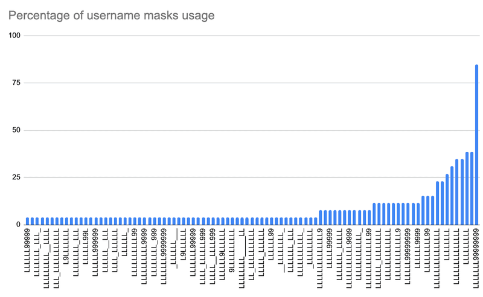

Many of the anti-scam articles that we publish involve the tactic of [social engineering](/following-an-ethereum-phishing-scam-down-the-rabbit-hole) - tricking a user into sending funds or revealing their secret recovery phrases. With the surge of mainstream interest in cryptocurrency, many scams occur on one of the most popular places to discuss crypto: Twitter.

The problem with bad actors using Twitter as a platform to initiate their scams is [nothing new](/research-into-trust-trading-scams-on-twitter), but recent times have seen the amount of spam replies a user gets from tweeting about the misfortune of losing their funds increase tenfold. However, users aren’t often being tricked into sending funds (read: trust trading scams). Instead, they are primarily being socially engineered into handing over their private keys and compromising their entire accounts (and if they hand over their [secret recovery phrases](https://support.mycrypto.com/general-knowledge/cryptography/how-do-mnemonic-phrases-work), they lose all of the related accounts).

I was [recently tagged in a Twitter thread](https://twitter.com/_callil/status/1414394639780614145) where other users were honeypotting/farming replies, which piqued my interest in these campaigns. Additionally, [GridPlus recently tweeted](https://twitter.com/gridplus/status/1415049366956613636) that they have been observing the behaviour.

This article presents our research on Twitter reply scams in order to educate everyday users about their prevalence, as well as make the data available to other researchers.

### Observing The Bots
We took a look at which tweets got the attention of these scam replies, and built a bot to issue a new bait tweet every hour and collect the replies it received. Our goals were to:

* Determine if these replies are automated
* Collect any links
* Collect Twitter handles and user ids
* See if the user accounts performed any impersonation of brands
* Identify if any of the reply accounts were “high value” (i.e., verified, a lot of followers/tweets)
* Identify the keywords that they look for before they reply
* Graph any third-party domains linked to the reply accounts
* See if Twitter suspends any of the reply accounts for ToS violation

We created a dictionary of phrases to tweet and scheduled them to be tweeted every hour, followed by a bot that would collect and archive all the replies 20 minutes after the tweet was sent out.

After 10 days of tweeting phrases that included wallet product names, the bots had archived ~350 replies.

### Our Findings
The dataset of honeypot replies revealed that a total of 207 unique Twitter accounts engaged with us. The majority (if not all) of the accounts were filled out to look like authentic product support accounts, all with the intention of scamming us later. Unlike [my previous research](/research-into-trust-trading-scams-on-twitter), none of the accounts that replied to us were verified.

Many of the accounts that engaged with us were impersonating brands to solicit a direct message or to fill out a survey/form that was hosted on a reputable third-party domain. Some of the replies tried to get us off-platform to message users via Instagram and Email.

Most of the replies that referenced Instagram were replies to tweets that contained the keyword “hacked” in them, and the Instagram accounts they led to advertised web2.0 account takeover/recovery services (i.e., recover Facebook account).

These are typically low effort scam accounts that post fake “proof” of account recovery and ask for payment upfront then disappear - usually a relatively cheap lesson for any victim.

However, we were also directed to some accounts that “specialised” in cryptocurrency.

This suggests that there may be a network mass replying to tweets with certain keywords to promote some “underground” services, and that this network is now being harnessed specifically for cryptocurrency users.

Once we take a look at the `Tweet` object (the reply text), we gain a little more insight into the type of accounts using Twitter to target cryptocurrency users and how they conduct themselves.

Although the `Tweet` object from Twitter does suggest that they are using the Twitter Web Client or official Twitter mobile applications, there is some indication that a number of the accounts are replying to users in an automated manner (even though most of it seems to be manual - not considering third-party scripting automation, such as [Selenium](https://www.selenium.dev/) or headless browsers).

Some of the quickest responses to our bait tweets took a mere 8 seconds, and almost 17% of replies were made in 20 seconds or less. Having said this, the overall average time it took for the first response was 73 minutes - though this is somewhat skewed as some tweets did not get replies for a couple of hours but then, seemingly, got bumped.

Many of the replies directed us to a third-party domain - something trusted, such as Google - that hosted a branded form for users to fill in. These forms were all fairly similar and tried to look professional, threw jargon around to try and confuse users, and asked for wallet secrets (private keys and/or [secret recovery phrase](https://support.mycrypto.com/general-knowledge/cryptography/how-do-mnemonic-phrases-work)).

Of course, there’s no real product support through these forms and they are merely trying to trick users into giving up their secrets. It’s a somewhat low-effort scam for a potentially high reward.

We gathered all the data and organised it into separate files:

* [A list of our tweets with the first reply and tweet IDs of replies and quoted replies](https://gist.github.com/409H/22d6d17bc85a9f8c996953f0539f086c#file-honeypot_twitter_replies_cryptocurrency_phishing-json)
* [A count of the signup dates of the accounts that replied to us, including a count of how many accounts were created by week of this year](https://gist.github.com/409H/22d6d17bc85a9f8c996953f0539f086c#file-signups-json)
* [A list of all the `User` objects from the accounts that replied to us](https://gist.github.com/409H/22d6d17bc85a9f8c996953f0539f086c#file-users-json)
* [A brevity list of accounts that replied to us](https://gist.github.com/409H/22d6d17bc85a9f8c996953f0539f086c#file-users-txt)
* [A list showing the number of tweets sent](https://gist.github.com/409H/22d6d17bc85a9f8c996953f0539f086c#file-status_count-json)
* [A list of username masks](https://gist.github.com/409H/22d6d17bc85a9f8c996953f0539f086c#file-username_masks-json)

The majority of the accounts that replied to us were created this year (2021) which could indicate that they were purpose-built accounts, but what is especially noteworthy is that there is a small percentage of accounts that were created years ago. We previously found [similar results](/research-into-trust-trading-scams-on-twitter) of bad actors utilising Twitter to scam users out of their crypto holdings.

We can also look into the Tweet sources to see if any account was using the Twitter API (and what they named the integration) but it looks like all the accounts were using the official Twitter clients. This could indicate that they are searching for the latest tweets manually and replying manually (maybe with the use of macros and clipboards).

When mapping the usernames to their respective input mask (L = `[A-z]` and 9 = `[0-9]`), we can see that there is a majority of `LLLLLLL99999999` (the same majority input mask from [my other research post](/research-into-trust-trading-scams-on-twitter)), which could indicate the same/similar bot farm operation. However, this time we have more input mask variety - so it’s likely that there is more than one entity pushing these campaigns (that is to say, it’s not just one bot farm).

### How Can I Stay Safe?
As these campaigns prey on confused users and convince them to reveal their secrets, the best thing you can do is to educate yourself and your friends on how these secrets work. Our knowledge base is full of in-depth articles that explain everything Ethereum and how to stay safe in general, in addition to:

* [How Do Secret Recovery Phrases Work?](https://support.mycrypto.com/general-knowledge/cryptography/how-do-mnemonic-phrases-work)
* [Differences Between Wallet Types (e.g., Private Key vs Keystore)](https://support.mycrypto.com/general-knowledge/ethereum-blockchain/difference-between-wallet-types)
* [Securely Store & Guard Your Private Key by Drewshaver](https://support.mycrypto.com/staying-safe/how-to-securely-store-and-guard-your-private-key)
* [What to Do If Your Funds Are Stolen](https://support.mycrypto.com/staying-safe/phish-hacks-thefts-and-stolen-funds-due-to-phishing)
* [How to Help Defeat the Phishers](https://support.mycrypto.com/staying-safe/call-to-action-help-us-with-phishers-please)

However, if you are posting on Twitter about needing some support, then one of your main priorities would be to reduce the amount of noise to your thread - especially noise created by scammers. With Twitter, you can restrict who can reply to your tweet. I suggest you write your tweet and tag the official Twitter account of the product that you need support with, such as:

> “I am unsure how to securely backup my private key @MetaMask @MetaMaskSupport”

Before you hit “Tweet,” make sure to toggle the tweet options and restrict who can reply.

