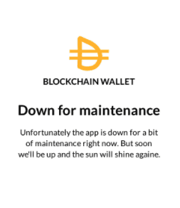
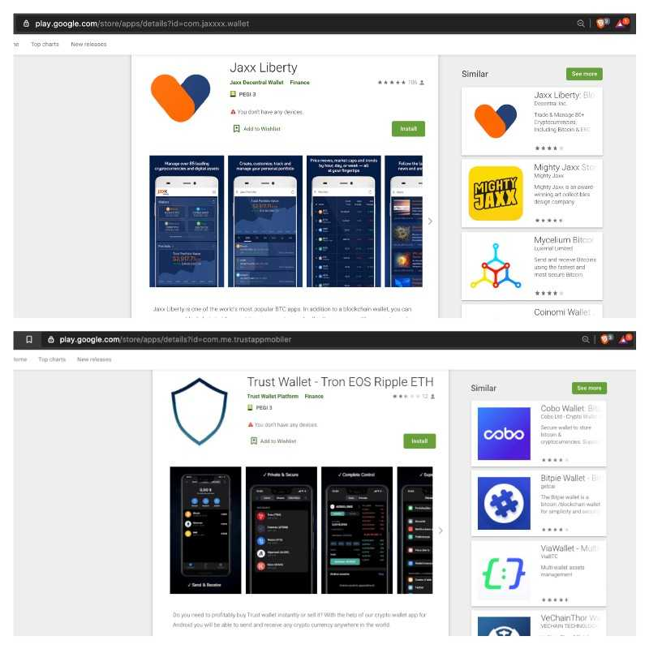
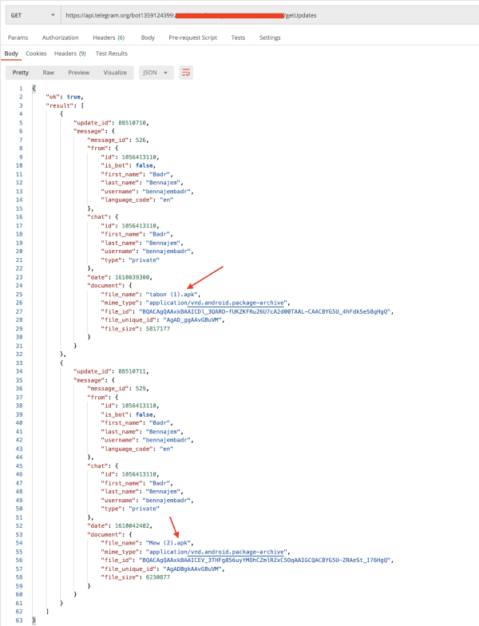
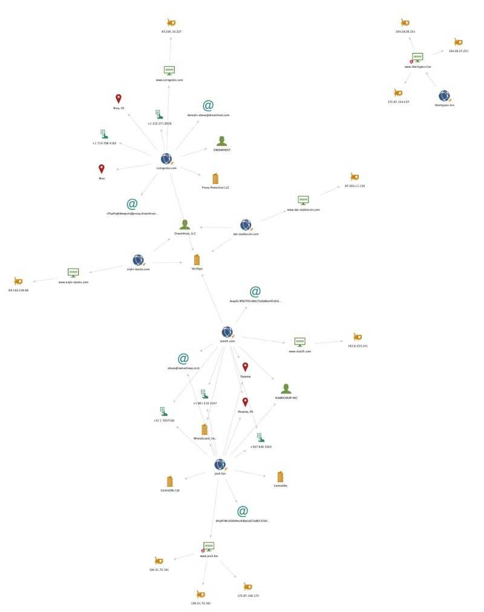

Some of these apps have thousands of downloads and can fool you into thinking they’re legitimate.

We’ve written about this before, but as the prices of cryptocurrencies are climbing and attracting a lot of new people into the space, I feel it’s crucial we bring it to the light again. Please beware of the risks of downloading and trusting applications when taking custody of their crypto assets — even when they are delivered on a trusted platform.

* [Intercepting and Saving $5,000 Worth of Phished Crypto](/intercepting-and-saving-5-000-worth-of-phished-crypto)
* [Discovering Fake Browser Extensions That Target Users of Ledger, Trezor, MEW, Metamask, and More](/discovering-fake-browser-extensions-that-target-users-of-ledger-trezor-mew-metamask-and-more)

Recently we took another look at the Google Play store and found a score of new, fake, malicious cryptocurrency apps that mimic real products. Some of these fake apps are targeting users of:

* DAI Stablecoin (MakerDAO)
* Trust Wallet
* MyEtherWallet
* Coinbase
* Jaxx

Whilst Google Play does not tell us the actual install numbers, we can see that there has been a *minimum* of 15,120 installations of these malicious APKs whose only working function is a field for inputting user secrets. After that, the app will display an error.



The applications/brands that had the most installs — with Google Play reporting “1,000+” — were:

* `com.jaxxx.wallet` (Jaxx)
* `com.libertyjaxxxx.app` (Jaxx)
* `com.jaxxlite.wallet` (Jaxx)
* `com.me.trustappmobiler` (Trust Wallet)
* `blockwallet20.bitcoin.wallet.btc` (Trust Wallet)




### Investigation

Most of these APKs pushed data to a custom domain or an instance on Firebase — however, some did push directly to Telegram using their API.

#### bot1359124399

```
#/getChat?chat_id=1056413110
{"ok":true,"result":{"id":1056413110,"first_name":"Badr","last_name":"Bennajem","username":"bennajembadr","type":"private","photo":{"small_file_id":"AQADBAADq6cxG7aV9z4ACO8FICpdAAMCAAO2lfc-AAR6BMq-M-biBkzCAAIeBA","small_file_unique_id":"AQAD7wUgKl0AA0zCAAI","big_file_id":"AQADBAADq6cxG7aV9z4ACO8FICpdAAMDAAO2lfc-AAR6BMq-M-biBk7CAAIeBA","big_file_unique_id":"AQAD7wUgKl0AA07CAAI"}}}

#/getMe
{"ok":true,"result":{"id":1359124399,"is_bot":true,"first_name":"mew0000basimo_bot","username":"mew0000basimo_bot","can_join_groups":true,"can_read_all_group_messages":false,"supports_inline_queries":false}}

#/getChatMember?chat_id=1056413110&user_id=1056413110
{"ok":true,"result":{"user":{"id":1056413110,"is_bot":false,"first_name":"Badr","last_name":"Bennajem","username":"bennajembadr","language_code":"fr"},"status":"member"}}
```

#### bot1408793069

```
#/getChat?chat_id=1056413110
{"ok":true,"result":{"id":1056413110,"first_name":"Badr","last_name":"Bennajem","username":"bennajembadr","type":"private","photo":{"small_file_id":"AQADBAADq6cxG7aV9z4ACO8FICpdAAMCAAO2lfc-AAT1TlPcxnlYpUzCAAIeBA","small_file_unique_id":"AQAD7wUgKl0AA0zCAAI","big_file_id":"AQADBAADq6cxG7aV9z4ACO8FICpdAAMDAAO2lfc-AAT1TlPcxnlYpU7CAAIeBA","big_file_unique_id":"AQAD7wUgKl0AA07CAAI"}}}

#/getMe
{"ok":true,"result":{"id":1408793069,"is_bot":true,"first_name":"blocc00chain_bot","username":"blocc00chain5555_bot","can_join_groups":true,"can_read_all_group_messages":false,"supports_inline_queries":false}}

#/getChatMember?chat_id=1056413110&user_id=1056413110
{"ok":true,"result":{"user":{"id":1056413110,"is_bot":false,"first_name":"Badr","last_name":"Bennajem","username":"bennajembadr","language_code":"fr"},"status":"member"}}
```

#### bot1525526258

```
#/getChat?chat_id=-336797117
{"ok":true,"result":{"id":-336797117,"title":"MewJallal","type":"group","permissions":{"can_send_messages":true,"can_send_media_messages":true,"can_send_polls":true,"can_send_other_messages":true,"can_add_web_page_previews":true,"can_change_info":true,"can_invite_users":true,"can_pin_messages":true},"all_members_are_administrators":true}}

#/getMe
{"ok":true,"result":{"id":1525526258,"is_bot":true,"first_name":"MewJallal","username":"mewjallal_bot","can_join_groups":true,"can_read_all_group_messages":false,"supports_inline_queries":false}}

#/getChatAdministrators?chat_id=-336797117
{"ok":true,"result":[{"user":{"id":860444721,"is_bot":false,"first_name":"Reda","last_name":"TM","username":"pingo0a"},"status":"creator","is_anonymous":false}]}

#/getChatMember?chat_id=1056413110&user_id=1056413110
{"ok":true,"result":{"user":{"id":1525526258,"is_bot":true,"first_name":"MewJallal","username":"mewjallal_bot"},"status":"member"}}

#/getChatMember?chat_id=-336797117&user_id=860444721
{"ok":true,"result":{"user":{"id":860444721,"is_bot":false,"first_name":"Reda","last_name":"TM","username":"pingo0a"},"status":"creator","is_anonymous":false}}
```

#### bot1425695036

```
#/getChat?chat_id=860444721
{"ok":true,"result":{"id":860444721,"first_name":"Reda","last_name":"TM","username":"pingo0a","type":"private","photo":{"small_file_id":"AQADBAADq6cxGzFYSTMACDP7HiddAAMCAAMxWEkzAASVULFOL5k7tDnqAwABHgQ","small_file_unique_id":"AQADM_seJ10AAznqAwAB","big_file_id":"AQADBAADq6cxGzFYSTMACDP7HiddAAMDAAMxWEkzAASVULFOL5k7tDvqAwABHgQ","big_file_unique_id":"AQADM_seJ10AAzvqAwAB"}}}

#/getMe
{"ok":true,"result":{"id":1425695036,"is_bot":true,"first_name":"MultiWallet","username":"multiwalletbb_bot","can_join_groups":true,"can_read_all_group_messages":false,"supports_inline_queries":false}}

#/getChatMember?chat_id=860444721&user_id=860444721
{"ok":true,"result":{"user":{"id":860444721,"is_bot":false,"first_name":"Reda","last_name":"TM","username":"pingo0a","language_code":"fr"},"status":"member"}}
```

We can see from the API responses that there are two individuals running these:

* Badr Bennajem (bennajembadr)
* Reda TM (pingo0a)



What I find interesting with these (apart from most being private 1:1 chats with the phishing APK owners and bots) is that one of the bots is hosting application/vnd.andriod.package-archive (APKs) files. Perhaps this is a c2 for not only receiving phished credentials but for a team to share the next campaign (very much speculation). But notice the filenames and the datestamp (read: 2021–01–07).

This is from the endpoint that fetches chat messages sent by users. As bot1359124399 is not a group chat, this is the owner “saving” these APKs to their chat log.

We downloaded these APKs and could immediately see that they are ready to target users of the legitimate MyEtherWallet brand and steal their secret keys that then lead to a Firebase instance. In fact, they’ve gone bold with the projectId, calling it smsscam-9d08d — this looks to be a re-kitted kit as it refers a lot to SMS messages and HTML elements with names suggesting a user input their mobile number.

Whilst the code suggests they are storing the secrets in a Firebase instance, they also send the input to their Telegram room.

#### bot1488935318

```
#/getChat?chat_id=1056413110
{"ok":true,"result":{"id":1056413110,"first_name":"Badr","last_name":"Bennajem","username":"bennajembadr","type":"private","photo":{"small_file_id":"AQADBAADq6cxG7aV9z4ACO8FICpdAAMCAAO2lfc-AATS2DBnvlxY1UzCAAIeBA","small_file_unique_id":"AQAD7wUgKl0AA0zCAAI","big_file_id":"AQADBAADq6cxG7aV9z4ACO8FICpdAAMDAAO2lfc-AATS2DBnvlxY1U7CAAIeBA","big_file_unique_id":"AQAD7wUgKl0AA07CAAI"}}}

#/getMe
{"ok":true,"result":{"id":1488935318,"is_bot":true,"first_name":"traker_hackping","username":"traker_hackping_bot","can_join_groups":true,"can_read_all_group_messages":false,"supports_inline_queries":false}}

#/getChatMember?chat_id=1056413110&user_id=1056413110
{"ok":true,"result":{"user":{"id":1056413110,"is_bot":false,"first_name":"Badr","last_name":"Bennajem","username":"bennajembadr","language_code":"fr"},"status":"member"}}
```

### Dump

```csv
apk_ids,reported_installs
com.attyn.dtouimfbile,"10+"
com.atton.tourinoos,"50+"
blockwallet20.bitcoin.wallet.btc,"1,000+"
com.me.trustappmobiler,"1,000+"
my.etherwallet.mycrypto,"500+"
com.ioesmewi.mewqaduhh.gsdx,"100+"
neuwalleteltr.elthrum,"100+"
com.travolta.copoloka,"100+"
com.xcrydsptousjqk.bloclswxcw,"100+"
com.tellawhte.cc,"50+"
com.blockfolioo.wallet,"10+"
com.daoiet.counba,"100+"
com.jaxxxx.wallet,"10,000+"
com.libertyjaxxxx.app,"1,000+"
com.jaxxlite.wallet,"1,000+"
io.mythrx.coom,"50+"

c2,apk_ids
dai-stablecoin.com,"com.attyn.dtouimfbile,com.atton.tourinoos"
api-project-751842291101.firebaseio.com,"blockwallet20.bitcoin.wallet.btc,my.etherwallet.mycrypto,neuwalleteltr.elthrum"
enjin-books.com,"com.me.trustappmobiler"
api.telegram.org/bot1359124399:<secret>,"com.ioesmewi.mewqaduhh.gsdx"
slolzfr.com,"com.travolta.copoloka"
api.telegram.org/bot1408793069:<secret>,"com.xcrydsptousjqk.bloclswxcw"
mwlott-a7b09.firebaseio.com,"com.tellawhte.cc"
api.telegram.org/bot1525526258:<secret>,"com.blockfolioo.wallet"
coingccko.com,"com.daoiet.counba"
jxxll.fun,"com.jaxxxx.wallet,com.jaxxlite.wallet"
libertyjaxx.live,"com.libertyjaxxxx.app"
api.telegram.org/bot1425695036:<secret>,"io.mythrx.coom"

domain,infra_ip
dai-stablecoin.com,67.205.11.150
coingccko.com,67.205.10.227
slolzfr.com,162.0.235.141
enjin-books.com,69.163.226.69
jxxll.fun,"104.31.73.161,172.67.149.172,104.31.72.161"
libertyjaxx.live,"104.28.26.231,172.67.154.237,104.28.27.231"

apk_id,sha256sum
com.attyn.dtouimfbile,1fd5435c2b72bc73a3ffd4fdb6ec778531f14e746b51531ad8a8fa92a01faa74
com.atton.tourinoos,aaae57e40591123847edf40b18c4f64438d968eeb3d577cf8556b7357a8072f4
blockwallet20.bitcoin.wallet.btc,611eba290a0aec78dd68aca4afa11ba1cb19f631654545294364258468ff0e67
com.me.trustappmobiler,963649123ce9358ddad992232f30858d728564438032c93683a406b7843d1900
my.etherwallet.mycrypto,1568f89ea10d4ffbbd7a0ae96879b3d822700b3457b07316b3d3645ada52ba0c
com.ioesmewi.mewqaduhh.gsdx,7166ada912c49a69f6d95d8c8ae7d5e20229c1c22a95f4c56b3f11c9c8357862
neuwalleteltr.elthrum,df0f9b6a92157e3e94c54efaad828dae3cf2963d46b7e741f2a20ad3929c3be6
com.travolta.copoloka,53d528db02f344d186cef1a5724a6a70f37973356b119af72675a8b42d614022
com.xcrydsptousjqk.bloclswxcw,e7b0094c7a70c464d65e71ee024846294116f94766ed21af31cbeac3eff2ba0b
com.tellawhte.cc,be6f05afbf925b598f0308c33c48992d8ce2be00b5b8555df1f81341af395ab2
com.blockfolioo.wallet,743fbfad4e7cad8dae61b68ec7a69b59b4714a0738b4c17185e8ba5337a8beb8
com.daoiet.counba,ba556113a537fe258f711a0bc44d71822422dbc66ec7d2d7e5b76f3e4df59740
com.jaxxxx.wallet,83c7fc62e0758bb05374b468243932e24ea4c5e37adcefe2bb5fcd902392b552
libertyjaxx.live,7d48821a9445ebef089e63aba25a161e88e736efa71273edd153d2fde359d855
com.jaxxlite.wallet,08b3f828f0a01a7dd12579de52f505f4291fe633583fb2a279200995ae09b712
io.mythrx.coom,bb3d0e777682a747ae0dc66793986f5854ef65ebe12ff52eee838fe416accf09
```

We can also issue some transforms on the domain entities with Maltego and see anything common from the infrastructure.



### Protect Yourself

If you have (or even *think* you may have) recently entered your secret into an interface and experienced the same type of error view as I showed at the start of the article, please create a fresh seed on trusted software [that you can verify](https://support.mycrypto.com/staying-safe/verifying-authenticity-of-desktop-app). Then you will need to migrate all your funds to your new address.

You will need to audit all of your apps to ensure the ones you are running are legitimate. You’ll also need to uninstall all the non-legitimate ones and do an audit of what could have been compromised.

Seek out the legitimate app namespace before installing it — you can do this by going to the correct website of the brand you want to use and they are usually linked in the footer (if not the hero section of the website).

Learn to [protect yourself and your funds](https://support.mycrypto.com/staying-safe/protecting-yourself-and-your-funds).