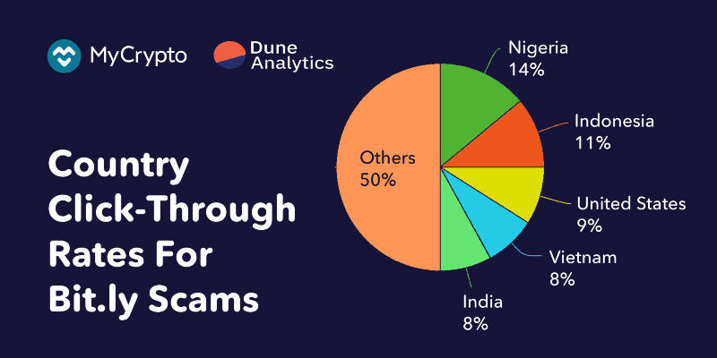
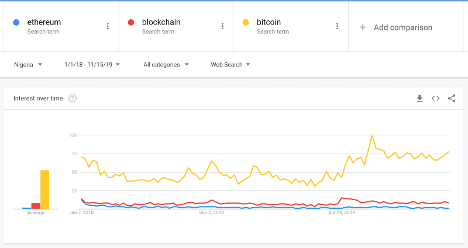
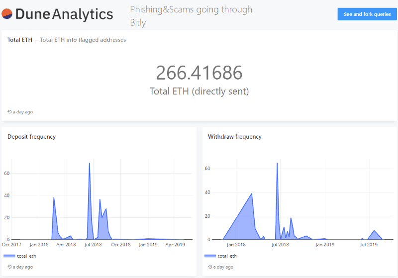
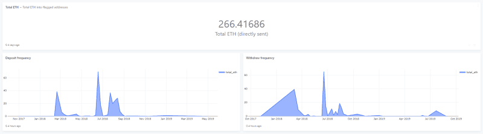

An analysis of over 100,000 click-throughs to popular crypto scams, via Dune Analytics

*Big thank you to [Dune Analytics](https://www.duneanalytics.com/) for providing the tools to help me analyze, visualize, and share this data much more easily. They just recently launched, and anyone can go use Dune right now to analyze, visualize, and share Ethereum data!*

Scams are still prevalent in this industry and will never go away. We aim to illustrate how much money has been sent through various scams, common inputs, and common outputs, as well as touch on some best security practices so you don’t fall victim.

As explained in [a previous article](/you-need-to-stop-trusting-links), we monitor Bitly links so we can learn:

* What regions are most targeted with scams
* How often the scams are replicated
* How long these scams live for
* How many clicks these campaigns get
* How the links are spread around the community

Here are some of the interesting finds.

### Click-through Analysis

Using [this data set](https://github.com/409H/research-2019_scams_phishing_bitly/tree/master/json), we’ve analyzed click-throughs (potential victims) for about 118,302 sessions (this does not imply 118,302 unique users).

*As with [the previous article](/you-need-to-stop-trusting-links) (that had a smaller data set), we are assuming that everyone has their browser language configured correctly and users were not using VPNs.*

Interestingly enough, the [regions that clicked through](https://github.com/409H/research-2019_scams_phishing_bitly/blob/master/json/count_country_clicks.json) are similar to what [we reported in August 2018](/you-need-to-stop-trusting-links):

* Nigeria — 14%
* Indonesia — 11%
* United States — 9%
* Vietnam — 8%

Previously, India was in the top 4, but with our updated data set, it sits at position 5 with a percentage of 7.8%.

If we take a look at Google Trends in Nigeria for ethereum, blockchain, and bitcoin, we can see there is little interest in Ethereum, which doesn’t correlate with the data that Bitly Analytics has shown. This could mean:

a) The links were given to individuals directly

b) A majority of people who clicked the links have VPNs/proxies in Nigeria

c) I am not seeing the full picture

Let’s explore option A — where did the targets find the Bitly links? Thankfully, Bitly is pretty verbose (and hopefully correct) when reporting referrer data within their analytics.

After compiling the data, we can see that the [top four referrers](https://github.com/409H/research-2019_scams_phishing_bitly/blob/master/json/count_referrer_clicks.json) are:

* Email, SMS, and direct clicks— 36%
* kinetictokenforms.typeform.com — 30%
* kinetictokenform.typeform.com — 5%
* Twitter — 4%

The scams that used typeform were pretty appealing to users. In essence, they would be promised a bunch of tokens through an airdrop, usually advertised to be worth a good amount of USD, and they’d be asked to provide information such as:

* Phone number (sim-swap avenue)
* Email address (phishing email avenue)
* Ethereum address (identifying if the user is worth targeting)

At the end of the user journey, once the bad actor has harvested that information, the user would be sent to a fake wallet interface to sign a message that would use the Bitly link.

Note that this phishing method would only work if you were using an insecure (on the internet) method such as a raw private key, mnemonic phrase, or keystore file. We recommend getting yourself a hardware wallet, such as a Ledger or a Trezor, so that your private keys always stay offline in a contained device.

Overall, the scams that were redirected via Bitly were predominately [trust-trading scams](/research-into-trust-trading-scams-on-twitter) — where a user is supposed to send a small deposit of some coin and in return is promised to get ten times the amount they sent, magically.

### Onchain Analysis

When we find a phishing campaign or one is [reported to us](https://cryptoscamdb.org/), we (among other things) archive the blockchain addresses so we can:

* See where the stolen funds go
* Maintain a blacklist for people to use in their own software to help minimize the victim count
* Flag the address/website as bad

There are 58 ETH addresses from our data set that we can confidently attribute to the campaigns that ran a redirect through Bitly.

[Using Dune](https://explore.duneanalytics.com/public/dashboards/ojwZPL3FnKzgVrSwWWH0PV3KoyZmHf3KjjD7fn3K), we can see there are 200 unique addresses that have sent ETH to the flagged addresses, with the top four coming from Binance.

The fifth most active address that sent ETH to the flagged addresses is an unlabeled address ([`0x620a3e5cddd2748e111a11810757f419d10b1aac`](https://etherscan.io/address/0x620a3e5cddd2748e111a11810757f419d10b1aac)) that has had a total of 456,263.20ETH transferred through it in its lifetime — first seen July 2017.

In fact, the majority of the top 10 input addresses were from exchange hot wallets, which raises some questions:

* Let’s play Devil’s Advocate and assume the scams were not scams - how can we educate people to not send from an exchange (which, onchain, is not sent from a user address, but from the exchange’s hot wallet) to claim airdropped tokens — but to send from an address they have the keys to? Or better yet, discourage airdrops altogether!

* How can we better educate users about how exchange hot wallets work, as well as custody for both onchain and offchain scenarios?

* Should we be lobbying exchanges to consume known open-source blacklists, like [CryptoScamDB](https://cryptoscamdb.org/)’s? If so, how do they verify the addresses? Do exchanges “have the right” to prevent someone from sending coins to an address based on community-sourced blacklists — even if its in the user’s best interest?

If we look at the common outputs for these scams, a big percentage (34%) of the stolen funds (that we know about) were sent to [`0x00789b1C3d583e3057c264888afC2C38E4aff5b7`](https://etherscan.io/address/0x00789b1C3d583e3057c264888afC2C38E4aff5b7), which, at time of writing, is holding 849ETH/$150k. This address could be owned by the bad actors.

The other addresses that received a lot of funds from the known flagged addresses were one-time-use addresses to move funds to different consolidation addresses — [some of which are holding over $100k](https://etherscan.io/address/0x1798711464b6e8a8081a22f4ac422bcc33d9e304) and have sent transactions to exchanges such as HitBTC, YoBit, and Bittrex. We can also see that some of the lower ETH values were [funneled through exchange services to the XMR (Monero) chain](https://shapeshift.io/txstat/0x5e5720a3de83d46b537048471d36a771a7d41e07).

Since we have the creation date of the Bitly link, we can utilize Dune’s tools to see [how soon after link creation the first transaction to the (known) bad actor address](https://github.com/409H/research-2019_scams_phishing_bitly/blob/master/json/links_with_addresses.json) was.

The quickest time it took for ETH to be sent to a flagged address relative to the Bitly link creation was 67 days prior to the Bitly link being created. This was campaign [2MJy4Nt](https://bitly.com/2MJy4Nt+), which had a total of seven click-throughs and a total of only 0.61ETH scammed, according to the reported data.

However, if we only look at transactions *after* the Bitly links were created, the quickest time was 22 hours for campaign [2Bqe3eg](https://bitly.com/2Bqe3eg+), which had a total of five click-throughs and 1.02ETH scammed, according to the reported data.

The longest time it took for ETH to be sent to a flagged address relative to the time the Bitly link was created was 29 days. This was campaign [2sK3rPO](https://bitly.com/2sK3rPO+), which had a total of 47 click-throughs and a total of only 0.001ETH scammed, according to the reported data.

Scams are unfortunately a fact of life in this industry. Gathering and visualizing data like this helps us discover trends that could aid in finding new ways of defending against future scams.

Thanks again to [Dune Analytics](https://www.duneanalytics.com/) for the help with generating the dashboard that allowed me to analyze this data more easily.

### Resources:

* https://explore.duneanalytics.com/public/dashboards/ojwZPL3FnKzgVrSwWWH0PV3KoyZmHf3KjjD7fn3K
* https://cryptoscamdb.org/
* [Research into Trust-Trading Scams on Twitter](/research-into-trust-trading-scams-on-twitter)
* [You need to stop trusting links!](/you-need-to-stop-trusting-links)
* https://github.com/409H/research-2019_scams_phishing_bitly/tree/master/json
* https://trends.google.com/trends/explore?date=2018-01-01%202019-11-15&geo=NG&q=ethereum,blockchain,bitcoin