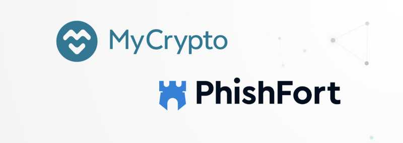
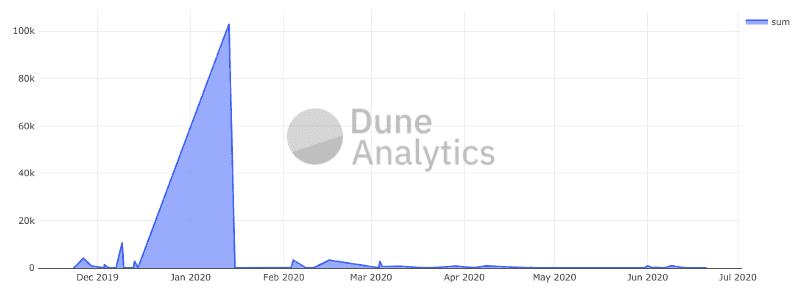
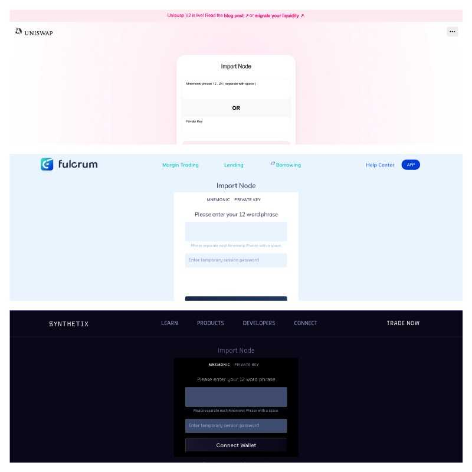
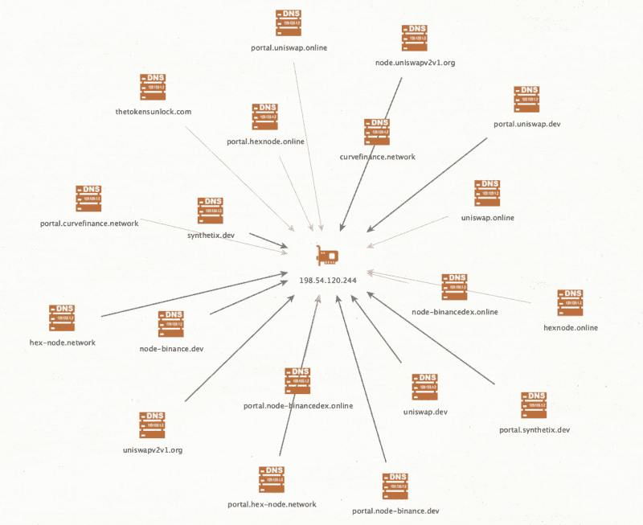
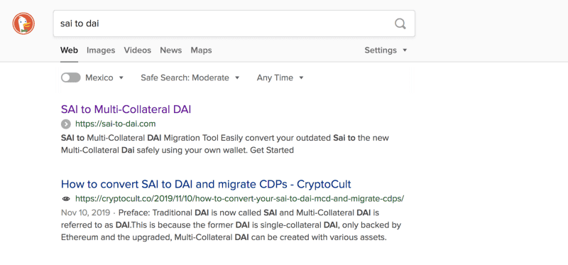
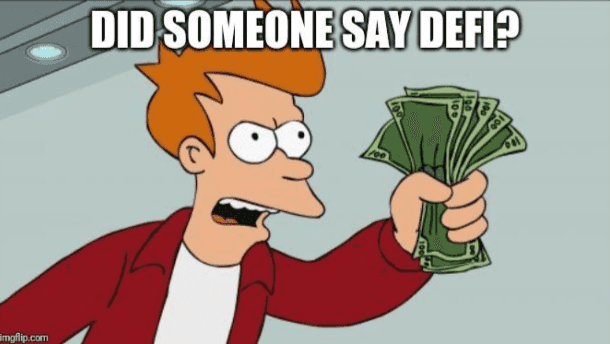

This is the second collaboration piece with [PhishFort](https://www.phishfort.com/). In the [first piece](/discovering-fake-browser-extensions-that-target-users-of-ledger-trezor-mew-metamask-and-more), we wrote about our discovery of a large campaign that targets cryptocurrency users with browser extensions. We predicted these campaigns would continue to grow in size and quantity, and there would be many more malicious browser extensions hitting as the year progressed. You can read our first post here: [Discovering Fake Browser Extensions That Target Users of Ledger, Trezor, MEW, Metamask, and More](/discovering-fake-browser-extensions-that-target-users-of-ledger-trezor-mew-metamask-and-more).

[PhishFort also published an article](https://www.phishfort.com/blog/web3-phishing-has-finally-arrived) at the start of this year to bring awareness about this type of phishing.

*This* article aims to bring awareness to “phishing dapps”—malicious Web3 applications that are designed to steal your cryptocurrency by pretending to be a legitimate application or service. These types of phishing kits appeared our radar during the [MakerDAO SAI shutdown](https://blog.makerdao.com/single-collateral-dai-to-multi-collateral-dai-upgrade-timeline-and-actions/), which required a new tool to help users migrate from SAI to DAI.

This domain (`sai2dai.com`) hosted a simple interface that indicated you would be initiating a 1:1 conversion from Single-Collateral DAI (SAI) to the new DAI — just like the official bridge. However, the transaction you would actually sign would simply send SAI to an address owned by the attackers.

Via our own analysis and reports that have come in through [CryptoScamDB](https://cryptoscamdb.org/), we’ve [tracked over $100k USD in SAI](https://explore.duneanalytics.com/queries/4922/source) that has been sent to these bad actors.



These phishing kits capitalize on a dangerous UX pattern used by legitimate apps but now are increasingly being taken advantage of by illegitimate apps: entering your private key directly in a web interface.



This iteration of Web3 phishing, at least from the samples we discovered, appears to be run by a group of bad actors. A cluster of them resided on the same infrastructure along with other cryptocurrency scams — [198.54.120.244](https://twitter.com/search?q=198.54.120.244%20from%3Acryptophishing&src=typed_query). This appears to be a shared web hosting server offered by Namecheap, but due to the overlap in content and method of attack, it is safe to assume the campaigns are being run by the same actors.



If you enter your private key or mnemonic phrase on these websites, it will send your secrets to a server-side PHP script called `submit.php` which will then be processed by the bad actor. Transactions will then be signed, authorizing the move of your assets to their address. Due to the fact they have your private key, this account is now fully compromised — from today until the end of time.

### Infrastructure Analysis
As we come across malicious domains, we archive certain data to help with articles like this and track the patterns and evolutions being observed in the wild. We also use this data to find more cryptocurrency phishing domains with the hopes of preventing cryptocurrency users from falling victim to new domains and scams as quickly as possible.

Here’s a group of domains using the “Web3 phishing kit” described above:

```csv
domain,domain_created,notes
saitodai.app,2019-11-25 05:24:15 UTC,
sai-to-dai.com,2019-11-25T09:24:23Z,
sai2dai.exchange,2019-11-25 09:28:28 UTC, 
sai2dai.link,2019-12-02 02:51:53 UTC,
sai2dai.pro,2019-12-06 04:53:15 UTC,
makerdao.tools,2019-12-21 19:12:36 UTC,
makerdao.live,2019-12-21 19:12:45 UTC,
makerdao.click,2020-01-14 04:27:12 UTC,
makerdao.llc,2020-01-20 07:40:06 UTC,
migrate.makerdao.guide,2020-01-22 13:15:21 UTC,
maker.migrate.tools,2020-01-26 14:22:00 UTC,
maker.dao.migrate.ltd,2020-01-29 09:02:42 UTC,
maker.dao.migrate.fund,2020-02-05 16:07:58 UTC,
maker.dao.migrate.claims,2020-03-25 02:23:20 UTC,
makerdao.redeem.fund,2020-05-27 18:50:37 UTC,
makerdao.redeem.bz,2020-06-03T00:48:52,
portal.fulcrum.network,2020-06-10 09:02:27 UTC,
uniswap.services,2020-06-10 09:02:30 UTC,
portal.curvefinance.network,2020-06-11 21:34:40 UTC,
portal.uniswap.dev,2020-06-12 07:44:12 UTC,
portal.hex-node.network,2020-06-13 07:15:24 UTC,
portal.synthetix.dev,2020-06-14 11:01:26 UTC,
uniswapv2v1.org,2020-06-16 21:57:38 UTC,Not weaponised
hexnode.online,2020-06-19 16:10:27 UTC,Not weaponised
fulcrum.plus,2020-06-21T05:32:23Z,
makerdao.one,,
makerdao.cash,, 
makerdao.ltd,,
```

From our dataset, the first transaction of SAI to a known bad actor’s address was in [block 8,983,524](https://etherscan.io/tx/0x7a486b985f1a64cb56fef9e95b9e4904cf88de306fe4a292dd50dcd5ed57a5b2) (2019/11/23), which is an address that belongs to saitodai.app. The domain was registered only two days prior, according to WHOIS. This could mean...

* There was another URL used by the same actor that we aren’t aware of (most likely)
* The actor seeded the address with some funds to make it look more legitimate

Phishing groups have spent an increasing amount of time working to get these scams in front of users. With these URLs, they utilize search engine optimization and [Telegram DMs](https://twitter.com/RichardHeartWin/status/1273592394295005195).



We also noticed that the brands being targeted are increasingly related to DeFi. This makes sense as DeFi has grown significantly over the past year and often attracts new, naive users with promises of easy returns. Namely, these kits steal the branding of:

* MakerDao
* Uniswap
* Fulcrum
* Synthetix
* Curve Finance

At the time these URLs were in the wild, these were [the top DeFi applications](https://defipulse.com/) (top usually being measured by “total value locked”).

Since then, the “top” list has shifted a bit. The recent explosion of #YieldFarming has shot Compound to the top. Aave too has quickly risen up the list after gaining major traction in Feb/March 2020. Fulcrum/bZx has moved down the list.



### A Call To Action
We suspect that these kits will continue to evolve to target the most used, most talked about, or most “in the news” cryptocurrency dapps, especially if the dapp attracts less experienced users who may not be as vigilant.

When the reward is as valuable and anonymous as cryptocurrency assets and secrets, these attackers quickly iterate and target the most used and most talked about apps. In 2017 and 2018, we often saw phishing emails and messages that used a real event that was in the news—an ICO, a hard fork, another hack—in order to increase their ROI. Now they are using the DAI-to-SAI migration. Tomorrow it will be something else.

They use a combination of urgency, fear of missing out, and fear of being negatively affected (by a hard fork, ICO, token migration, or other actionable item) with the hopes that the targeted person **will act quickly and never notice they are interacting with a malicious application.**

As your product, application, or service gains usage and popularity, we urge you to take steps to educate your community and your users about these types of attacks.

* Remind them that neither your site nor your team will ever ask them for their private keys/mnemonic phrases/seed phrases/passwords.
* Remind them that secrets are secret for a reason.
* Remind them to be vigilant and bookmark the dapps they interact with.
* Remind them to be more careful when they fear missing out, not less, and always check the URL they are on and address they are sending to.
* Share educational tidbits across your social media and directly in your product.

If your product does accept private keys/ keystores/ mnemonics/ seeds, stop it right now. You are normalising a fundamentally unsafe behavior that will lead to more loss and more harm. Remember, the worst user experience is when people lose all their money.