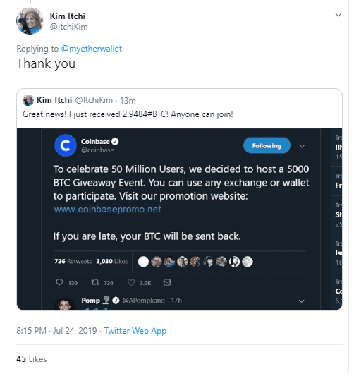
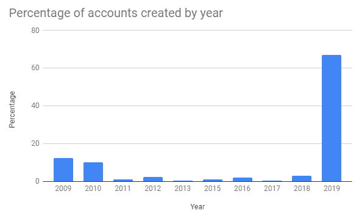
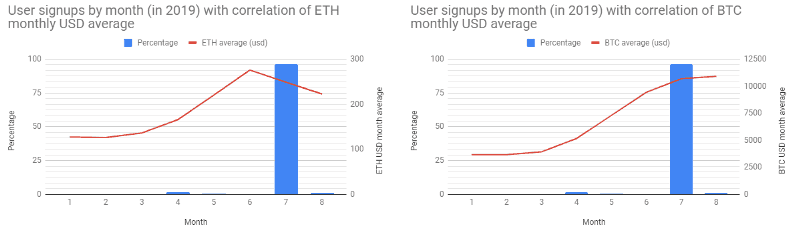
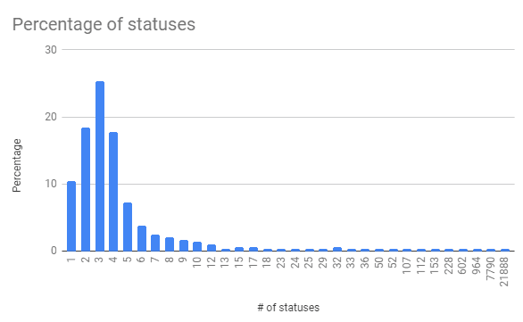
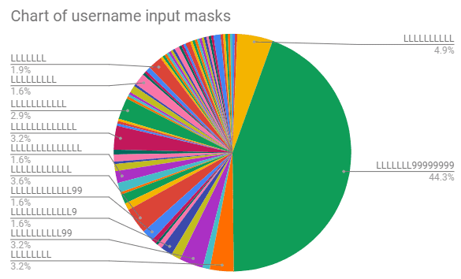
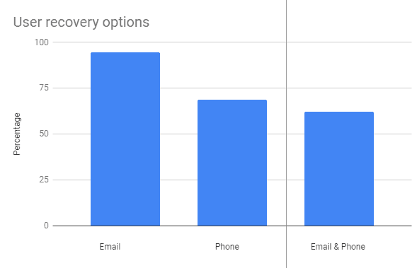
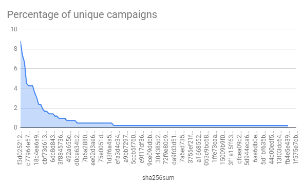
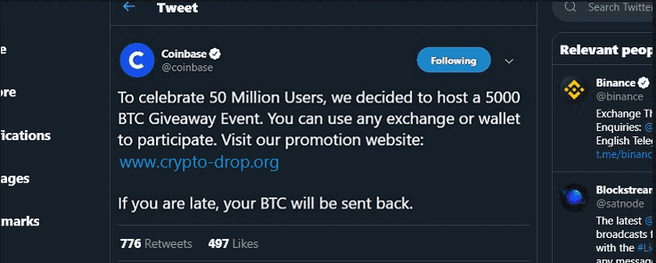
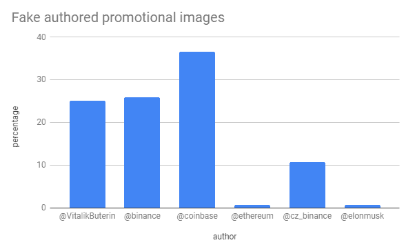
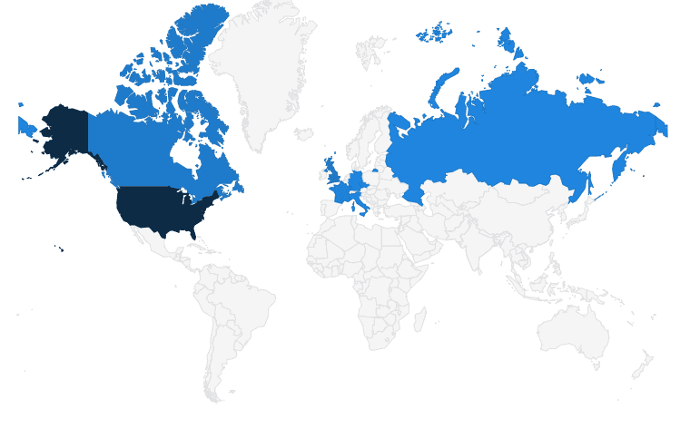

### Motivation and Purpose

During the 2017-18 bull market, we saw a lot of people promoting trust-trading scams (specifically on Twitter), from either fresh new accounts or hijacked accounts (including blue-tick/verified).

You’ve probably seen these scams in the form of a tweet that says something like *“We’re doing a giveaway, send us 0.5 ETH and we’ll send you 5 ETH back.”* These are always a lie.

To help combat these scam campaigns, [EtherAddressLookup](https://harrydenley.com/ethaddresslookup-chrome-extension-release) was created.

> “Cryptocurrency scams on Twitter are so common, this guy built a tool to help detect fraudsters” — [Business Insider article](https://www.businessinsider.com.au/this-ethereum-enthusiast-is-releasing-a-chrome-extension-to-catch-fake-twitter-accounts-2018-2)

Since then, we’ve seen iterations of trust-trading scams by the language used in tweets, the huge campaign of [hijacking verified accounts](https://www.ccn.com/cryptocurrency-scammers-hijack-verified-twitter-accounts-trick-users/), re-skinning the trust-trading kits, and tweeting photoshopped images to make it harder for bots to search for them.

I’ve been archiving the Twitter profiles, tweets (including the raw images), and infrastructure for some time. I tweeted a teaser at the start of the month, but since then, I’ve increased our data-set.

This article aims to show various statistics for the 2019 Twitter trust-trading campaign which is primarily tweeting photoshopped images. We will analyze the tweets, Twitter profiles, cryptocurrency addresses, and the infrastructure hosting the scams.



The data set includes:

* 333 Twitter users
* 327 tweets
* 425 tweeted images

See the research data set dump repository: [https://github.com/409H/research-2019_twitter_trust_trading](https://github.com/409H/research-2019_twitter_trust_trading)

### Analysis of users

By using the data from the Twitter API, we are able to graph the creation date (by year) of the accounts, and surprisingly reveal that some of the accounts were not created in 2019.



If we focus on the accounts created in 2019 and group the accounts by which month in that year they were created, then graph the months’ average prices of $BTC and $ETH, we get a not-very-surprising graph that generally correlates price increase with more accounts created to push the scam.



Unsurprisingly, the count of statuses for the majority of the users is very low — an indication of throw-away accounts used solely to promote a single trust-trading scam campaign. However, there are some very high status count profiles.



The user with the considerably high status count of 21,888 (at time of snapshot) is @AgamYogi — (supposedly) an Industrial Engineer from Jakarta, Indonesia. The user a peg down from that, with 7,790 statuses, is @megandaisy98, who seems to have abandoned the account a while ago (only retweeting and having unfollow count bots write to the timeline — the last actual [tweet was 2018/03/06](https://twitter.com/megandaisy98/status/971102605144444929)), is now replying directly to cryptocurrency entities with trust-trading scams — this account is one of the highest authors in the tweet data set.

If we map the usernames to their respective input mask (`L = [A-z]` and `9 = [0-9]`), we can start to see a common pattern involving the mask of `LLLLLLL99999999` that spans nearly half our data set, which leads to suspicion of an automated bot farm. These names consist of a human first name (sometimes including one or more initials of a second name) followed by a bunch of numbers.



Twitter’s password reset journey, which can be used to gain additional information on accounts, [is a little more restrictive than Facebook’s](https://twitter.com/sniko_/status/1151933045668290560), so the following is not from our full data set — only a subset (as we get locked out after 10 attempts and I haven’t set-up a proxy for the script yet. This subset is 37.5% of our total dataset).



Whilst email is the most popular recovery option, there are accounts that also involve a phone number recovery option, and more than half (62%) have both. 94% of accounts have an email recovery option and 68% have a phone number recovery option.

### Analysis of tweets

Since [Twitter is not altering the images](https://twitter.com/sniko_/status/1151587685015982080) to give unique checksums, we can calculate a checksum for each image that was tweeted to see which campaigns were advertised the most.



As we can see, there are a lot of single-use images (at least from our data set) but there are also a good number of identical images used across tweets, the most notable being f3d02...57a542 that was used in 8.7% of our tweet data set — this campaign was [crypto-drop.org](https://api.cryptoscamdb.org/v1/domain/crypto-drop.org), which had [0.164BTC](https://blockchair.com/bitcoin/address/1JRprezHFY97JEJo55t8wRnuNkAcVkB4uY) sent to its listed BTC address, `1JRprezHFY97JEJo55t8wRnuNkAcVkB4uY`



All the images are made to look like they are tweets or Facebook posts by the legitimate brand running a promotion based on their own success (like the one above) or another’s (e.g., Ethereum’s 4th birthday). Sometimes they’ll include fake replies from known cryptocurrency entities, either supporting the scam or giving a positive reply (such as they received the promised Bitcoin).



We can see the scammers favoured certain entities in the cryptocurrency scene, Coinbase being the most popular— possibly due to the mindset of piggybacking off the [Coinbase Earn program](https://www.coinbase.com/earn)(?). Faking tweets by Binance and Vitalik Buterin seem to be a close second favourite choice of the scammers.

### Analysis of infrastructure

The following domains were promoted through the tweeted images to try to fool users into sending cryptocurrency with the promise of getting a returned amount n times more than they deposited — a total of 52 different domains. All of these were added to our [open-source domain blacklists](https://harrydenley.com/ethaddresslookup-chrome-extension-release/) that protect over 1,000,000 cryptocurrency users (including [MetaMask users](https://github.com/MetaMask/eth-phishing-detect)).

```txt
www.crypto-drop.org
www.now5000.com
www.coinbase-team.com
20eth.com
www.giftbinance.com
www.binancefunds.com
www.ethereum4th.com
www.coinbase-promo.com
www.drop-crypto.com
btc.wz.sk
www.binclic.com
www.ethereumpromo.epizy.com
www.coinbasetop.com
bit.do/binance5000
www.coinbase.gift
www.airdrop2.com
www.promobinance.net
bit.ly/binancegive
bit.do/binancebtc
www.coinbase.promo
www.bit.do/binance10x
www.5000bitcoin.net
www.2019giveaway.com
www.gift-binance.com
www.5000giveaway.com
www.coinbase5000.com
5000promo.net
mybinance.net
www.bit.do/promo10x
www.drop-binance.com
www.2019airdrop.com
cryp.li/mSty0q8
www.binance5000.info
www.bit.do/10xpromo
www.5000btc.org
www.win-binance.com
bigpromo.net
www.coinbasepromo.epizy.com
www.coinbasepromo.net
www.top-binance.com
www.bit.do/coinbasepromo
www.promo5000.com
www.eventbinance.com
www.bit.do/vitalik10x
www.btcfast.net
www.5000btc.gift
promo-binance.netlify.com
www.coinbasegift.net
www.ethereum4th.org
www.promotion-crypto.com
www.airdrop-crypto.com
muskelon.net
```

The majority of these (64%) were hosted in the US, followed by GB (11%) and CA (9%).



Following the same trend as the Twitter account creation (the majority being in July 2019), 86% of domains in our data set were registered in July 2019 also.

 the domains were registered")

### Analysis of cryptocurrency addresses

From our data set, we have 14 ETH addresses (13 unique) and 43 BTC addresses (43 unique) that were advertised on the domains (listed above) for a user to send funds to.

As of block height 588,957 (BTC) and block height 8,299,909 (ETH) we can calculate that the campaigns in total took;

* 11.789 BTC (~$138k)
* 42.310 ETH (~$9.5k)

A theory has been floating around that “they funnel funds to the addresses themselves to make it look legit,” but that would mean marking nearly $150k as bad in taint analysis and potentially blacklisted from exchanges, so I am not entirely convinced on that theory.

### Conclusions

As we expected, when the interest of cryptocurrencies goes up (thus price increases), we are to expect more trust-trading scammers to target the user base and most of these campaigns are run by suspected bot farms.

### Look at the data yourself

We’ve collected some data from the big campaigns on Twitter and archived the API results and raw images into a git repository.

* You can clone the data and come to your own conclusions: https://github.com/409H/research-2019_twitter_trust_trading
* You can play around with the data and generate new charts to analyze: https://docs.google.com/spreadsheets/d/1nZYI0xkDu2p5Uy8LTJoPTJwGPoLWd-UgXFrT69Gc3gU/edit?usp=sharing