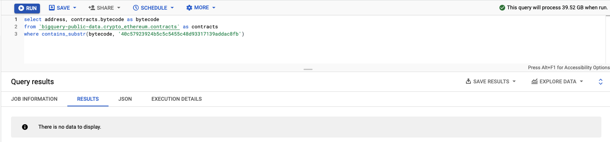

On Ethereum, you can have smart contracts which allow for assets on the chain other than the native currency (ETH). There are many smart contracts and assets on top of Ethereum (and other EVM chains) since its [genesis block on July 30, 2015](https://etherscan.io/block/0).

A lot of institutions are building on and around blockchains, especially Ethereum. As such, most (if not all) of these institutions need to be compliant with regulations, most notably (in the case of this post), the [US OFAC Sanctions](https://home.treasury.gov/policy-issues/office-of-foreign-assets-control-sanctions-programs-and-information).

https://twitter.com/sniko_/status/1514982907819044875

On March 10, 2022, ChainAnalysis launched a "Sanctions Oracle" smart contract on EVM chains.

> The Chainalysis oracle is a smart contract that validates if a cryptocurrency wallet address has been included in a sanctions designation. The smart contract is maintained by Chainalysis on a variety of popular blockchains and will be regularly updated to reflect the latest sanctions designations listed on economic/trade embargo lists from organizations including the US, EU, or UN. The smart contract is available for anyone to use and does not require a customer relationship with Chainalysis.

The idea behind this is that now anyone can check against this list onchain (smart contracts can check against this list, for example) and exclude access to an address that has been designated sanctioned. However, as of [block 14910130](https://etherscan.io/block/14910130) there has not been a single contract deployed with the Sanctions Oracle address in the bytecode.

Anyway, I have decided to build an app that steps through blocks on various EVM blockchains and indexes (certain) event topics for various smart contracts that have sanction/blacklisting ability.

### Notable finds (USDT)

* Who is `0x6f5901e3c53a51fce8edc15f6fa2b01b24226dcc` and why were they USDT blacklisted for 4 blocks? [[Blacklisted](https://etherscan.io/tx/0xda5c3d1c03c8dcc3a23709b4285d4e5744596e3db03070e3dfd0f8586b10a22f)] [[Removed from the blacklist](https://etherscan.io/tx/0xae48c8c72e95400395efea8b9cefac9595ce84b056ac7d6bdba4c148d182168c)]

