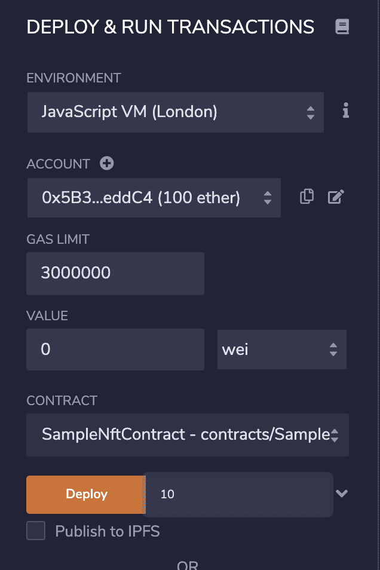

NFTs (Non-Fungible Tokens) saw a meteoric rise in popularity this year, and many projects have been published with communities forming around them.

As a display of loyalty or support for a project, many users (anonymous or not) choose to change their profile picture (or ‘PFP’ for short) to an NFT from one of their collections. This makes these users easily identifiable as members of a community, and owning/displaying an NFT with uncommon/rare traits can increase not only the tangible value of that NFT but also the social value.

https://twitter.com/tommyk_eth/status/1440807417810280458

In fact, [OpenSea](https://opensea.io/) - a popular trading market for NFTs - has seen exponential growth in their user base and sales volume due in part to the rise of art-based PFP NFTs.


A lot of people have been having fun launching their own PFP NFT projects, but this can be tough if you don’t have the knowledge or skill set.

By the end of this tutorial, you should have an understanding of how to programmatically build any number of images using layers (specifically NFTs with no inherent utility/value, to be used as a PFP project), list out their traits, and put it all “on-chain” to start building your community. In addition, I will touch on some scam tactics to be aware of and general contract hygiene to be considered when building an NFT project.

For this article, if you wish to follow along, please refer to my [409H/sample_nft_project](https://github.com/409H/sample_nft_project#sample-nft-project) repository.

https://twitter.com/pet3rpan_/status/1437094807164239873

### 1. Building the Layers
First, we need to describe what layers/traits we want in our project so we know what kind of graphics to make. For this example project, we will create a simple project with some basic different layers/traits:

* Head shape
* Head color
* Eye color
* Eye shape
* Mouth color
* Mouth shape

We will begin by building the different types of heads: circle, square, and triangle options, with colour variations.

To start, you’ll need a graphic creation software. For this project, I’m using “[8bit painter](https://apps.apple.com/gb/app/8bit-painter/id894301273)” with a canvas size of 16x16 (with grid enabled).

Reference the 0,0 coords (where the horizontal and vertical lines meet in the center) as the middle of the face. This is so that we can create the other layers on the canvas with spacing relative to the head (the primary layer in the graphic).


In the image above, you’ll notice [three directories](https://github.com/409H/sample_nft_project/tree/master/images_raw) (layers): `00head`, `01eyes`, and `02mouth`. The head will be the base layer of the graphic, and the eyes and mouth will overlay on top of the head layer programmatically so we don’t have to manually create each image with all their various layers.

*Keep in mind this is a sample project - I haven’t done much work with the art to make it fancy looking, nor have I prepared many different trait types - this is all just to give you a small idea of what we can accomplish.*

Note that every layer (apart from the head) has a transparent background and the same canvas size so the images can be easily and uniformly overlaid on top of each other, as seen [here](https://github.com/409H/sample_nft_project/tree/master/images_raw).

Once all the different layers and variations are complete, we can start writing the code to build the final images and record the respective trait mapping for each image. Notice that we have named each layer as `<layer>_<trait_shape>_<trait_color>.png` - this is intentional as it will help programmatically build the trait mappings for each graphic. If you are building your own project with the same code, make sure to run `composer run test` to run the tests against your image filenames.

### 2. Combining the Layers
Now that our project contains the layers needed to output our final graphics, we’ll need to write some code to combine the layers together and force some sort of rarity into the project - for example, some projects like to make zombie/skeleton variations of their characters as “rare,” meaning only a small percentage of the final images will have these “skins.” In our case, we won’t be forcing any type of rarity and the layers will be picked at random.

For this, we will write some PHP code and use the [image processing GD library](https://www.php.net/manual/en/book.image.php) for the image manipulation. The end code probably won’t look pretty (and I am expecting pitchforks for the use of PHP 😜) but it will work as intended to build images.

We have a total of 4 head types, 4 head colors, 3 eye colors, 2 eye types, 2 mouth colors, and 1 mouth type, and have the freedom to write code to describe their rarity - but first, let’s get the code together to merge each layer.

Once the code has merged the layers to our ruleset (which merely chooses layers at random for n iterations), the code will generate the JSON object needed for interfaces (such as OpenSea) to display the traits for each image, which will be fetched from the endpoint stored in baseURI at contract level.


### 3. Creating the NFT Smart Contract
For the most part, NFT contracts use the widely accepted [EIP-721 standard](https://eips.ethereum.org/EIPS/eip-721), which is a set of rules for some code. These rules outline the function names, function parameters, and function return types, which then allow for implementation/consumption of the contract to go smoothly as products would only need to write code to these standards and don’t have to worry about any project-specific calls to render a graphic (or interrogate the contract for information, such as “how many NFTs does address 0x11b6A5fE2906F3354145613DB0d99CEB51f604C9 own on this contract?”).

There are various frameworks and tools that assist in deploying a contract to an EVM-based blockchain; we’ll use [Remix](https://remix.ethereum.org/) to deploy the NFT contract and set up the contract to allow a purchase of an NFT. Because it is [EIP-721](https://eips.ethereum.org/EIPS/eip-721) compliant, it will work out-of-the-box with secondary marketplaces such as OpenSea.

To customize the contract logic, we can use the [OpenZepplin Wizard](https://docs.openzeppelin.com/contracts/4.x/wizard) and [Remix](https://remix.ethereum.org/). To deploy the project to the Rinkeby testnet, we’ll follow this great [tutorial](https://forum.openzeppelin.com/t/create-an-nft-and-deploy-to-a-public-testnet-using-remix/6358) by [Andrew B Coathup](https://twitter.com/abcoathup). (Then, once we’re certain we want to spend real money on this, we will deploy to the Mainnet.)


As we want to allow for users to mint some NFTs for some value, we can add a function to the contract (deletion of EIP-721 functions is not allowed, but we are free to add as many as we want to the overall contract).

We’ll need to modify the code generated by the wizard to set a limit on the amount of times mint() can be called - there should be no more mints than the amount of unique graphics we created earlier. Note: Because of zero-based indexing (meaning the numbers start at zero, not one), we’ll need to subtract 1 from the number.

```sol
uint immutable maxSupply;

constructor(uint _maxSupply) ERC721("Sample NFT Project", "SNP") {

maxSupply = _maxSupply - 1;

}
```



When the contract is deployed, we have to input the max supply that can be minted (the number of unique images we output earlier) in the constructor argument. This means that there will be an image and attributes for every mint() made.

The minting function for an NFT is most often paid for by the user who mints it, meaning the minter will need to send some ETH to the contract in order to receive their NFT. To allow for this, we’ll add a new function to our contract that enables minting with a cost of 0.01ETH. The ETH will sit in the contract until the owner of the contract calls another new method: `withdraw()`. Note that you can set this to be whatever price you want - some projects even allow minting for free and the minter is only required to pay gas!

```sol
function mint() public payable {
    require(_tokenIdCounter.current() <= maxSupply, "Sold out"); // NFT project sold out
    require(msg.value == 0.01 ether, "Incorrect amount"); // Cost to mint 1 NFT is 0.01 ETH (10000000000000000 wei)

    _safeMint(msg.sender, _tokenIdCounter.current());
    _tokenIdCounter.increment();
}

function withdraw() public onlyOwner { // Owner can withdraw all the eth that was paid to mint NFTs
    address payable recipient = payable(address(msg.sender));
    recipient.transfer(address(this).balance);
}
```

Once we’ve deployed the contract to Rinkeby with our init arguments, we can call `mint()` to mint an NFT.

* Creation of contract: https://rinkeby.etherscan.io/tx/0x46ce4ad1cacae757ee12252b5e214509d829bcc0626aaf325965ae99b5249f74
* Minting an NFT: https://rinkeby.etherscan.io/tx/0x4d4102264edfe4aee9a58d1cbc405b0e5b308708c92ffce5413d80459e0e7c1c
* Claiming ETH: https://rinkeby.etherscan.io/tx/0xb6eb339e065c9cb573af2496cef3d2ca67e9b9852c08b2492e9eaed11cbc3bbd


Now we have the contract on-chain ([0xab9d2c623ec60a60a08a87e22adc83b91a486f2c](https://rinkeby.etherscan.io/address/0xab9d2c623ec60a60a08a87e22adc83b91a486f2c)) and an NFT has been minted (with index 0), we can verify the metadata by using OpenSea’s [validate endpoint](https://rinkeby-api.opensea.io/asset/0xab9d2c623ec60a60a08a87e22adc83b91a486f2c/0/validate/).

Then we can [view the NFT on OpenSea](https://testnets.opensea.io/assets/0xab9d2c623ec60a60a08a87e22adc83b91a486f2c/0) with all of its traits!


### 4. Verifying the Contract
Block explorers such as Etherscan will now [show our contract](https://rinkeby.etherscan.io/address/0xab9d2c623ec60a60a08a87e22adc83b91a486f2c#code) since it has been deployed, but will only show the byte code until we verify the contract. Sometimes this is a manual process, but there are automated tools available during the deployment process to do this. As our contract imports other contracts from the OpenZeppelin repository, we will save time by using a great tool called [truffle-plugin-verify](https://kalis.me/verify-truffle-smart-contracts-etherscan/).

Verifying the contract will make it more human-readable as the Solidity code will be published on the block explorer and people can verify the logic of the contract more easily. This builds inherent trust with the community and the developers as everyone has the same optics on the code behind the project.

We will need to create a new .env file and add API keys for both [Etherscan](https://etherscan.io/apis) and [QuickNode](https://quiknode.io/?tap_a=67226-09396e&tap_s=860550-6c3251), as well as provide a ***[test use only!!]*** [secret recovery phrase](https://support.mycrypto.com/general-knowledge/cryptography/how-do-mnemonic-phrases-work#:~:text=A%20Secret%20Recovery%20Phrase%2C%20mnemonic,back%20up%20the%20users'%20funds.), so we can deploy the contract on the Rinkeby testnet and verify the contract with two commands.

```shell
truffle migrate --network rinkeby # Deploy contract to Rinkeby with Truffle

truffle run verify SampleNftContract --network rinkeby # Verify contract source code on Etherscan
```

### 5. Pre-Deploy Notes
If you are following along with the [sample_nft_project repository](https://github.com/409H/sample_nft_project), then:

#### Graphic related

* Add more layer graphics to the [images_raw directory](https://github.com/409H/sample_nft_project/tree/master/images_raw) and name the files correctly.
* Read the [PHP script](https://github.com/409H/sample_nft_project/blob/master/src-php/index.php) to make sure the end graphics and traits are built as you want as currently there is no rarity/uniqueness enforced.
* It is of the utmost importance to host your image metadata safely and securely. If it is hosted on your own domain (like with this example, the data is hosted on [harrydenley.com](https://harrydenley.com/)), then there is a risk of the graphic not being everlasting. Some projects promote the use of storing the data on [IPFS](https://docs.ipfs.io/concepts/what-is-ipfs/).

#### Smart contract related

* Make sure you change the [static endpoint for the metadata](https://github.com/409H/sample_nft_project/blob/master/src-node/contracts/SampleNftContract.sol#L20) to where you are hosting the metadata.
* Make sure you change the [contract name and symbol](https://github.com/409H/sample_nft_project/blob/master/src-node/contracts/SampleNftContract.sol#L15) to something that relates to your project.
* Make sure you are happy with the cost of each NFT or [change the value](https://github.com/409H/sample_nft_project/blob/master/src-node/contracts/SampleNftContract.sol#L25) if you are not.
* When deploying the contract, make sure you set the maxSupply as the integer of the highest number in `images_processed` directory.
* Consider deploying this using Remix with either the JavascriptVM or injected web3 provider pointed to Rinkeby so that you are not using real money to test it out.

### 5. Post-Deploy Notes
Since we can add/edit functionality to the contract, including changing the BaseURI (where the metadata is held), it is best (for the community’s sake) to set this value as static or at least call `renounceOwnership()` later if you want to point everything to a server and update the endpoint for a “reveal your NFT” event. It is especially critical to note that if the metadata is on a centralised server (that is, a server that is not “immutable,” such as [IPFS](https://ghost.mycrypto.com/ipfs-and-nft-the-relationship/), Arweave, etc.) then anyone with access to that server can change the traits and looks of the NFTs.

Once the minted supply has reached its maximum value (the value set in in the constructor when deploying the contract) and you have withdrawn the ETH from the contract, think about calling `renounceOwnership()`. You won’t need any ownership power on the contract anymore as there is a static supply of NFTs.

This NFT smart contract, without modification, will ask for ETH payment in return for an NFT, which can cause a “[gas war](https://blog.mycrypto.com/nft-gas-wars/),” especially if your NFT collection drop is highly anticipated. There are different ways to approach this problem, which [we recently highlighted](https://blog.mycrypto.com/nft-gas-wars/).

We have also been mindful of how the creator receives the ETH that was paid for the NFTs. Instead of adding the logic to forward the ETH payment to the contract owner on a `mint()` call, we added another method for the owner to call, `withdraw()`, so that they can call whenever they desire. This means the gas limit (and in turn the transaction cost) for users to mint an NFT will be lower.

Buying and selling NFTs can be fun, but building your own NFT project can be daunting. Hopefully this sheds some light on the process and gives you the confidence to build!