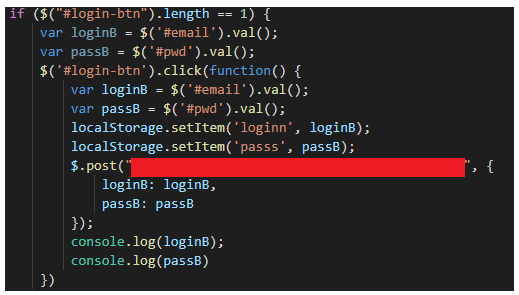
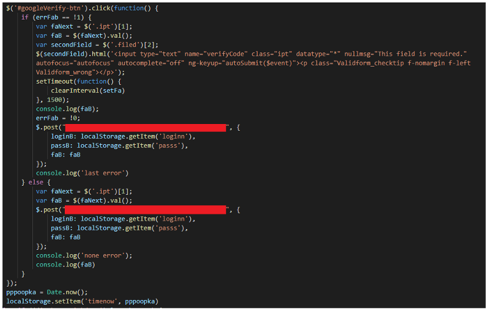
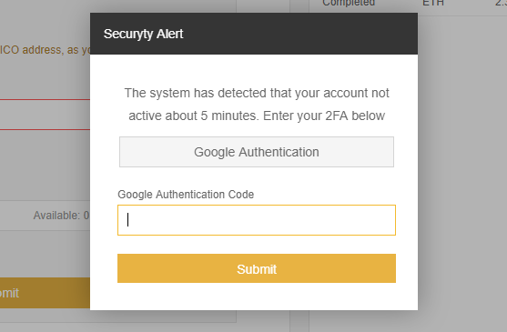
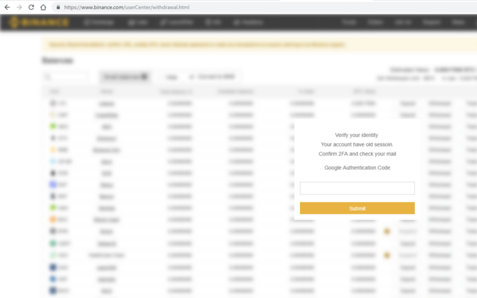
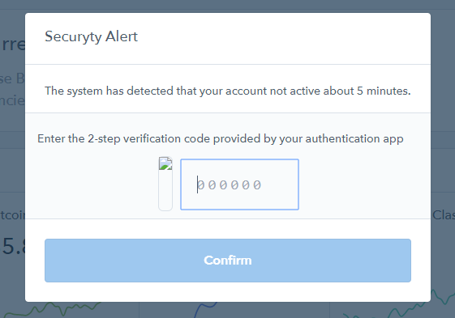
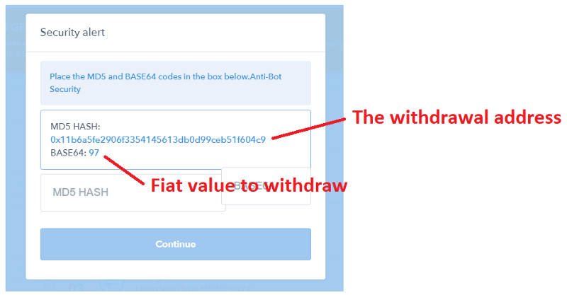

**Be careful with what you install.**

Recently, I came across a project that promises to give you cashback on each transaction — including trading on centralized exchanges — and *all you need to do* is install a browser extension to get that 5% cashback.

If it’s too good to be true, it’s probably false.

At the time of discovery, their extension — Chrome extension ID `liachincjagnalnmahhaioaogkngbmhf` (CCB Cash)— had 181 users on it. The extension has now been removed from the store.

So, I inspected the code — it has very malicious behaviour.

The malicious extension is only interested in the following coins; BTC, ETH, BCH, BNB, LTC, XRP, ETC.

### What permissions does it require?

When you first install the browser extension it asks for write access to multiple domains including Github, Exmo, Coinbase, Binance, HitBTC, LocalBitcoins, and more.

It requests access to all open tabs and your cookies — these permissions are abused a lot to steal your assets from various exchanges and wallet services.

### What does it do?

To sum it up in a sentence, it steals all your secrets depending on the domain you are on.

For example, on Binance it steals your login details, 2FA codes, CSRF tokens, and attempts to automatically withdraws coins.

Let’s look at the actual execution...

#### Step 1) Stealing your Logins

There is code in the extension that will trigger on a click event on the login button to steal the email and password inputs, store them in LocalStorage and send them to their server in the backend without disrupting the normal login routine from the exchange.

#### Step 2) Stealing 2FA codes

If you’re logging in, it will monitor for the 2FA input and wait for the form to be submitted. Once it is, it sends the inputted 2FA to their backend along with the email and password stored in LocalStorage from step 1.

If you are logged in, every 5 minutes it will prompt you for your Google 2FA code — which will be sent to their server in the backend — this gives them more attempts if they are trying to get into your account and miss the 2FA code from login.

#### Step 3) Stealing your CSRF token and withdrawing

If you go to the balances view (in Binance) the extension steals your CSRF token from your cookies and sends it to their backend server. It then makes a POST request to grab your coin balances and attempts to withdraw silently.

It steals your CSRF tokens so it can `md5()` them and make a `POST /exchange/private/yserAssetTransferBtc` request to get your balances. Once that’s done, it will sort them by highest value first and try to withdraw.

If it finds one of these coins with a balance of >0.01 (BTC value) and is able to withdraw, it will navigate you to the withdrawal view for the coin with the highest value and automatically fill in the withdrawal request and click withdraw automagically — it will also blur the Binance screen by injecting a div into the body and bringing it to the front and modifying the text of the 2FA code confirmation to try to make you believe you are logged out — this is done super fast so you don’t even notice that you’re being redirected away from the dashboard.

The user will then input their 2FA code to “reinstate” their session (little do they know they’ve just confirmed the withdrawal of the coin to the bad actor’s address) and will get them to check their email.

Of course, the only email the user would have gotten is the “Confirm Withdrawal”, but if they become ‘blind’ to checking the contents of an email and just clicking links, you’ve then 100% confirmed and started the withdrawal process.

The same sort of behaviour is done on Coinbase, bringing up the occasional 2FA inputs and stealing your cookies and logins.

If you go to your Accounts view with this extension, it will calculate your highest value asset (also sending all your asset values to their backend server) and attempt to withdraw. It looks like this…

This happens on every pageload of your accounts so it can confuse users to accidentally crafting a withdrawal. Sneaky.

Essentially, this browser extension steals your exchange logins and tries to trick you into accepting withdrawals to the attackers.

### Where do the funds go?

The bad actors have the following addresses:

* BTC — `16EegrNMdZ9Rxku6Za5neEFjMW57wkQr1S`
* ETH — `0x03b70dc31abf9cf6c1cf80bfeeb322e8d3dbb4ca`
* BCH — `1PCh7w6LdcEv1sWd5wtvkELHcWe5HumUi3`
* LTC — `LRPChoyN8qLWENjo1dUjk2bESZjE7bQ6sP`
* BNB — `0x03B70DC31abF9cF6C1cf80bfEEB322E8D3DBB4ca`
* XRP — `rGmdGrMjvxt6S3VjF4M78U2YMLPR6XLPSN`
* ETC — `0x4F53C9882Ba87d2D7c525dF2aEF2540EFB6e32e5`

Since their extension was launched in the Chrome store on December 03, 2018, they have stolen a total of 23.23550279BTC (assuming everything that has gone through these addresses is stolen and these addresses are exclusively used for this browser extension).

### What secrets did we find?

* The bad actor addresses.
* Backend servers and domains.
* Russian code comments — highly likely this is a RU outfit doing this.

We’ve also taken down the domain pointed to the backend server — people running the extension won’t become victims anymore — we still urge you to **purge the extension from your browser** and **change your email and passwords** to every cryptocurrency related thing you’ve been on.

The browser extension injected its malicious activity on the following platforms: Exmo, Coinbase, Hbg / Huobi, Hitbtc, Binance, LocalBitcoins, Blockchain, Bitfinex, and MyEtherWallet.

### How can I stay protected?

* Don’t install software that you cannot read and asks for intrusive permissions.
* If something seems off, it probably is. Evaluate what might cause your user journey to change.
* Periodically evaluate what extensions you have on your browser — remove those you don’t use anymore.
* If you have an extension on your browser that you use, seek an open-source version/alternative or disable automatic updates from the Chrome store — make sure you audit the code or find someone reliable and trustworthy to.

Thanks to Jeremiah O’Connor for help with this investigation. We have notified exchanges that were targeted to investigate.