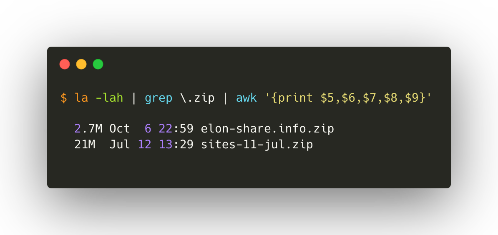
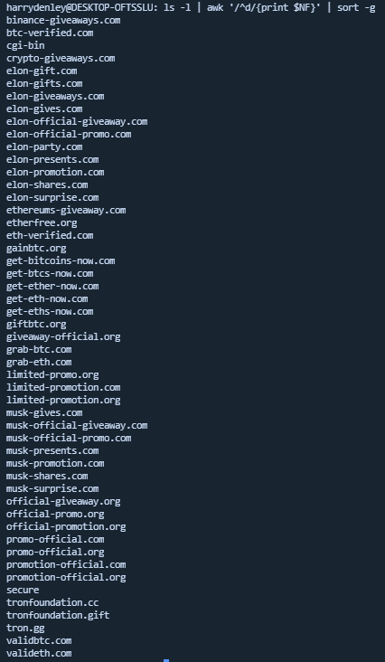
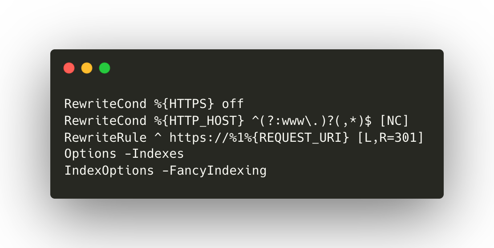
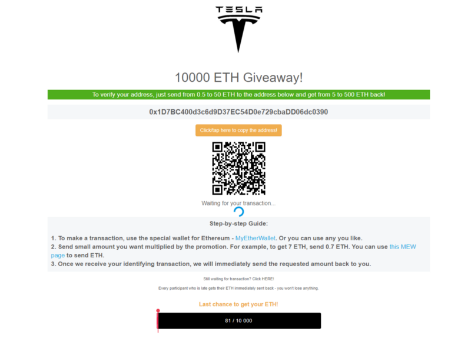
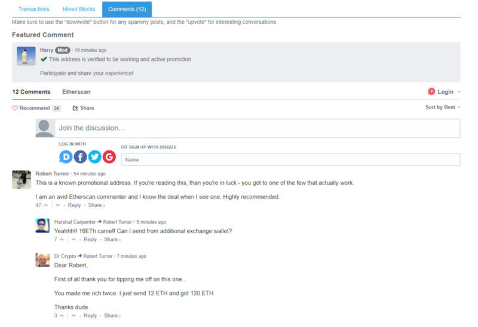
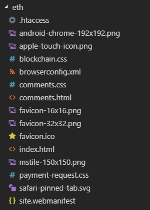
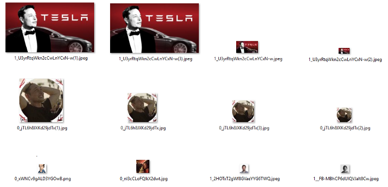

**Before you read this, REMEMBER NOBODY IS GIVING AWAY FREE MONEY.**


Recently I came across a server hosting around 60 trust-trading domains and the server was [incorrectly] configured so that if you navigated to the server IP on port 443 directly, it exposed the DirectoryIndex — lovely, another incompetent scamming sysadmin group.

After figuring this out, I noticed they had also left two .zip files on the server which were holding the Trust-Trading scam kits for each domain. So, I downloaded everything so we can examine it all locally.



I then unzipped elon-share.info.zip and sites-11.jul.zip and examined the directories inside.



***Great!*** This is a lot of data — even if it’s just known and unknown domains that will be used for this type of scam.

Let’s do a quick grep on the known trust-trading fingerprint to find the bad actor addresses and get the unique ones — see [addresses.txt contents](https://gist.githubusercontent.com/409H/9f7b1ec2388e224bb84ed34d197c5a04/raw/174e8df0fd377b2c8590ecb5fa25711da8775d02/98aaf18270a7-addresses.txt).

```bash
$ cat addresses.txt | cut -d " " -f2 | sort -n | uniq

0x11775A106157a283873A81E8Ec58394b8d568E06
0x1597D86B81166CF78bb56AC4Cab48EF81f203d23
0x18B139F86407B1a834da4258F01121ae9F8d06f5
0x1D7BC400d3c6d9D37EC54D0e729cbaDD06dc0390
0x368A4ECB480f4FBca0C0e7A93A858171A7053988
0x62a51E3c89E13616D7fcB2ce4e460E0237a04682
0x6DF33c859EE68215393B0B0a88C4a082E617BC44
0x973cC36EEF960389b1DdDCE82a9f0663Af61809B
0x9c29046A4178d15aA7BE23e6b73Ef0f2E429A9a1
0x9Da01DF0eeAE50B30845a1cAFb27E1f75887B887
0xCc3a7e3c3CDCbA86761De4FB3311b8ADd77761f2
0xE4837A2ECE6832bABEDc2BE30Bb92DA6Fa42f484
0xeb5EB9ecEb8ecB486149eF81Ff86d689EeE80b3b
0xFb90119D9e1610dcbC5f3f2e7301aA62e9051916
1AVw15FpZGf3hY6ea3kbni9ank6Ln42e7F
1DkauXB8FEP3e94FPLvsRU96zPLLwJk5Z5
1Dtykbcz4dsKzHrddrkxw8FrKKiVu2tTgX
1EMG2n35pxcC7ycvwErvCFkzvaNXBz85hG
1FnaucN6FtADHUD5Z1mW55j9okubkjsTAW
1GCyPRRgRu6EHieBhs5DpDW38pfVc3aNH4
1Gq42JugPnFzwxqTJMqTN1cmQT6wsLVCbq
1KZxzCqyAk72UdfBNKYptQQ1LySmd9KTrC
1LFFZPK28FqgnqbwxzbmrmsveXXC5PiVAz
1LxVDvGZ7LR8zQNPwsmPnraqRDTgWJa3Zu
1P7wAYMgBJE5FWmAuuhymCRSfsW2QTSZx3
15xd99WKi98JK9bUPp4AZEc2gZ5y7bBMCQ
18r9PbxJzwiQudyLx5SNjeMNmxtH9nfWoM
```

Now that we have a dump of addresses, let’s dump the directories named after domains.

```bash
$ ls -la | grep -E "\.(com|org|cc|gg|gift)$" | awk '{print $9}' | sort -g

binance-giveaways.com
btc-verified.com
crypto-giveaways.com
elon-gift.com
elon-gifts.com
elon-giveaways.com
elon-gives.com
elon-official-giveaway.com
elon-official-promo.com
elon-party.com
elon-presents.com
elon-promotion.com
elon-shares.com
elon-surprise.com
ethereums-giveaway.com
etherfree.org
eth-verified.com
gainbtc.org
get-bitcoins-now.com
get-btcs-now.com
get-ether-now.com
get-eth-now.com
get-eths-now.com
giftbtc.org
giveaway-official.org
grab-btc.com
grab-eth.com
limited-promo.org
limited-promotion.com
limited-promotion.org
musk-gives.com
musk-official-giveaway.com
musk-official-promo.com
musk-presents.com
musk-promotion.com
musk-shares.com
musk-surprise.com
official-giveaway.org
official-promo.org
official-promotion.org
promo-official.com
promo-official.org
promotion-official.com
promotion-official.org
tronfoundation.cc
tronfoundation.gift
tron.gg
validbtc.com
valideth.com
```

### Looking at the code (from sites-11-jul.zip)

Using ethplorer we can determine which Ethereum address was most effective (the most ETH value went through it), and then we can look at the code behind that specific campaign.

The most “successful” address for the bad actors was [0x1d7bc400d3c6d9d37ec54d0e729cbadd06dc0390](https://etherscan.io/address/0x1d7bc400d3c6d9d37ec54d0e729cbadd06dc0390) which had a total of 61.966ETH going through it. This address belongs to the elon-gift.com domain.

The code behind this campaign has 3 different campaigns on it — only one was Ethereum based, the others were Bitcoin based.

```bash
$ grep "elon-gift.com" addresses.txt

./elon-gift.com/btc/index.html 15xd99WKi98JK9bUPp4AZEc2gZ5y7bBMCQ
./elon-gift.com/eth/index.html 0x1D7BC400d3c6d9D37EC54D0e729cbaDD06dc0390
./elon-gift.com/musk/index.html 1FnaucN6FtADHUD5Z1mW55j9okubkjsTAW
```

The Bitcoin campaigns stole 2.27509273BTC — a quite successful campaign even at today’s prices ($9,601.12USD).

Having a look at the code running it, we can see they all have pretty much the same .htaccess file.



* If the client is connecting without HTTPS, force them to use HTTPS with a RewriteRule (based on the `RewriteCond`).
* Turn off the option to browse the directory index (if index.html doesn’t exist — it does here, but it’s a nice to cover).
* For some reason, make the DirectoryIndex be fancy with headings — even though this option is disabled on line 4.

Now, the site looks pretty familiar to what we are used to, but there is an added feature that turns users into victims by incorporating a familiar interface component found on etherscan.io — the comments section, with a pinned moderator comment (which is actually mimicking my profile on Etherscan DISQUS channel — I am a volunteer moderator there) as well as fake comments about everything being legitimate.




The files are all the same in the kits, except for branding and the address to send funds to. Here’s an example of the files;



### Looking at the code (from elon-share-info.zip)

This kit is a little different in terms of the files as it loads local images also — some of the images in the directory /index_files/ are totally unrelated to the scam kit which is very interesting.



What’s interesting is the following:

* 1__FB-MbhCP6dUlQVJalt8Cw.jpeg is [Zat Rana (from StyleGuide)](https://styleguide.sg/writers/zat-rana)
* 0_xWNCv9gALD3YGOwB.ong is a random mspaint? cartoon drawing
* 0_nl3cCLoFQlkX2dwt.jpg is an unidentified person wearing glasses looking to the left
* 1_2HOTxT2gWf8GVaeYYG6TWQ.jpg is a profile shot of an unidentified person

### Let’s look at the server

The IP of the server we found this on is 162.144.47.96 — we’ve [archived this on urlscan](https://urlscan.io/search/#ip%3A162.144.47.96).

```bash
$ whois 162.144.47.96

#
# ARIN WHOIS data and services are subject to the Terms of Use
# available at: https://www.arin.net/whois_tou.html
#
# If you see inaccuracies in the results, please report at
# https://www.arin.net/resources/whois_reporting/index.html
#
# Copyright 1997-2018, American Registry for Internet Numbers, Ltd.
#

NetRange:       162.144.0.0 - 162.144.255.255
CIDR:           162.144.0.0/16
NetName:        UNIFIEDLAYER-NETWORK-14
NetHandle:      NET-162-144-0-0-1
Parent:         NET162 (NET-162-0-0-0-0)
NetType:        Direct Allocation
OriginAS:       AS46606
Organization:   Unified Layer (BLUEH-2)
RegDate:        2013-03-01
Updated:        2013-03-01
Ref:            https://rdap.arin.net/registry/ip/162.144.0.0

OrgName:        Unified Layer
OrgId:          BLUEH-2
Address:        1958 South 950 East
City:           Provo
StateProv:      UT
PostalCode:     84606
Country:        US
RegDate:        2006-08-08
Updated:        2018-07-31
Ref:            https://rdap.arin.net/registry/entity/BLUEH-2

ReferralServer:  rwhois://rwhois.unifiedlayer.com:4321

OrgAbuseHandle: ABUSE3581-ARIN
OrgAbuseName:   Abuse Department
OrgAbusePhone:  +1-888-401-4678
OrgAbuseEmail:  abuse@unifiedlayer.com
OrgAbuseRef:    https://rdap.arin.net/registry/entity/ABUSE3581-ARIN

OrgTechHandle: NETWO5508-ARIN
OrgTechName:   Network Operations
OrgTechPhone:  +1-888-401-4678
OrgTechEmail:  netops@unifiedlayer.com
OrgTechRef:    https://rdap.arin.net/registry/entity/NETWO5508-ARIN

OrgNOCHandle: NETWO5508-ARIN
OrgNOCName:   Network Operations
OrgNOCPhone:  +1-888-401-4678
OrgNOCEmail:  netops@unifiedlayer.com
OrgNOCRef:    https://rdap.arin.net/registry/entity/NETWO5508-ARIN

#
# ARIN WHOIS data and services are subject to the Terms of Use
# available at: https://www.arin.net/whois_tou.html
#
# If you see inaccuracies in the results, please report at
# https://www.arin.net/resources/whois_reporting/index.html
#
# Copyright 1997-2018, American Registry for Internet Numbers, Ltd.
#

Found a referral to rwhois.unifiedlayer.com:4321.

%rwhois V-1.5:000080:00 rwhois.unifiedlayer.com (by Unified Layer, V-1.0.0)
```

The server is hosted in Provo, United States, managed by AS46606 ( UNIFIEDLAYER-AS-1 — Unified Layer, US)

The server is running cPanel (cPanel Login and WHM Login).

*Abuse reports have been processed to UnifiedLayer about the user running these scam websites.*

As always, trust-trading is never going to be legitimate, never going to be worth your time. Stay far away and remember that nobody is ever going to give you money for free.