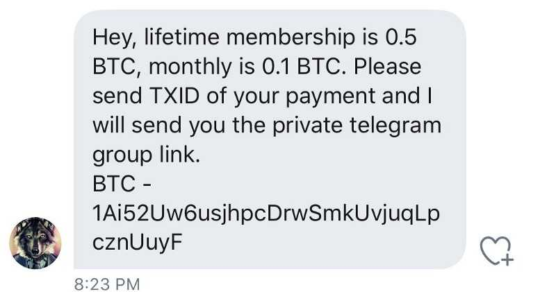
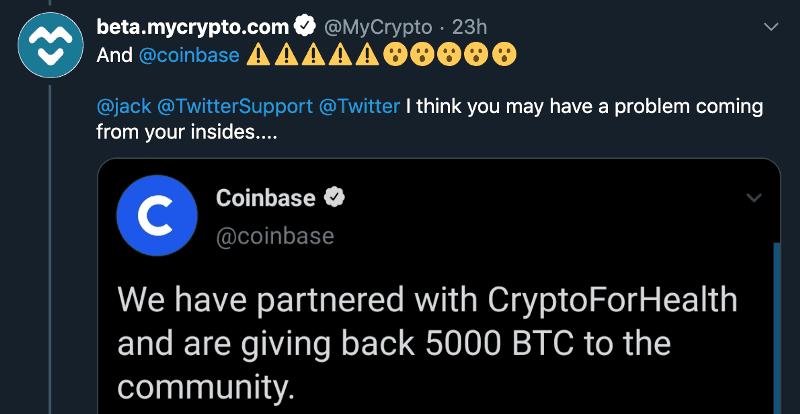
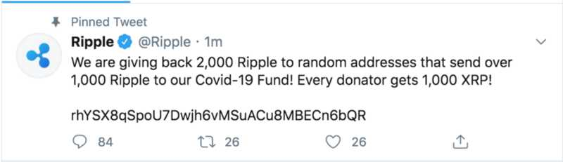

Note: This is a high-level overview of the events that occurred. To see a detailed timeline of every single account and tweet, [view this spreadsheet](https://docs.google.com/spreadsheets/d/1ZpIzc1Z2i9zcRlS89Qpd7CYD0IEICNXO6prbmgbnvNk/edit?usp=sharing). 
You can also view the [massive tweet thread](https://twitter.com/MyCrypto/status/1283483711942479872) that we tweeted in realtime.
For screenshots of all the tweets, view [this imgur album](https://imgur.com/a/d5oMGT5).

On July 15, around 40 (possibly more) Twitter accounts — **with hundreds of millions of combined followers** — were compromised and began tweeting out forms of trust-trading scams.

These scams netted more than $100,000 in cryptocurrency and the actions made waves throughout the internet.

*Last updated Friday, July 17 @ 12:20PM PT*

### Timeline

#### **11:23AM PT · Jul 15, 2020**

In the first of a series of unfortunate events, popular crypto Twitter account “AngeloBTC” is hijacked and asking for funds.



#### **12:13PM — 1:09PM PT · Jul 15, 2020**

Popular cryptocurrency accounts start sending tweets about partnering with CryptoForHealth.

This includes binance, cz_binance, gemini, bitcoin, kucoincom, coinbase, coindesk, and others.



#### **13:11PM PT · Jul 15, 2020**

The messaging on the tweets changes to promote crypto addresses instead of a website.



#### **13:23PM PT · Jul 15, 2020**

We issued a [domain blacklist](https://github.com/MetaMask/eth-phishing-detect/commit/c7f1a6b15841d6e216a7456485418f59dab8b3f7.patch) to MetaMask so users who have the extension will be met with a warning if they visit the scam site.

Accounts continue to become compromised and send scam tweets, including those of Barack Obama, Joe Biden, Bill Gates, Jeff Bezos, Warren Buffett, Wiz Khalifa, Kim Kardashian, Kanye West, and others.

#### **14:45PM PT · Jul 15, 2020**

Twitter posts an update and acknowledged the situation while the scam tweets continue.

#### **14:58PM PT · Jul 15, 2020**

Twitter disables one of the password reset flows that shows you a hint of the email address associated with the account.

#### **15:11PM PT · Jul 15, 2020**

Twitter disallows all verified accounts from tweeting as a stop-gap. No further scam tweets appear.

#### **17:41PM PT · Jul 15, 2020**

Twitter begins to restore the ability for verified accounts to tweet.

#### **19:38PM PT · Jul 15, 2020**

Twitter publishes explanatory thread.

In this explanatory thread, Twitter claims that this attack was a “coordinated social engineering attack” that resulted in outside access to internal systems and tools. This access was then used to deploy the scam tweets across the various accounts.

They are continuing to investigate.

#### **09:30AM PT · Jul 16, 2020**

Reuters published an exclusive that the FBI is leading the inquiry into the hack: https://www.reuters.com/article/us-twitter-cyber-fbi-exclusive-idUSKCN24H2PH

#### **17:53PM PT· Jul 16, 2020**

Twitter continues their previous thread and adds more information.

In the following tweets, they state their belief that ~130 accounts were targeted in some way during this incident. They’ve disabled the ability to download Your Twitter Data in the meantime, and are taking ‘aggressive’ steps to secure their systems while continuing the investigation.

### Who tweeted the scam tweets?

```
@AngeloBTC
@apple
@barackobama
@billgates
@binance
@bitcoin
@bitfinex
@cashapp
@cloudwhiteven (possible troll)
@coinbase
@coindesk
@crypto_bitlord
@cz_binance
@elonmusk
@floydmayweather
@gemini
@hqtrivia
@jedijamesdean
@jeffbezos
@joebiden
@justinsuntron
@kanyewest
@kimkardashian
@kucoincom
@luckyovlegends
@mattglantz
@mcnicollme (possible troll)
@mikebloomberg
@mrbeastyt
@ninodevries (possible troll)
@paultudorjone (possible troll)
@ripple
@satoshilite
@thesoleprano (possible troll)
@tronfoundation
@uber
@warrenbuffett
@wizkhalifa
@WtfffMichael (possible troll)
@xxxtentacion
```

### Which crypto addresses were promoted?

```
BTC: 1Ai52Uw6usjhpcDrwSmkUvjuqLpcznUuyF
BTC: 38qyALcxSnfzaFFTnt46xHMTN3GCGanKXC
BTC: bc1q0kznuxzk6d82e27p7gplwl68zkv40swyy4d24x
BTC: bc1qxy2kgdygjrsqtzq2n0yrf2493p83kkfjhx0wlh
BTC: 1Ai52Uw6usjhpcDrwSmkUvjuqLpcznUuyF
BTC: 1AXRMCHu2yCTHJGcaaCBmWAzXCWmo7RKFx
BTC: bc1qwr30ddc04zqp878c0evdrqfx564mmf0dy2w39l
XRP: rhYSX8qSpoU7Dwjh6vMSuACu8MBECn6bQR
```

### Which email addresses were attached to the accounts?

What is interesting to note is that these recovery emails cycled in batches. The first couple of accounts had `mi********@gmail.com` then there was a noticeable break in the tweets and the accounts that tweeted after the break had a different recovery email.


This suggests an (internal) tool was changing the details of accounts to emails owned by the “hackers” and they were simply going through the normal account recovery flow. This theory is reinforced with the fact that [Twitter disabled that flow](https://twitter.com/MyCrypto/status/1283521550860251136) at 1458PM PST Jul15, 2020.

```
th*****************@prontonmail.com (17 stars)
si************@gmail.com (12 stars)
mi********@gmail.com (8 stars)
mi**********@gmail.com (10 stars)
mi***********@gmail.com (11 stars)
va**************@gmail.com (14 stars)
je***********@g****.*** (11 stars)
```

#### [Visit this spreadsheet to view an extensive breakdown of the events that occurred.](https://docs.google.com/spreadsheets/d/1ZpIzc1Z2i9zcRlS89Qpd7CYD0IEICNXO6prbmgbnvNk/edit?usp=sharing)

### The various unknowns/concerns
This Twitter hack is the biggest hack that Twitter has ever seen, and the sheer amount of people that these scam tweets were exposed to may make it one of the most widely known hacks on the internet.

One of the biggest discussions surrounding this incident is the fact that Twitter is a centralized platform with a backdoor that allowed for this to happen at all. Some speculate that the internal tools allowed for tweeting directly from any account, but there’s a chance that it was a tool that made it easier to recover any account by changing the associated email address.

A handful of questions remain:

* What other Twitter user accounts were/are compromised?
* What accounts were compromised but never tweeted—was anything sensitive in saved tweets/drafts, DMs, connected devices, and/or active session data?
* Did they export DMs and now have access to potentially sensitive information (some companies ask for sensitive information over Twitter DM)?
* Does having 2FA vs hardware 2FA do anything to protect anything of yours at all?
* Why hasn’t Twitter implemented the end-to-end encrypted DMs [that they had been working on previously](https://twitter.com/wongmjane/status/992265256679297025/photo/1)?
