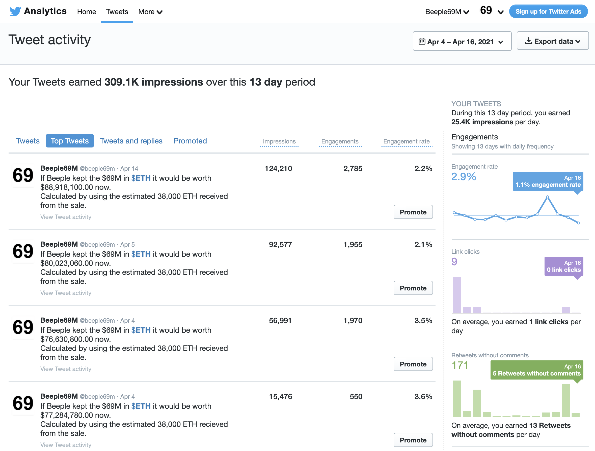

### 👉 Go follow the bot: [@beeple69m](https://twitter.com/beeple69m)

# Motivation for the bot

Beeple is a 3D artist, and has been releasing art every single day for the past 13 years. He has recently started selling his art (some as 1/1) as NFTs. He's been making a lot of money as the NFT community welcomed him with open arms. He's an incredible artist and has a lot of amazing work!

You can check his work out here: [https://www.instagram.com/beeple_crap/](https://www.instagram.com/beeple_crap/)

On Feburary 16, Christies (a famous auction house) tweeted that they would be auctioning off a collage of the first 5,000 days of Beeples work.

https://twitter.com/ChristiesInc/status/1361670588608176128

This auction started "slow" and there were "expert opinons" that this auction would reach around the $20,000,000 level. Bids started flowing in and reached the $60,000,000 level - the winning bidder was [@justinsuntron](https://twitter.com/justinsuntron) at this time.

https://twitter.com/justinsuntron/status/1370228036428177409

With only a couple of seconds left, an (at the time) anonymous bidder came in and won the auction by bidding $69,346,250. Incredible! 🤯

You can read my tweet thread about the auction from the $60M bid

https://twitter.com/sniko_/status/1370027281075249159

This is a historic moment for NFTs. A digital piece of art fetching ~$70M at auction with payment in [$ETH](https://www.coingecko.com/en/coins/ethereum). Some weeks later, it was said that Beeple sold all the $ETH that he received from the sale into USD.

* [CoinDesk: Beeple Sold Out. So What?](https://www.coindesk.com/the-node-beeple-sold-out-so-what)

I decided to build a bot to document the value Beeple would have if he kept the entire fortune in cryptocurrency.

After 13 days, the tweet impressions are relatively very well!

> Your Tweets earned 309.1K impressions over this 13 day period

# The Bot, technicals and behaviour

On April 04, 2021 I deployed a bot to tweet periodically (once per day at 1800UTC) the calculations of Beeples holdings if he kept it in $ETH.

The bot works by calling [CoinGecko API](http://coingecko.com/api) for the current aggregated market price of $ETH and multiplying it by the recorded (estimated) units of $ETH Beeple received. 

It is a simple script written in PHP and makes use of [Heroku Scheduler](https://devcenter.heroku.com/articles/scheduler) to run everyday at a certain time.

### 👉 Go follow the bot: [@beeple69m](https://twitter.com/beeple69m)