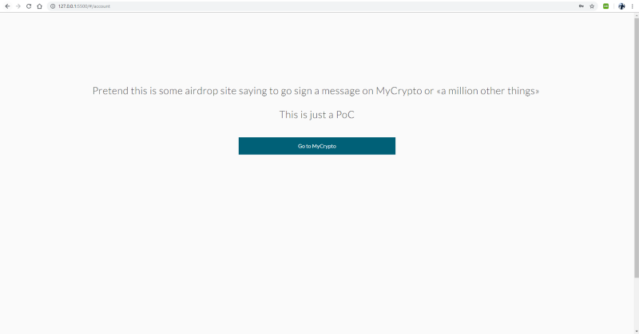

**Using the browser API to fool you into giving up your details.**

A lot of websites in the cryptocurrency scene— especially products that need you to enter secret information—ask you to check the URL bar for the correct SSL certificate (sometimes specifically the EV cert) and the correct URL. A lot of them make this the first instruction on their login page. It turns out that even checking these two items can give you a false sense of security due to some extra clever attacks.

Let’s start by stating this isn’t a vulnerability in any of the products (MyCrypto, Binance, Google Chrome, Firefox, or Brave) shown in the article. Instead it’s manipulating the user into believing they are on a certain website when they aren’t.

End-users should always be extra vigilant—especially when dealing with cryptocurrencies—and opt for additional security mechanisms (2FA, running offline, hardware wallets, etc.). Again, there is nothing that MyCrypto or Binance or any other website can do to mitigate this, unfortunately.

`youtube:https://www.youtube.com/embed/ebWftq6kA30`

### The PoC explained

By using the browser’s fullscreen API, some javascript to detect the browser, and a couple of images, we can (almost/fully) fool you into thinking you’re on the correct domain. Above is a PoC.

Although at first glance it may seem you leave the 127.0.0.1:5500 server, you never do. Let’s break it down.

The first view is just for demonstration purposes — a simple view with a legitimate link to MyCrypto. However, imagine this is used in the wild and it’s some sort of malicious crypto news site: someone’s blog explaining how to get started with MyCrypto, a malicious airdrop site promising free tokens, or whatever — anything to convince the user to click a valid `<a href="https://mycrypto.com">MyCrypto.com</a>` link.

Once the linked is clicked the browser is forced into fullscreen mode with some images displayed that appear to be the frame of the user’s browser. We’re using some simple javascript to detect which browser the user is running and show the correct browser frame images accordingly.

Now let’s pretend MyCrypto didn’t [deprecate private keys on the web](https://medium.com/mycrypto/a-safer-mycrypto-79d65196e7d8) or you were using a product that asked for your private key. This is where the attacker would ask for your keys and record them as you type them in (shown below).

This part wouldn’t be verbose like the PoC, but this demonstrates that you never left the 127.0.0.1:5500 server and the browser was manipulated into looking like you were on MyCrypto.com.

Unless you are extra, extra vigilant, your private keys would have already been stolen at this point and funds wiped out.

Now, let’s look at another example — the popular exchange Binance. This is a prime example as they tell you to check the address bar on their login page — which is generally good advice.

`youtube:https://www.youtube.com/embed/hOgPAhEXNSw`

As you can tell from the above, unless you are giving the screen your undivided attention, it would be very easy to fall victim to this trick.

### What does it look like in other browsers?

I mentioned earlier that we can use javascript to detect what browser the user is on and display the appropriate images.

In Firefox, it is slightly more obvious that your browser has switched to fullscreen mode, but the verbose PoC doesn’t trigger showing the actual address bar with the `alert()` (keep in mind a bad actor wouldn’t `alert()` you so this comparison is somewhat meaningless).

`youtube:https://www.youtube.com/embed/phmS05-hF1Y`

Using Brave it’s the same as the Chrome experience — but that’s because Brave is using the Chromium web browser that Chrome is based off.

`youtube:https://www.youtube.com/embed/qYnY2DOd5fo`

### How can I stay safe?

* Keep your eyes vigilant to see if your browser flicks into fullscreen mode.
* Never enter your credentials or private keys into websites you arrived at via a link. Always navigate yourself, preferably via a bookmark you created yourself.
* Install [EtherAddressLookup browser extension](https://github.com/409H/EtherAddressLookup#etheraddresslookup) to get protected from known bad domains.
* Keep an eye on the [EtherScamDb directory](https://etherscamdb.info/).
* Learn and share knowledge on new phishing tactics within the community.
* If you think something seems off, trust your gut and find a reliable source to whatever you’re trying to do.
* Use hardware wallets and 2FA wherever you can ([Buy a Ledger Wallet](https://www.ledgerwallet.com/r/1985?path=/products/) or [Buy a Trezor](https://shop.trezor.io/?offer_id=10&aff_id=1735))
* Opt for desktop applications / running offline when you can (e.g. the [MyCrypto Desktop App](https://download.mycrypto.com/))

PS: I’ve yet to see this being performed to phish cryptocurrency users.