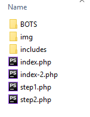
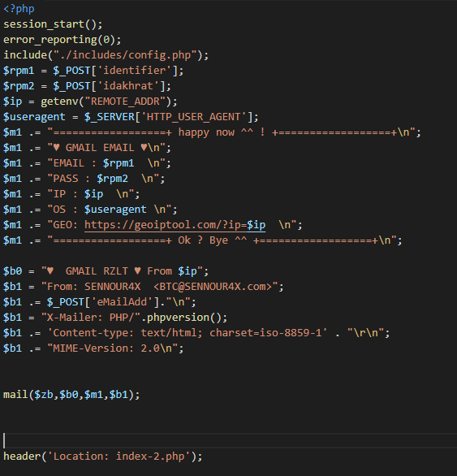
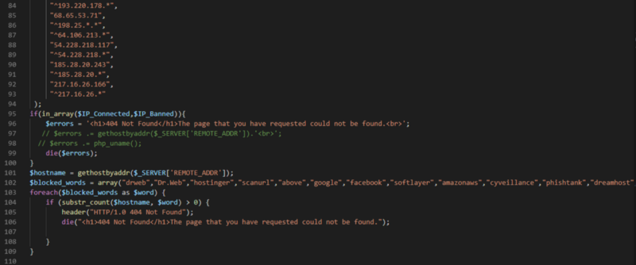
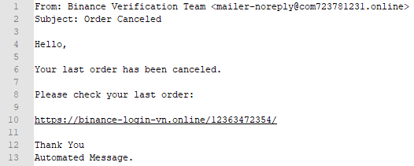

Jeremiah O’Connor (security researcher at Cisco) forwarded me a domain that has been phishing for Binance logins — `logins-binance.com12754825.ml`.

This domain has a different phishing kit to previous ones we’ve seen, as it changes the user sign-in journey to collect personal information to eventually use in social engineering methods — this server does not communicate with the Binance domain.


I decided to check the root domain, com12754825, and to my surprise, it was open.


Most of these are email scripts — with default text and tools to send out mass PayPal phishing emails.


All these tools communicate with/reference a third-party domain — `provip[dot]cc`.


The homepage for provip[dot]cc — the third-party domain that these tools reference/use. The Bitcoin address is 19L4d7EuQ6ug4rM3mBXqqbnNCJQarAFCLL.

What is most interesting is the script called unzipper.php that lets anyone zip any directory on the server, then unzip it in the web directory — I abused this…


### So, what did I find?

After zipping /home/ and unzipping into the web directory, I found the user’s name is "strooutz". Navigating through the exposed /home/ directory, we can see the user has some phishing kits targeting Binance and Gmail.


After inspection, we found out most of them use PHP as a backend. So let’s expose `/tmp` to see how many users have been potentially affected by exposing the session files (for `$_SESSION` data that the kits use — we are assuming garbage-collection hasn’t run in a while).


But one of the most important things we found out is the fact that there are the **three other kits** run by the same person/group. We discovered this when we exposed the /home directory earlier:

* binance.com128236.ml/
* gmail.com1865236.ga/
* info-binance.ml/

## Let’s view the /home/ directory code

So, I downloaded the generated zip for /home/ and inspected the kits.

### binance.com128236.ml

There are 2 files.
* hacces.php
* 136244725/index.html


### gmail.com1865236.ga

This is an entire application (it still has the same `haccess.php` script).



Let’s hunt for some secrets! The files are too large to share here, but [DM me on Twitter](https://twitter.com/sniko_) if you are a researcher and need a copy of the kits.



Interestingly enough, this phishing script ties in with the Binance phishing kit. After the bad actor has phished the Gmail account, it redirects back to the Binance phishing kit.


Within includes/ directory, the .htaccess file has a lot of rules — many of them deny from rules (too large to show here).


They also have a script called `BOTS/antibots5.php` that will show the default 404 Not Found message when viewed from a select group of IPs or if your user agent contains specific words — including phishtank.



### Let’s see the other domain — binance.com12786312634.space

So this is on the same server — but it’s what the other domain redirects users to — and as we have learned from the code above, we can execute arbitrary code by passing a base64 encoded PHP script into the ev query params. I navigated to `com12786312634.space` and exploited the ev query params.

I created a PHP file to execute `phpinfo()` to see what we are playing with...


Now that we know what version of PHP are we using and where we are on the server, let’s zip everything up in the home directory (specifically `/home/strooutz`) — we can’t do this with PHP easily, so let’s execute `exec("zip -r strooutz.zip /home/strooutz/")`


***Holy fuck.*** There’s a phishing kit for everything... There’s about 25 kits here ranging from Binance to Yahoo.


I’m not going to go through all of them, but since I have the entire /home/strooutz/ directory, let’s see if we can find anything useful.


Examining a kit that attempts to phish 2FA for Binance, we can see what the attacker gets from a successful phish.


After that, they are directed to the 2FA phishing view and an email is sent in the backend.


All the bad actor cares about is:
* Your full name
* Your phone number
* Your email
* The 2FA code
* Your IP (incl. geo location from your IP)
* The browser you use

All that’s needed then is for the bad actor to try their hand at socially engineering the support team to lift your 2FA (i.e., “I broke my phone and I can’t log in because of 2FA — here’s my details”) and then log into your exchange account (if successful).

The email associated with all the kits has some relevancy (identical name) to a “[carding](https://en.wikipedia.org/wiki/Carding_%28fraud%29)” individual.


With each kit, an admin email is put in `xxxx/includes/config.php` — on this server, there are 2 admin emails variations, which lead to some more Binance phishing domains that we discovered with a reverse WHOIS lookup.

```
tarakuapostrof@gmail.com (yahoo[dot]com763271231[dot]gq)
eriklicoke55@gmail.com (inbox-binance[dot]com12786312634[dot]space)
tarakuapostrof@gmail.com (hotmail[dot]com12754825[dot]ml)
tarakuapostrof@gmail.com (gmail[dot]com12754825[dot]ml)
eriklicoke55@gmail.com (gmail[dot]com1865236[dot]ga)
eriklicoke55@gmail.com (binance[dot]com12786312634[dot]space)
tarakuapostrof@gmail.com (binance[dot]com763271231[dot]gq)
tarakuapostrof@gmail.com (binance[dot]com12754825[dot]ml)
eriklicoke55@gmail.com (binance[dot]com1865236[dot]ga)

Reverse Whois results for tarakuapostrof@gmail.com
==============

There are 6 domains that matched this search query.
These are listed below:

Domain Name                Creation Date      Registrar
gotagotagota.com           2018-08-13         PDR LTD. D/B/A PUBLICDOMAINREGISTRY.COM
loginviet-binance.com      2018-09-03         PDR LTD. D/B/A PUBLICDOMAINREGISTRY.COM
verify-binance.com         2018-09-11         PDR LTD. D/B/A PUBLICDOMAINREGISTRY.COM
vietnam-binance.com        2018-09-02         PDR LTD. D/B/A PUBLICDOMAINREGISTRY.COM
vietnam-login-binance.com  2018-09-05         PDR LTD. D/B/A PUBLICDOMAINREGISTRY.COM
vietnamese-binance.com     2018-09-02         PDR LTD. D/B/A PUBLICDOMAINREGISTRY.COM

Reverse Whois results for eriklicoke55@gmail.com
==============

There are 1 domains that matched this search query.
These are listed below:

Domain Name                Creation Date      Registrar
verifyprocescommunity.us   2018-07-30         NAMECHEAP, INC.
```

Script signatures look the same — so most likely the same Binance phishing kits — though this server doesn’t hold the haccess.php script that allows for arbitrary code injection, unfortunately.

### Looking at the email logs

Since we have the entire home directory of the bad actor, let’s see what emails have been sent out...

This server does have exposed scripts that will send emails out to whoever, but we can do a grep on the directory to find the ones relevant to Binance.

Let's search for the term "Binance” in the /home/strooutz/mail directory.

`$ grep -Rn -m 1 "Binance" . | wc -l` gives an output of 139. Below is an example of an email that is sent out.


We can grep this directory to see what kind of Binance emails are being sent out also;





### But wait… there’s more

Now let’s look at `/home/strooutz/mail` and see all the email accounts;

```
ca-mail@spritecocacola.ml
donotreply@com1865236.ga
donotreply@com12786312634.space
donotreply@info-binance.ml
edit@asdqwr.spritecocacola.ml
mailer-noreply@com723781231.online
maileri@com12754825.ml
noreply-binance@com1865236.ga
reply@salesdepartment48123.ml
```

Looking at the `.Sent/cur` box of `donotreply@com12786312634.space` we can see they sent 3 test emails to the following accounts using RoundCube WebMail/1.3.3;

```
to: donotreply@com12786312634.space
bcc: kokakolla112@yahoo.com
Subject: hello bro

to: donotreply@com12786312634.space
bcc: mahmutilorik6@gmail.com
Subject: hello brojk

to: mahmutilorik6@gmail.com
Subject: gahsg ash
```

Looking at `.cpanel/email_accounts.json`, we can see which domains were set up on the user account:

```
gmail.com12754825.ml
com12786312634.space
com1865236.ga
binance.com1865236.ga
spritecocacola.ml
binance.com763271231.gq
com12786312634.strongnews.website
yahoo.com763271231.gq
spritecocacola.strongnews.website
strongnews.website
com128236.strongnews.website
login-blnance.space
binance.com12786312634.space
com12754825.ml
binance-login-vn.strongnews.website
salesdepartment48123.ml
com128236.ml
com763271231.gq
info-binance.strongnews.website
info-binance.ml
com723781231.online
salesdepartment48123.strongnews.website
com12754825.strongnews.website
binance.com128236.ml
com723781231.strongnews.website
login-blnance.strongnews.website
inbox-binance.com12786312634.space
gmail.com1865236.ga
asdqwr.spritecocacola.ml
binance.com12754825.ml
binance-login-vn.online
login.binance.com1865236.ga
com1865236.strongnews.website
binance.com723781231.online
hotmail.com12754825.ml
com763271231.strongnews.website
```

### Looking at the certificates

We also have downloaded the `/home/strooutz/ssl/ssl.db` file which gives us information on each certificate for each domain on the server.

There are 20 certificates in here, 8 of which are self-signed. The rest are issued by Let's Encrypt Authority X3 . We can see that the earliest certificate was created at timestamp 1538426177 (October 1, 2018) for the domain `yahoo.com763271231.gq`.

### How can I stay safe?

* Keep up-to-date with our working directory of known phishing and scam domains at https://etherscamdb.info.
* If your user journey changes logging into a service, be skeptical.
* Use bookmarks to websites that you created yourself.
* Double check the domain you’re on before you enter any data.
* Install [EtherAddressLookup](https://github.com/409H/EtherAddressLookup#installations) or [MetaMask](https://metamask.io) browser extension to get alerted of known phishing domains.

### Signing off

We have the entire server data to investigate — the above is a summary of a six-hour investigation.

If you are a security researcher and want to take a look at the data, [ping me on Twitter](https://twitter.com/sniko_).