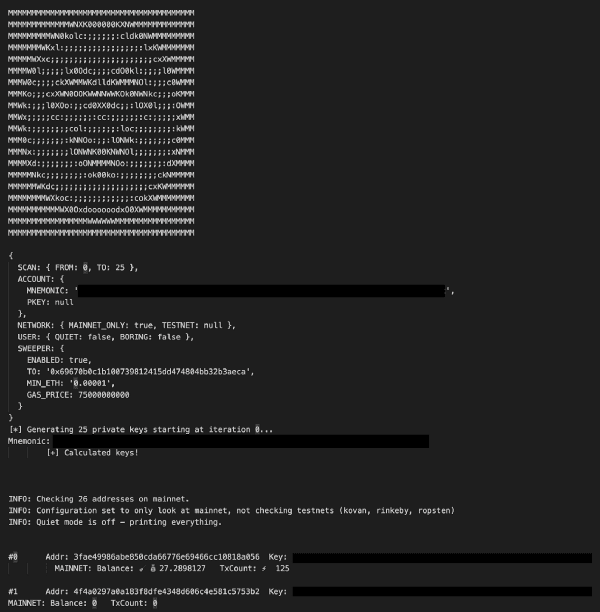
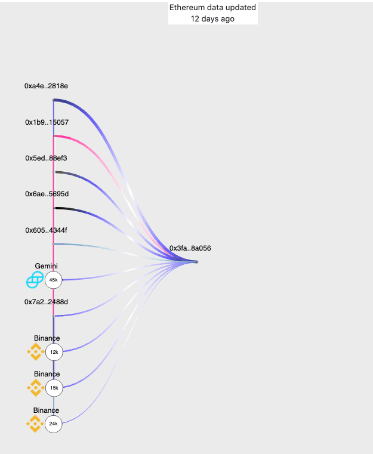

Centralized exchanges come with their drawbacks and may not fulfill all of the goals generally associated with crypto philosophies, but there are instances when custodial elements can become beneficial. For example, in the wake of the [recent Twitter hack](/the-twitterhack-postmortem), it was revealed that [Coinbase blocked user attempts to send over $280,000 in Bitcoin to the scam address](https://www.theverge.com/2020/7/20/21331499/coinbase-twitter-hack-elon-musk-bill-gates-joe-biden-bitcoin-scam).

In the case of my recent experience, Binance was able to provide an assist by passing along our information to the owner of the victimized address, giving them the option to reach out and resolve this.

The phishing technique used in this case was sophisticated in the sense that it mimicked two separate UIs to steal a user’s secret (private key, keystore file, mnemonic phrase). It can be convincing to unsuspecting users.

The bad actor(s) would deploy a malicious dapp interface (in this case it was a fake Uniswap UI) and prompt the user to connect their MetaMask account. The kit would then mimic the MetaMask popup and throw an error state to then prompt the user to enter their secret. Once the user did, it would send the user’s input to their database via a REST API and direct the user to the legitimate app.

`youtube:https://www.youtube.com/embed/1jEk16uaRYk`

### Intercepting the funds



Fortunately, the database was open for both read and write, which allowed me to periodically fetch the entries for their specific collections/table and run the keys through my custom sweeper. As they were using a DaaS, the only authorization barrier they had was an apikey HTTP header.

Similar to our other story of fund recovery, I was able to retrieve the phished details from their open database and run them through my sweeper, which resulted in the reception of some of the stolen funds.

I then pivoted the infrastructure using PassiveTotal by RiskIQ and found some more malicious domains targeting cryptocurrency users:

```txt
node.uniswapv1v2.app (162.213.255.91)
uniswapv1v2.app (162.213.255.91)
uniswapexchange.online (162.213.255.91)
uniswop.shop (68.65.123.97)
xmr-wallet.com (162.213.255.91)
...
```

### Returning the funds

I was able to determine that a victim address was used in Binance withdrawals so I reached out to my contacts there. I asked them to pass my email address to the user to confirm that they were the victim and start the process of returning the funds.

The user reached out to me within the hour.



After going through various steps to prove ownership of the compromised key and the new address, I sent the recovered funds to the victim’s new address and linked them to [our safety guides](https://support.mycrypto.com/staying-safe).

https://etherscan.io/tx/0x591fcf1c7c4555eb2b6f37880d2a6d9f2ae27acc0d0cfc7d143fdbb14069010c

https://etherscan.io/tx/0xebb7990628366fb5e75c24dc50bc1804cc91cb323e3f1352e3e28bdf6a640db0

### Don't become a victim

If you’ve recently entered your mnemonic phrase into an interface and experienced the same user journey as described at the start of the article, please create a fresh seed on trusted software [that you can verify](https://support.mycrypto.com/staying-safe/verifying-authenticity-of-desktop-app). Then you will need to migrate all your funds to your new address.

You will need to audit all of your apps to ensure the ones you are running are legitimate. You will need to uninstall all the non-legitimate ones and do an audit on what could have been compromised.

Learn to [protect yourself and your funds](https://support.mycrypto.com/staying-safe/protecting-yourself-and-your-funds).

If you run a website, web extension, or something else, [do not allow users to enter raw private keys, mnemonic phrases, or keystore files into your product](https://medium.com/mycrypto/private-keys-websites-aa85b42113a0). It is harmful to allow it and users need to learn from the very beginning of their journey that it’s not a safe method of accessing their funds.