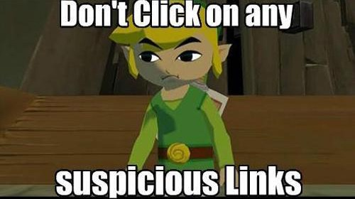
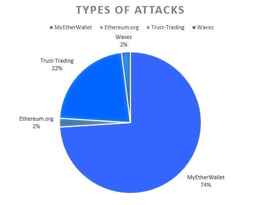
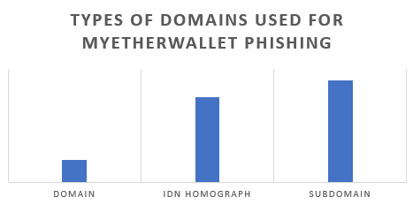
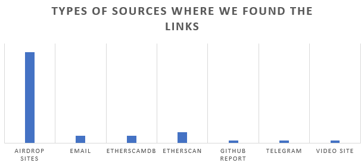
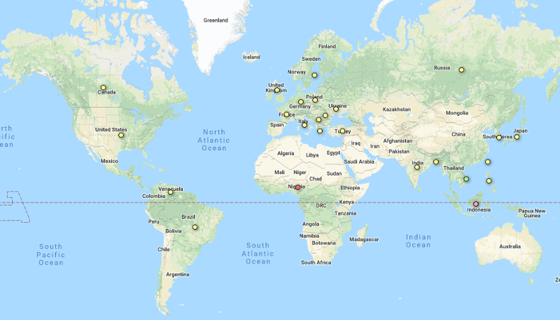
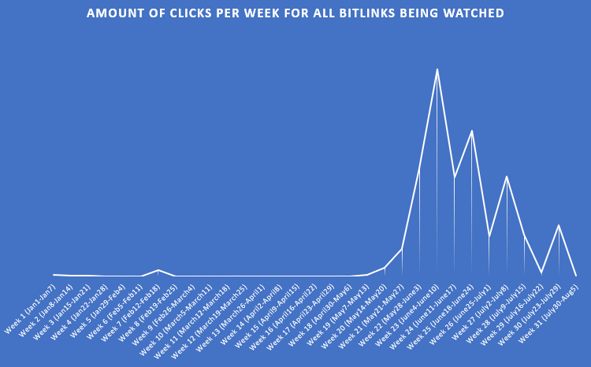

Here’s a walk-through of the popular links that people often fall for.

A little while ago, we started noticing suspicious domains with legitimate-looking content on it — as in, the domain itself wasn’t phishing you, but would link users to a foreign domain that was also controlled by the bad actors.

They started using the bit.ly service to direct users to bad content, primarily intending to steal their private keys by convincing you that you’d get some high-value airdrop of a new Ethereum-based token (that had no other web presence, not even a whitepaper or technical paper). These types of attacks play off of the greed that can live within someone. I touched on the use of bit.ly in one of my previous articles.

I want to preface this article by saying this isn’t a dig at the bit.ly service, but more of an analysis on phishers using their services.

### What it bit.ly?

Bit.ly is a link shortening service, a very popular one, that allows you to enter a url — they handle the redirection to that url as well as collect statistics on the clicks.

It’s mostly used with good intentions for marketing people to track click-throughs to specific campaigns or to pass to people on business cards or whatever so they don’t have to remember a really long domain — only the bitlink which is typically 7 characters.

### The types of attacks we see

Since we started tracking the bitly redirect codes, we have discovered over 50 that have directly affected a cryptocurrency enthusiast within the Ethereum scene, totalling over 124,000 clicks.

### Analysing the biggest attack type

As you can see from the chart above, MyEtherWallet-based attacks were the most popular to phish users of their keys/funds. This is a modified MyEtherWallet source designed to send your keys to a back-end server that will automatically “drain” your wallet of funds.

As you can see from the bar chart above, the mostly common domains used to phish users are [IDN homograph attack domains](https://en.wikipedia.org/wiki/IDN_homograph_attack) and subdomains.

There are various types of places we found these bit.ly links, including projects promising $100+ in token airdrops if they sign a message with their private key, and comments on popular block explorers.

We can see the vast majority of users who were redirected using the bit.ly service were targeted on airdrop sites exploiting users’ greed or interest in new tokens. Some of these airdrop sites were abusing the reputation of existing tokens/chains — such as EOSGas — which got very popular in recent weeks. The bit.ly links that we caught processed over 5,000 click-throughs using the EOS branding to phish users using MyEtherWallet phishkits.

### Analysing our dataset of Bit.ly links

Since our data is limited (as we are not the authors of these bitlinks), our analysis won’t be complete but it will still show some trends — for example, country data is limited to the top 3 traffic sources and the rest is bundled into “more” which we cannot view.

Analysis shows that Nigeria (39%), Indonesia (29%), Vietnam (15%), and India (8%) are the top traffic sources (that we can see) across the bit.ly links we have watched — yes, we are assuming we live in a perfect world where people have their browser language set correctly and no VPNs/proxies were used.

We also graphed most of the click-throughs by week of the year (for the first half of 2018) to see when these phishing/scams were most active.

As you can tell, May, June, and July 2018 were most active according to the links we found — mostly leading to private key phishing sites and trust-trading scams. This raises a very obvious problem that we can solve. In fact, we've already written about it — [deprecating private keys online](https://medium.com/mycrypto/a-safer-mycrypto-79d65196e7d8).

### What can you do to stay safe?

* Don’t be trusting of links. Always double check what you land on — even if sent by, what seems to be, a trusted party.
* You can always expand a bit.ly or goo.gl link by putting a + at the end and it will give you the statistics and destination address (example: https://bitly.com/2Mo5i5F+)
* If something seems to be too good to be true, it probably is.
* Nobody is giving away free ETH!
* Run EAL in your browser (load it manually if preferred) to protect you against known phishing/scam domains — https://github.com/409H/EtherAddressLookup#installations
* You can search any suspicious domain on EtherScamDB — we try to index everything — https://twitter.com/MyCrypto/status/1017174673795108864