## 👉 [Browser Web Store](https://chrome.google.com/webstore/detail/etheraddresslookup/pdknmigbbbhmllnmgdfalmedcmcefdfn)

## 👉 [GitHub Repo](https://github.com/409H/EtherAddressLookup#etheraddresslookup)

### 🔗 Linkify Ethereum Addresses

EAL will scan for Ethereum addresses (0x661b5...69b38bc) that aren't in an anchor tag on the page and link them to your favourite explorer - now all Ethereum address strings link to a block explorer.

Also, if you hover over the address, it will tell you how much ETH is associated with the address and how many transactions out it has!

### 🚫 Block you from malicious domains

EAL has 3 domain blacklists that are updated daily to ensure you don't browse to known malicious domains designed to steal your private keys/$ETH

EAL stores these blacklists locally so no third-party server is being hit on every page load. Blacklists are pulled every ~5 minutes from Infura and Github servers.

Get protected by;
* [MyCrypto Team](https://mycrypto.com)
* [PhishFort](https://www.phishfort.com/)
* [SegaSec](https://segasec.com/)

### ✔️ History Checker

With a click of a button you can check your browser history to see if you've recently been on a now-known bad domain.

### 🔍 Block Explorer

Search the blockchain with an 0x address or transaction hash and get human readable results.

### 📑 Bookmark your favourite domains

Bookmark your favourite cryptocurrency related domains to be shown in the extension. No need to remember domains or trust links when you can use these bookmarks.

### ✏️ Custom RPC node

Make all RPC calls go to 
your own node so you know you can rely on the data given back about addresses.

EAL comes supplied with a Quiknode node so you can use this feature if you don't have your own node.

### 🐦 Twitter Trust Badges

Get a warning badge and a verified badge next to Twitter handles - data you can trust. This is EALs way to combat phishing/scams on Twitter

### 🏷️ Add Labels to Addresses

You can add color-coded labels to addresses so you can quickly lookup or identify an address.

The labels show up when you hover on each address too!