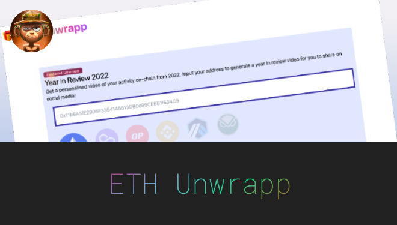
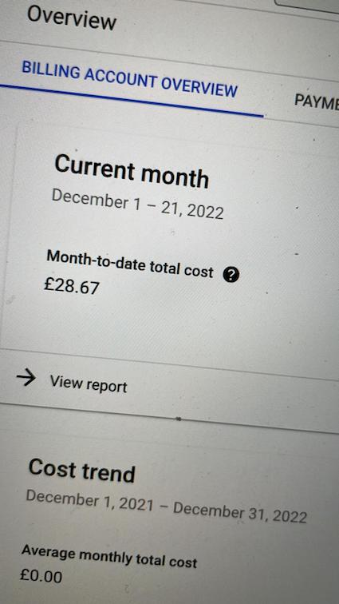
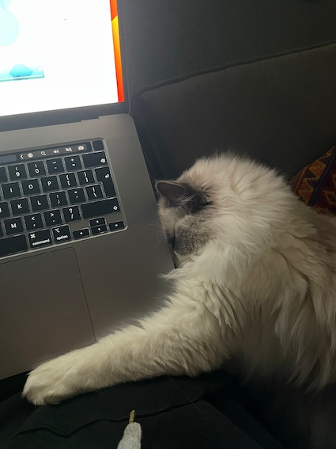

### 👉 [Go to the App](https://ethunwr.app/)


## Intro
During the holiday season in December, I thought I would be a fun idea to start a project to reflect back on the crazy year, with insipration from Spotify Unwrapped since I recently viewed by Spotify Unwrapped and I loved the idea of it!

For those unfamiliar, Spotify Unwrapped is a once-a-year thing by [Spotify](https://spotify.com) that gives you colourful stats on your year with Spotify.

I wanted to do something like this but for EVM chains as a little side project.

## Technical Challenges
At first, I had a simple idea for the project and, like always, turned out to be bigger than I imagined as every milestone I completed I wanted to add more - scope creep 😅

I experimented with Google BigQuery public Ethereum dataset to query the chain directly to fetch data, but during my minimal testing for just myself, the billing for that period reached about 30GBP, which is unsustainable for a public project that _hopefully_ will have more than just myself using it, lol. When I realised that Google BigQuery wasn't viable (though I could have experimented using it more with a better caching layer) for the project, I sought out other methods to interrogate the chain on the fly - without running the infrastructure myself. 



This led me to the great trusted oracle - Etherscan - which turned out great because the API for their products supports many EVM chains! 🤩

I also wanted to make full-use of [remotion](https://www.remotion.dev/) by using their @lambda library to render the videos and allow you to download them as .mp4 - but after I requested an increase in my lambda concurrent connections, my AWS accounts got put on hold and eventually closed 😬 So now I am looking at the [SSR docs](https://www.remotion.dev/docs/ssr) to build this myself and probably host it on [DigialOCean functions](https://m.do.co/c/b1c2c28c6822). However, in the mean time Desktop users can download a summary image to share on social media.

I had the idea to be able to move all the ETH in the contract to a GnosisSafe multisig (in 1 step), but [the OPCODE repricing](https://consensys.net/diligence/blog/2019/09/stop-using-soliditys-transfer-now/) slipped my mind (and my test cases only tested withdrawing to an EOA 😅), so I am unable to call `withdraw()` directly the multisig [without supplying an access_list in the transaction](https://eips.ethereum.org/EIPS/eip-2930) - which also adds friction to any users who want to call that function themselves to withdraw the funds on the projects behalf. Thankfully, the `beneficary` is changeable by the owner so it's not a big issue!

I am by no means a great frontend developer - especially with making things look 💅 pretty 💅 but the project has had a few iterations of design and I've finally settled on the current design using tailwindcss.
## Project Design
I designed the project to make use of ERC1155 standard NFTs (though within the app, they are mostly referred to as "badges"), with the idea that people can buy these badges to display on their profile and within unwrapped videos to show support for the project and have bragging rights on how many badges their profile has - more on that below!

I wanted to have one collection (one smart contract) that issued many NFTs that can have many mints - for this ERC1155 was most suitable.

The owner of the contract can create an "Edition" for users to mint, with the following configuration, stored within a `struct`.

```sol
struct Edition {
    uint256 editionId;
    string editionName;
    string uri;
    uint16 mintLimit;  
    uint256 minMintCost;     
    uint32 openTimestamp;
    uint32 closeTimestamp;
    address validator;
}  
```

* **`editionID`** - The number of the edition, starting from 0 and increasing after each Edition
* **`editionName`** - Configured per edition, gives a small description of the edition
* **`uri`** - The URI of where the metadata is held for the edition
* **`mintLimit`** - The total amount of mints that can be for the edition
* **`minMintCost`** - The minimum cost (in wei) to mint the edition
* **`openTimestamp`** - A unix timestamp of when you can start minting the edition
* **`closeTimestamp`** - A unix timestamp of when minting closes and cannot mint
* **`validator`** - A contract address for arbitrary minting validation for the edition

With this setup, we can create editions with different parameters, all under the same collection (read: smart contract address!)

## ✨ Some pretty cool notable features ✨ 

### `address validator`

This was something that I came up with when I completed the smart contract milestone for the project. I thought it would be pretty cool if in the future I could add arbitrary minting logic to any edition. 

For example, we could have a "premium unwrap" and only accounts that have a >=Tier I supporter badge can mint the "premium unwrap" badge. Or, let's say DEX A has a new record month of $1B trading volume, we could release an edition to target those users with onchain validation to ensure the badge (read: NFT) can only be minted by addresses that have interacted with that DEX - this is only a restriction on the minting process and does not affect any transfers.

### `mintForFren(uint256 _editionId, address _addr)`

With the addition of the validator logic within the mint, you may have an address that is in the "allowlist" of an edition, but your hot keys are not. 

With this function you can mint an edition with your hot keys for your other address - or, if you have friends and want to spice up their profile, mint a badge for them!

### `uint32 openTimestamp` & `uint32 closeTimestamp`

Some edition might be time sensitive for whatever reason - especially in the future. With this configuration, we can create an edition and choose when the mint period is by supplying a unix timestamp.

## Future hopes & plans
During the time I have spent creating this project, I started to hope that it would become more than just a one-time "flash\-in\-the\-pan" thing and instead have recurring use for the community.

I think it would be cool to see adoption of `contract EthUnwrapp{}` for events more than just a year acitivty unwrapped and if the idea is accepted, with the community suggesting on what else to unwrap. I have thought about and started the idea of having a main profile page (`/profile/0x11b6A5fE2906F3354145613DB0d99CEB51f604C9`) for an address that shows different events to unwrapp - I just need to finalise the design for it.

I don't have any plans to offer an ERC20 token and staking (*cough*feeswtf*cough*) because that really doesn't make sense, and originally I was on the fence about offering NFTs but I think the decision to offer badges (read: NFT) makes sense - a vanity badge to show support for the edition and boost your profile (think "Game Achievement Profile") - plus they are optional and you get the same service as if you did not mint an edition.

Big up to my cat, Agnes, for being my mascot and keeping me company on very late night programming sessions.



### 👉 [Go to the App](https://ethunwr.app/)