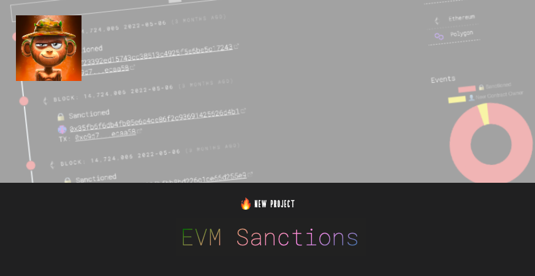

### 👉 [Go to the App](/projects/evm-sanctions)

I've wanted to have my own dashboard so I can monitor different EVM-based sanctions for certain contracts, and I've finally found some spare time on the weekend to do it!

The app steps through blocks to watch for events from certain contracts ([`0x40c57923924b5c5c5455c48d93317139addac8fb`](https://etherscan.io/address/0x40c57923924b5c5c5455c48d93317139addac8fb), [`0xdAC17F958D2ee523a2206206994597C13D831ec7`](https://etherscan.io/address/0xdAC17F958D2ee523a2206206994597C13D831ec7)) and then indexes the ones that I have noted as "evm-sanction"-worthy.

https://twitter.com/sniko_/status/1514982907819044875

### Findings #1

* As of mainnet block [`15294674`](https://etherscan.io/block/15294674) there is no overlap of sanctioned addresses in ChainAnalysis Sanctions Oracle and USDT Blacklist.

### Findings #2

* Address [`0x881d40237659c251811cec9c364ef91dc08d300c`](https://etherscan.io/address/0x881d40237659c251811cec9c364ef91dc08d300c) was added to the USDT blacklist twice, with 7 months apart - [Tx1](https://etherscan.io/tx/0xf678198e4cdb85680daba0bb940645ee230c1544ed09c2615fcd311c6b164e71), [Tx2](https://etherscan.io/tx/0xcb406e3b32283617ce088a8aa7937e1864dc7631f81f618301baed35eb11c2dd)

* Address [`0x967bb571f0fc9ee79c892abf9f99233aa1737e31`](https://etherscan.io/address/0x967bb571f0fc9ee79c892abf9f99233aa1737e31) was added to the USDT blacklist twice, with 3 minutes apart - [Tx1](https://etherscan.io/tx/0x269915190502566025d195fd2adb57501699d8fdaee4cffc3ece3d3ea80cb8b8), [Tx2](https://etherscan.io/tx/0xa25b8a888ddffa99f1b72dd96d76b8d7cf3bc7b2b51e93ce20ce1cda539f4172)

* Address [`0x707176b584d0ae0c77d3035da8686f8b58cda73b`](https://etherscan.io/address/0x707176b584d0ae0c77d3035da8686f8b58cda73b) was added to the USDT blacklist twice, with 8 days apart - [Tx1](https://etherscan.io/tx/0x37c2097e14b44c7d4225af26dc6812a0863c7007eb13f1fab1a7005200824036), [Tx2](https://etherscan.io/tx/0x1fc9979855038ffa561871c7936156e13a6ae52b4e3dfecc0169b5202a54d7bb)

* Added [`0xfae3ff7e05d921c1d48bbe6676ef5c902e32c801`](https://etherscan.io/address/0xfae3ff7e05d921c1d48bbe6676ef5c902e32c801) was added to the blacklist twice, with 8 days apart - [Tx1](https://etherscan.io/tx/0xc66014a30d2ac558beb333db6ab867a2480852c9d87ede116ef37877b6256c14), [Tx2](https://etherscan.io/tx/0x1888853b19cdb9c2285394aceab610cbdd254c7154a7107b2f051f9ce30f1c7a)

### Findings #3

* Address [`0x6f5901e3c53a51fce8edc15f6fa2b01b24226dcc`](https://etherscan.io/address/0x6f5901e3c53a51fce8edc15f6fa2b01b24226dcc) was the quickest to be added and removed from the blacklist, with only being blacklisted for 4 blocks - [Tx1](https://etherscan.io/tx/0xda5c3d1c03c8dcc3a23709b4285d4e5744596e3db03070e3dfd0f8586b10a22f), [Tx2](https://etherscan.io/tx/0xae48c8c72e95400395efea8b9cefac9595ce84b056ac7d6bdba4c148d182168c)

### Findings #4

* Address [`0x5441bfcda141759eaae9737a28cb2f9fd43e8869`]() got [blacklisted at block 9554129](https://etherscan.io/tx/0x266cf685565a922f45a9f18492b30d7e4dbf1c849dcecfdb0d35422eaac84d1e) then tried to unblacklist itself three times ([Tx1](https://etherscan.io/tx/0x4fc3eb3f58b85d444e20f58e21413fb5474576aa57e4b09921a28a862d796ba2), [Tx2](https://etherscan.io/tx/0x3680e1331617efc5b0351723821dd18a417b0692e5d714d642bac7656aae529d), [Tx3](https://etherscan.io/tx/0xac8572b8ffd6c035b12f2f0cbf4b985b9b6bca2f4aef9157ee92e5c4b21b4773)) before [being unblacklisted](https://etherscan.io/tx/0x7b9bfde7fb39ec4616f37fdee42c14185ddaabb3f4a6ee8b2b0169763f398702) 604,210 blocks later.

### 👉 [Go to the App](/projects/evm-sanctions)