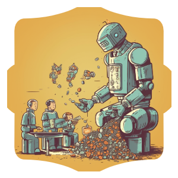

## What is it?

During memecoin season, a lot of projects hype their contribution address to a private EOA with no soft/hard caps and people "ape in". Management of these funds can be mismanaged and token distribution cannot be easily checked.

If a project does not go ahead (ie: meet their soft-cap) they rely on the meme coin creators to not rug and send back the ETH.

What if there was a better way? We are working with programmable money after all! Enter Fundraise.sol - a project built with Foundry. 

A more transparent, auditable way to raise funds and start a community. Before the soft-cap is reached, users have the ability to withdraw their contributions.

## Features
* Deployer sets min and max contribution limits that are enforced!
* Deployer sets the soft-cap and hard-cap limits, these have enforced rules!
* Deployer cannot withdraw the ETH until they have met the soft-cap!
* Disallow contributions from exchanges!
* Users can withdraw their contributions (partial or full) until soft-cap is reached!

### Soft-Cap
This is the amount of ETH to have raised before the deployer/owner can withdraw anything. Before hitting the soft-cap, the contributors can withdraw a partial or their full contributions.

### Hard-Cap
This is the amount of ETH the contract wants to raise and will not accept any ETH after this has been hit.