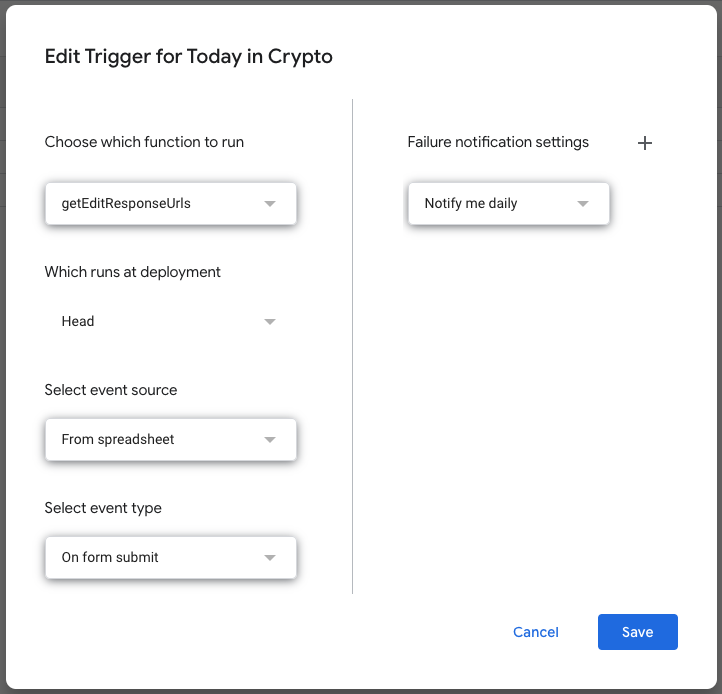

## Intro
After seeing how useful the [@TodayInInfosec](https://twitter.com/todayininfosec) Twitter bot was to me, I decided I wanted to do the same kind of bot but focus on cryptocurrency events - as we all know a week in crypto is a whole year in the normal life!

I thought it would be a great idea to frame this as a Twitter bot and a website. The Twitter bot to have tweets go out when a notable event happened on that day in the previous year, and a website for people to search events by month.


So, now I have [@0xHistoryToday](https://twitter.com/0xHistoryToday) and [historyofcrypto.today](https://historyofcrypto.today/).

## Project Design
I had a couple of goals in mind for this project - since I wanted to use the data in more than one way, and I wanted to accept community submissions as well.

To start, I [setup a Google Form](https://docs.google.com/forms/d/e/1FAIpQLSdNLO173ooex5pbw0NqaNFIreL4iAGnVcnpUsiuilO_BcnAcQ/viewform) to allow people to submit data to the project, which inturn submits the data into a Google Spreadsheet.

This Google Spreadsheet allows me to review the submissions and edit them with the same Google Form (by using AppsScript to get the form edit link) and to mark the entry as verified so it'll be picked up at the midnight-run routine to store the events in a Firebase database.

```js
var formURL = 'https://docs.google.com/forms/d/<form_id>/edit';
var sheetName = 'Entries';
var columnName = 'Edit' ;
var startRow = 2;

function getEditResponseUrls(){
  const sheet = SpreadsheetApp.getActiveSpreadsheet().getSheetByName(sheetName);
  const headers = sheet.getRange(1, 1, 1, sheet.getLastColumn()).getValues(); 
  const columnIndex = headers[0].indexOf(columnName);
  const data = sheet.getDataRange().getValues();
  const form = FormApp.openByUrl(formURL);
  for(let i = startRow-1; i < data.length; i++) {
    const timestamp = data[i][2];
    if(timestamp === "") {
      continue;
    }
    const formSubmitted = form.getResponses(timestamp);
    if(formSubmitted.length < 1) continue;
    const editResponseUrl = formSubmitted[0].getEditResponseUrl();

    const richValue = SpreadsheetApp.newRichTextValue()
    .setText("✏️")
    .setLinkUrl(editResponseUrl)
    .build();
    sheet.getRange(i+1, columnIndex+1).setRichTextValue(richValue);
  }
}
```

I then trigger this code to run when the form is submitted using the AppsScripts Triggers.



This script will then place a "✏️" in column A for me to click and edit the entry - which I find easier to do than edit a bunch of text in the cell.

After the events are reviewed in the Google Sheet, I have a serverless function that runs every midnight to pull the newly created events into the database, which then gets displayed on the website and consumed by the Twitter bot.

If there is a historic day and the Twitter bot has something to publish, it will generate a nice sharable graphic for the tweet and give a summary of the event in the tweet text.

https://twitter.com/0xHistoryToday/status/1630357248210870277


# Future hopes & plans

By the end of 2023, I hope to have more than 250 events indexed in the application and a decent size following on Twitter for the project, hopefully growing the idea to help people remember the good and bad times we have lived through whilst being in crypto.

Right now I have set myself a goal of adding 5 events per week for the remainer for the year to keep the projects pulse alive and not fall behind on the events that happen in the space.

Once the project is big enough, I do plan to also release a supporter/memorable NFT through [EthUnwrapp](/ethunwrapp).