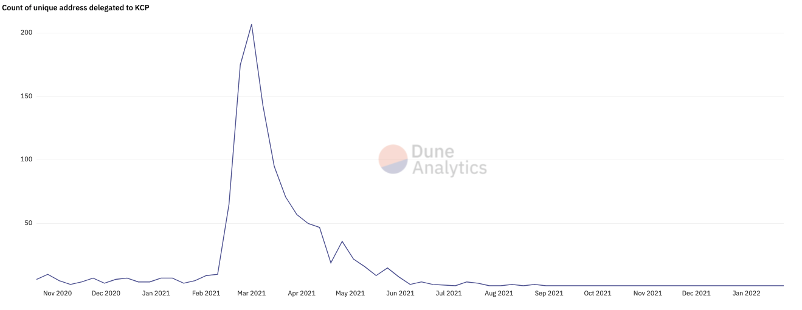

I built the frontend application for KCP, which was a service that users could delegate their voting power to KCP by depositing their KNC tokens and periodically get ETH rewards for participating by-proxy in governance. The project was [officially launched October 20, 2020](https://defidude.medium.com/kyber-community-pool-now-live-2226bf526081).

At it's peak, we had 1,150 unique addresses delegating their governance voting power to the project.

The project involved writing the frontend and deploying the [KCP smart contract](https://etherscan.io/address/0xff895dbc075379af849dfd8a5c42ba4e920b04a2#code).

## Sunsetting the project

On November 25, 2021, the [project was sunsetted](https://defidude.medium.com/sunsetting-the-kyber-community-pool-kcp-5654636334a8) and no more improvements were made to the project.

Users are still able to withdraw their KNC (as the project did not take custody) and claim any unclaimed ETH rewards.

### Key milestones

* Serviced over 1,000 users on Ethereum
* Over $1.5M in KNC staked in the KCP
* Over $150K in rewards
* As a community, we contributed plenty of feedback to help Kyber Network grow