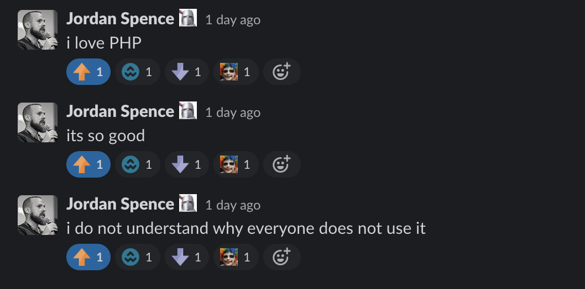

# The Everything Tweet Bot

This is a Twitter bot that makes use of Heroku and Heroku Scheduler to tweet a phrase of "[prefix] [adjective] [noun] [suffix]" such as "Acrobatic Meat Punks" or "The Confused Red Punks".

The output structure: `{$prefix}{$adjective}{$noun}{$suffix}`

It is written in PHP because brother likes it


```php
// Run test cases
composer run test

// Run script locally
composer run app
```

Add to the wordlists in `data/` - words need to be separated by a new line.

### Installation

##### Create the Twitter bot

1. Go to `https://developer.twitter.com/en/apply/user`

    a. Choose "Hobbyist"

    b. Choose "Making a bot"
    
    c. Go through the application

        i. What would you like us to call you? - Name this what you want the bot to be called

        ii. What country do you live in? - NEVER TELL LIES!!!

        iii. What’s your current coding skill level? - Whatever

        iv. In your words question: `Automate status updates using the POST /statuses/update.json API endpoint. The script will generate new statuses every n minutes and send a request to the API to post them to the timeline. 1 bot instance per user account`

        v. Are you planning to analyze Twitter data? - No

        vi. Will your app use Tweet, Retweet, Like, Follow, or Direct Message functionality? - Yes - `The bot will only be tweeting status updates, tagging nobody, for the user account every n minutes using POST /statuses/update.json`

        vii. Do you plan to display Tweets or aggregate data about Twitter content outside Twitter? - No

        viii. Will your product, service, or analysis make Twitter content or derived information available to a government entity? - No

    d. Wait for the application process to complete and check your email

2. Not go to `https://developer.twitter.com/en/portal/projects-and-apps`

    a. Press "Create App"

    b. Name your App - whatever you put in 1ci

    c. Note down all the keys in the next screen

3. Go to the app dashboard

    a. Click "Edit app permisions"

    b. Click "Read and Write"

    c. Press "Generate" under "Authentication Token" to generate an access token & secret

4. Put in the credentails in the environment variables

    a. `TWITTER_CONSUMER_KEY` = API key (Consumer keys - from step 2c)

    b. `TWITTER_CONSUMER_SECRET` =  API key secret (Consumer keys - from step 2c)

    c. `TWITTER_OAUTH_ACCESS_TOKEN` = API key (Authentication Tokens - from step 3c)

    d. `TWITTER_OAUTH_ACCESS_TOKEN_SECRET` = API key secret (Authentication Tokens - from step 3c)

5. Run the app `composer run app`

##### Heroku

[](https://dashboard.heroku.com/new?template=https%3A%2F%2Fgithub.com%2F409H%2FTheEverthingTweetBot)

```
# These will be autofilled if you press the Heroku button above
heroku config:set WORDS_PREFIX=""
heroku config:set WORDS_SUFFIX=""
heroku config:set WORDS_SEPARATOR=" "

heroku config:set TWITTER_OAUTH_ACCESS_TOKEN=""
heroku config:set TWITTER_OAUTH_ACCESS_TOKEN_SECRET=""
heroku config:set TWITTER_CONSUMER_KEY=""
heroku config:set TWITTER_CONSUMER_SECRET=""
```

Once built, go to the Heroku app dashboard and click the `Heroku Scheduler` app.

a) Press `Add Job`

b) Schedule: `<whatever interval you want>`

c) Run command: `composer run app`